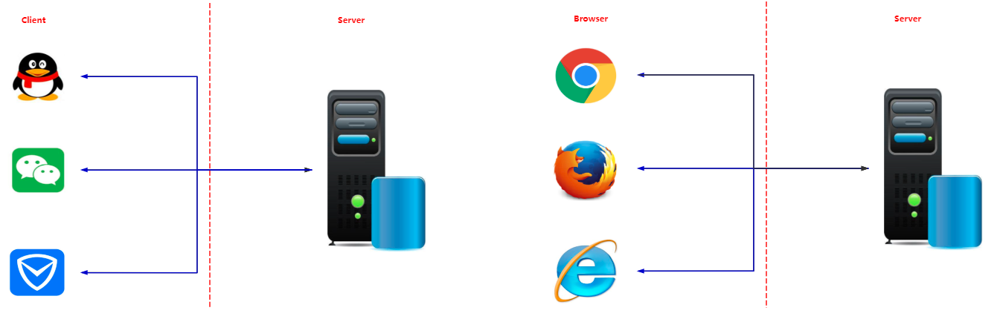
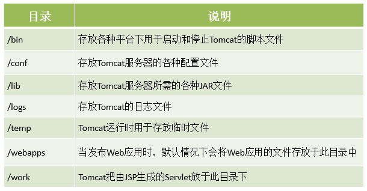
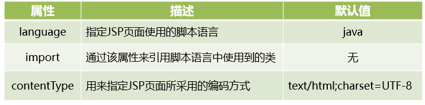
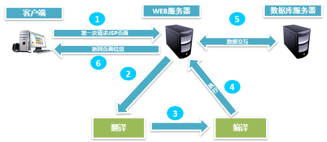

# 初识`JSP`

## 1. 程序结构

互联网发展到现在出现过两种结构：C / S 结构和 B / S 结构



### 1.1 C / S 结构介绍

C / S 是 Client / Server 的简称，C / S结构在技能上非常成熟，它的重要特征就是交互性强、拥有安全的存取形式、网络通信数量低、响应速度快、利于处置大量数据。

* 优点：
  * 优秀的处理能力，很多工作能够在客户端处理后再提交给服务器，减少服务器端的开销，因此， C / S 结构的客户端响应速度较快
  * 操作界面漂亮、形式多样，能够足够满足客户自己的个性化要求
  * 安全性能能够非常容易确保，能够对权限实行多层次校验，对信息安全的控制能力非常强
* 缺点：
  * 需要安装客户端程序，分布功能弱
  * 兼容性差

### 1.2 B / S 结构介绍

B / S 是 Browser / Server 的简称，就是只安装维护一个服务器，而客户端选用浏览器运行软件。B / S 结构应用程序相对于传统的C / S结构应用程序就是一个特别大的进步。 B / S结构的重要特征就是分布性强、维护方便、开发简单并且共享性强、总体拥有费用低

* 优点：
  * 分布性强。只需要有网络、浏览器就能随时随地实行查询、浏览等业务处理
  * 业务扩展简单遍历，通过添加网页就可以添加服务器功能
  * 维护简单便利，只须要更改网页，就可以完成全部用户的同步更新
  * 开发简单，共享性强
* 缺点：
  * 个性化特征明显减少，难以完成拥有个性化的功能要求
  * 在浏览器上，B / S 结构不尽如意
  * 在速度与安全性上需要花费超大的设计的费用


## 2. Web服务器

### 2.1 服务器概念

Web服务器是可以向发出请求的浏览器提供文档的程序，主要提供网上的信息浏览服务

### 2.2 常见服务器

* `IIS(Micro Sort)`
* `Tomcat(Apache)`
* `WebLogic(Oracle)`
* `WebSphere(IBM)`
* `Nginx`


## 3. Tomcat 服务器

Tomcat是Apache 软件基金会（Apache Software Foundation）的Jakarta 项目中的一个核心项目，由Apache、Sun 和其他一些公司及个人共同开发而成。Tomcat 服务器是一个免费的开放源代码的Web 应用服务器，属于轻量级应用服务器，在中小型系统和并发访问用户不是很多的场合下被普遍使用，是开发和调试`JSP`程序的首选。

### 3.1 Tomcat 目录结构



### 3.2 启动 Tomcat 服务器

进入 bin 目录， 然后 双击 `startup.bat` ，启动 Tomcat 服务器

### 3.3 **访问** **Tomcat** 服务器

在浏览器地址栏输入网址：http://localhost:8080/firstApp/first.html 进行访问

这个网址有一个专业的名称，叫做 **统一资源定位符**

统一资源定位符包含以下三部分：

* 协议

  比如 `http`

* 主机地址

  `localhost 127.0.0.1` 都是表本机，可以用来代替本机的`IP`地址

  主机地址包括了主机 `IP` 地址和端口号，比如 `IP` 地址 `localhost` ，端口号 8080

* 资源地址

  比如 `/firstApp/first.html`

### 3.4 关闭 Tomcat 服务器

进入 bin 目录， 然后 双击 `shutdown.bat` ，关闭 Tomcat 服务器


## 4. Tomcat 配置

### 4.1 端口号配置

进入 `conf` 文件夹，找到 `server.xml` 文件，使用文本编辑器打开，找到如下内容

```xml
<Connector port="8080" protocol="HTTP/1.1"
               connectionTimeout="20000"
				redirectPort="8443" />
```

解释说明：

* `port`

  端口号，默认配置8080，可修改

* `protocol`

  Tomcat 服务器使用的协议，默认配置为HTTP协议，HTTP协议版本为1.1

* `connectionTimeout`

  访问 Tomcat 时，连接的超时时间，默认配置为20000毫秒

* `redirectPort`

  重定向端口，默认配置为8443，主要是针对于访问 Tomcat 服务器上的资源时，如果该资源需要使用 `HTTPS` 访问，此时，Tomcat 会将这个请求重定向到8443端口

### 4.2 虚拟路径配置

#### 4.2.1 资源准备

在任一磁盘上（比如 D 盘）创建资源文件夹 actual， 然后编写一个 `test.html` ，将其放入 actual 文件夹中。

```html
<!DOCTYPE html>
<html>
    <head>
        <meta charset="utf-8">
        <title>虚拟路径</title>
    </head>
    <body>
        <h1>This Is A Virtual Path</h1>
    </body>
</html>
```

#### 4.2.2 虚拟路径配置

进入 `conf` 文件夹，找到 `server.xml` 文件，使用文本编辑器打开，找到如下内容

```xml
<Host name="localhost" appBase="webapps" unpackWARs="true" autoDeploy="true">
    <Valve className="org.apache.catalina.valves.AccessLogValve" directory="logs"
           prefix="localhost_access_log" suffix=".txt"
           pattern="%h %l %u %t &quot;%r&quot; %s %b" />
</Host>
```

在 <host></Host> 标签对之间添加如下内容

```xml
<Context path="/virtual" docBase="D:/actual"/>
```

然后启动 Tomcat 服务器

#### 4.2.3 测试访问

在浏览器地址栏输入： http://localhost:9000/virtual/test.html 进行访问

### 4.3 `web.xml` **配置**

#### 4.3.1 会话超时配置

```xml
<session-config>
    <!--这里的单位是分钟-->
    <session-timeout>30</session-timeout>
</session-config>
```

会话指的是用户访问 Tomcat 服务器的有效时间。比如，当用户登录某网站后，30分钟内，没有进行任何操作，此时，用户与该网站的会话已经超时。如果再进行页面操作，那么服务器将提示用户重新登录。

#### 4.3.2 欢迎页面配置

```xml
<welcome-file-list>
    <welcome-file>index.html</welcome-file>
    <welcome-file>index.htm</welcome-file>
    <welcome-file>index.jsp</welcome-file>
</welcome-file-list>
```

所谓的欢迎页就是当用户访问Tomcat 服务器资源时，没有对任何资源进行定位，此时，Tomcat 将使用配置的欢迎页进行展示


## 5. 初识 `JSP`

### 5.1 `JSP` 概念

`JSP` 是 Java Server Pages 的简称，意为 Java 服务器页面。其支持 Java 代码与 HTML 代码混合使用来完成页面的编写。

### 5.2 `JSP Page` 指令

<font color = "blue">语法</font>

```jsp
<%@ page 属性名="属性值" [属性名="属性值" 属性名="属性值"]%>
```

<font color = "blue">常用属性</font>



### 5.3 `JSP` 小脚本

<font color = "blue">小脚本代码的定义语法</font>

```jsp
<%
// 小脚本代码
%>
```

<font color = "blue">小脚本方法的定义语法</font>

```jsp
<%!
// 小脚本方法
%>
```

<font color = "blue">小脚本中的变量引用语法</font>

```jsp
<%= 变量名或者表达式 %>
```

<font color = "blue">示例</font>

```jsp
<%--import属性就是用来导包的--%>
<%@ page import="java.util.Date" %>
<%@ page import="java.text.SimpleDateFormat" %><%--
  Created by IntelliJ IDEA.
  User: sonnet
  Date: 2026/8/22
  Time: 14:12
  To change this template use File | Settings | File Templates.
--%>
<%@ page contentType="text/html;charset=UTF-8" language="java" %>
<html>
<head>
    <title>第一个JSP程序</title>
</head>
<body>
<div>Hello JvaWeb</div>
<%
    // 这里就是JSP的小脚本，支持编写Java代码
    Date now = new Date();
    SimpleDateFormat format = new SimpleDateFormat("yyyy-MM-dd HH:mm:ss");
    String currentTime = format.format(now);
%>
<%!
    // 这里就是可以定义方法的地方
    String Date2String(Date date) {
        SimpleDateFormat format = new SimpleDateFormat("yyyy-MM-dd HH:mm:ss");
        return format.format(date);
    }
%>
<div>今天是<%= currentTime %></div>
<div>使用方法展示日期：<%=Date2String(new Date())%></div>
<%
    String[] names = {"张三", "李四", "王五"};
%>
<%
    for (String name : names) {
%>
    <div><%=name%></div>
<%
    }
%>
</body>
</html>
```

### 5.4 `JSP`交互流程

`JSP` 文件在第一次被访问时会被翻译成 `java` 文件，然后被编译为 `class` 文件才能被执行，编译好的`class`文件可以被重用



