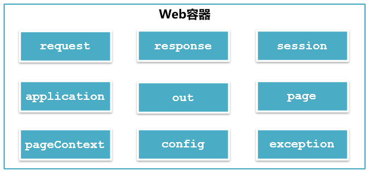

# `JSP` 数据传递

## 1. `JSP`内置对象

### 1.1 `JSP`内置对象的概念

`JSP` 内置对象是 Web 容器创建的一组对象，在页面中可以直接使用。 `JSP` 常用内置对象入下图所示：



### 1.2 内置对象 out

#### 1.2.1 out 对象的数据类型

`javax.servlet.jsp.JspWriter`

#### 1.2.2 作用

向web浏览器内输出信息，负责管理对客户端的输出

#### 1.2.3 用法

```jsp
<%
	// 在页面输出Hello JSP
	out.println("Hello JSP");
%>
```

<font color = "blue">示例</font>

```jsp
<%--
  Created by IntelliJ IDEA.
  User: sonnet
  Date: 2026/8/30
  Time: 16:02
  To change this template use File | Settings | File Templates.
--%>
<%@ page contentType="text/html;charset=UTF-8" language="java" %>
<html>
  <head>
    <title>out内置对象</title>
  </head>
  <body>
    <%
      out.print("这是out对象输出的信息");
    %>
  </body>
</html>
```

### 1.3 内置对象 request

#### 1.3.1 request 对象的数据类型

`javax.servlet.http.HttpServletRequest`

#### 1.3.2 作用

获取客户端的参数和数据流

#### 1.3.3 常用方法

```java
//根据表单组件名称获取提交数据
String getParameter(String name);
//获取表单组件对应多个值时的请求数据
String[] getParameterValues(String name);
//指定请求的编码
void setCharacterEncoding(String charset);
//返回一个RequestDispatcher对象，该对象的forward()方法用于转发请求
RequestDispatcher getRequestDispatcher(String path);
//获取客户端cookie
Cookie[] getCookies();
//获取请求中所有参数和参数值的映射
Map<String,String[]> getParameterMap();
//获取当前会话
HttpSession getSession();
// 获取当前请求的URL，这个URL就包含了上下文路径在内
String request.getRequestUri();
```

#### 1.3.4 案例

使用内置对象 request 完成注册信息显示

```jsp
<%--
  Created by IntelliJ IDEA.
  User: sonnet
  Date: 2026/8/31
  Time: 14:04
  To change this template use File | Settings | File Templates.
--%>
<%@ page contentType="text/html;charset=UTF-8" language="java" %>
<html>
<head>
    <title>内置对象request</title>
</head>
<body>
    <%--post请求发送的参数如果是中文，那么在页面展示的时候可能会出现乱码，可以在request对象中设置请求编码的格式，然后在从request对象中取值--%>
    <%--如果get请求发送的是中文，那么在页面展示的时候也可能出现乱码，可以使用字符串的转码方式来解决--%>
    <form action="info.jsp" method="post">
        <div>
            用户名
            <input type="text" name="username">
        </div>
        <div>
            密码
            <input type="password" name="password">
        </div>
        <div>
            信息来源
            <input type="checkbox" name="channel" value="报刊">报刊
            <input type="checkbox" name="channel" value="网络">网络
            <input type="checkbox" name="channel" value="朋友推荐">朋友推荐
            <input type="checkbox" name="channel" value="其他">其他
        </div>
        <div>
            <input type="submit" value="注册">
            <input type="reset" value="重置">
        </div>
    </form>
</body>
</html>
```

```jsp
<%@ page import="java.util.Arrays" %>
<%@ page import="java.nio.charset.StandardCharsets" %><%--
  Created by IntelliJ IDEA.
  User: sonnet
  Date: 2026/8/31
  Time: 14:16
  To change this template use File | Settings | File Templates.
--%>
<%@ page contentType="text/html;charset=UTF-8" language="java" %>
<%
    // 设置请求的字符集编码
    request.setCharacterEncoding("UTF-8");
    // 从请求中获取参数username的值
    String username = request.getParameter("username");
    String password = request.getParameter("password");
    // 因为前端传输的数据是一个数组，所以要使用数组来接收
    String[] channels = request.getParameterValues("channel");

    for (String channel : channels) {
        // 在ISO_8859_1这种编码下获取字节数据
        byte[] bytes = channel.getBytes(StandardCharsets.ISO_8859_1);
        // 通过字符串的构造方法进行转码
        String s = new String(bytes, StandardCharsets.UTF_8);
    }
%>
<div>
    <%=username%>
</div>
<div>
    <%=password%>
</div>
<div>
    <%=Arrays.toString(channels)%>
</div>
```

#### 1.3.5 GET 和 POST 请求的区别

* GET 请求的参数在URL中，而 POST 请求的参数在请求体（body） 中
* GET 请求有数据长度限制，这个长度限制是浏览器或者服务器为了提升处理效率而做出的限制，而POST 请求没有。

* GET 请求的安全性低，因为参数在URL中，直接暴露了信息，而 POST 请求的安全性高，因为 POST 请求的参数在请求体（body） 中，隐藏了信息

### 1.4 内置对象 response

#### 1.4.1 response 对象的数据类型

`javax.servlet.http.HttpServletResponse`

#### 1.4.2 作用

对客户端请求做出响应

#### 1.4.3 常用方法

```java
//添加cookie
void addCookie(Cookie c);
//重新定位新的资源，也叫重定向
void sendRedirect(String url);
//设置响应状态码
void setStatus(int status);
//获取打印流，主要用于向页面传输数据
PrintWriter getWriter();
//获取输出流，主要用于图片传输、下载等功能
ServletOutputStream getOutputStream();
//设置向页面输出的数据的字符集编码
void setCharacterEncoding(String charset);
```

#### 1.4.4 案例

实现登录页面跳转功能，并在跳转的页面中显示登录信息

`login.jsp`

```jsp
<%--
  Created by IntelliJ IDEA.
  User: sonnet
  Date: 2026/8/31
  Time: 20:24
  To change this template use File | Settings | File Templates.
--%>
<%@ page contentType="text/html;charset=UTF-8" language="java" %>
<html>
<head>
    <title>response内置对象</title>
</head>
<body>
    <form action="process.jsp" method="post">
        <div><span>用户名</span><input type="text" name="username"></div>
        <div><span>密码</span><input type="password" name="password"></div>
        <div><input type="submit" value="登录"></div>
    </form>
</body>
</html>
```

`process.jsp`

```jsp
<%--
  Created by IntelliJ IDEA.
  User: sonnet
  Date: 2026/8/31
  Time: 20:29
  To change this template use File | Settings | File Templates.
--%>
<%@ page contentType="text/html;charset=UTF-8" language="java" %>
<%
    // 获取参数username的值
    String username = request.getParameter("username");
    // 获取参数password的值
    String password = request.getParameter("password");
    if ("admin".equals(username) && "123456".equals(password)) {
        // 页面重定向至主页面
        response.sendRedirect("main.jsp");
    }
%>
```

`main.jsp`

```jsp
<%--
  Created by IntelliJ IDEA.
  User: sonnet
  Date: 2026/8/31
  Time: 20:33
  To change this template use File | Settings | File Templates.
--%>
<%@ page contentType="text/html;charset=UTF-8" language="java" %>
<%
    String password = request.getParameter("password");
    String username = request.getParameter("username");
%>
<div>用户名： <%=username%></div>
<div>密码： <%=password%></div>
```

*访问`login.jsp`，然后点击登录按钮，查看地址栏信息页面与页面信息。<font color = "red">发现地址栏信息页面发生了变化，说明重定向发生在客户端，相当于客户端再发了一次请求，重新定位了新的资源。由于这次请求是新的请求，与之前的登录请求完全独立，因此页面信息中展示的全是null</font>*

为了让登录信息在新的页面中显示，可以通过转发来实现，修改`process.jsp`

```jsp
<%--
  Created by IntelliJ IDEA.
  User: sonnet
  Date: 2026/8/31
  Time: 20:29
  To change this template use File | Settings | File Templates.
--%>
<%@ page contentType="text/html;charset=UTF-8" language="java" %>
<%
    // 获取参数username的值
    String username = request.getParameter("username");
    // 获取参数password的值
    String password = request.getParameter("password");
    if ("admin".equals(username) && "123456".equals(password)) {
        // 页面重定向至主页面
//        response.sendRedirect("main.jsp");
        // 从请求中获取一个转发的对象，既然是请求转发，那么上一次请求的信息，准发的对象应该也清楚，因此可以从新的对象中获取上一次的参数
        RequestDispatcher dispatcher = request.getRequestDispatcher("main.jsp");
        // 实现请求转发
        dispatcher.forward(request, response);
    }
%>
```

*访问`login.jsp`，然后点击登录按钮，查看地址栏信息与页面信息。<font color = "red">地址栏信息未发生变化，而页面信息进行了跳转。说明转发发生在服务器，由服务器完成。转发后，页面能够展示登录信息，说明转发可以共享请求的参数</font>*

### 1.5 内置对象 session

#### 1.5.1 session 概念

session 就是浏览器与服务器之间的一次通话

#### 1.5.2 为什么会有session

HTTP 协议是一种无状态协议，用户在访问服务器时，服务器无法感知到用户是哪一个用户，也就无法追踪用户的后续操作。为了解决这一问题，

服务器端设计了一个类 `HttpSession` 来感知用户，这个类产生的对象就是 session。在用户第一次访问服务器时，服务器就会为该用户生成了一个 session 对象，session 对象一产生就会生成了一个唯一标识符 `JSESSIONID` ， 并将这个唯一标识符使用Cookie存储在浏览器中，用户后续进行的每一个操作都将携带这个唯一标识符，服务器就根据这个唯一标识符追踪用户。

session 对象产生时就有一个过期时间，主要用于检测用户是否还在进行有效的操作。如果用户具有有效的操作，那么每一次用户的有效操作都将重置 session的过期时间。这个过期时间就是检测用户登录超时的依据。除此之外，session 还可以存储数据。

#### 1.5.3 session 对象的数据类型

`javax.servlet.http.HttpSession`

#### 1.5.4 常用方法

```java
//以key/value的形式保存对象值
void setAttribute(String key, Object value);
//通过key获取对象值
Object getAttribute(String key);
//设置session对象失效
void invalidate();
// 获取sessionid
String getId();
//设定session的非活动时间
void setMaxInactiveInterval(int interval);
//获取session的有效非活动时间(以秒为单位)
int getMaxInactiveInterval();
//从session中删除指定名称(key)所对应的对象
void removeAttribute(String key);
```

#### 1.5.5 案例

使用 session 完成登录成功后页面显示登录信息，要求登录处理使用重定向。

`login2.jsp`

```jsp
<%--
  Created by IntelliJ IDEA.
  User: sonnet
  Date: 2026/9/1
  Time: 11:04
  To change this template use File | Settings | File Templates.
--%>
<%@ page contentType="text/html;charset=UTF-8" language="java" %>
<html>
<head>
    <title>response内置对象</title>
</head>
<body>
<form action="process2.jsp" method="post">
    <div><span>用户名</span><input type="text" name="username"></div>
    <div><span>密码</span><input type="password" name="password"></div>
    <div><input type="submit" value="登录"></div>
</form>
</body>
</html>
```

`process2.jsp`

```jsp
<%@ page contentType="text/html;charset=UTF-8" language="java" %>
<%
    // 获取参数username的值
    String username = request.getParameter("username");
    // 获取参数password的值
    String password = request.getParameter("password");
    if ("admin".equals(username) && "123456".equals(password)) {
        // 将用户名和密码存储在session中，因为session是针对用户来的，因此只有用户本人，可以获取存储的数据
        session.setAttribute("username", username);
        session.setAttribute("password", password);
        // 页面重定向至主页面
        response.sendRedirect("main2.jsp");
    }
%>
```

`main2.jsp`

```jsp
<%--
  Created by IntelliJ IDEA.
  User: sonnet
  Date: 2026/9/1
  Time: 11:04
  To change this template use File | Settings | File Templates.
--%>
<%@ page contentType="text/html;charset=UTF-8" language="java" %>
<%
    String password = (String) session.getAttribute("password");
    String username = (String) session.getAttribute("username");
    String sessionID = session.getId();
%>
<div>response数据类型： <%=response.getClass().getName()%></div>
<div>session的数据类型： <%=session.getClass().getName()%></div>
<div>sessionID： <%=sessionID%></div>
<div>用户名： <%=username%></div>
<div>密码： <%=password%></div>
```

#### 1.5.6 include 指令

```jsp
<!-- 语法 -->
<%@ include file="文件名" %>
```

在开发过程中，开发的页面数量总是很多，如何确保用户的每一次操作都是有效操作呢？所谓的有效操作是指在登录没有超时的情况下进行的操作。

可以编写一个检测登录超时的页面，然后使用 include 指令引入至每一个页面中

```jsp
<%--
  Created by IntelliJ IDEA.
  User: sonnet
  Date: 2026/9/1
  Time: 12:17
  To change this template use File | Settings | File Templates.
--%>
<%@ page contentType="text/html;charset=UTF-8" language="java" %>
<%
     String user = (String) session.getAttribute("username");
    // 说明登录超时，因为session超时，session就会被回收掉，那么session里面存储的数据就没有了
    // 用户又发起了请求，此时服务器发现浏览器传输过来的JSESSIONID不存在，就重新为用户创建一个新的session
    // 既然是新的session，当然没有之前存储的数据，如此呢来判断session已经超时
    if (user == null) {
        response.sendRedirect("login2.jsp");
    }
%>
```

#### 1.5.7 session 超时设置

**第一种方式：Tomcat中的`web.xml`**

```xml
<session-config>
	<!-- 单位：分钟 -->
	<session-timeout>30</session-timeout>
</session-config>
```

**第二种方式：工程中的`web.xml`**

```xml
<session-config>
	<!-- 单位：分钟 -->
	<session-timeout>30</session-timeout>
</session-config>
```

**第三章方式：Java 代码实现**

```java
//设置会话超时时间，单位：秒
session.setMaxInactiveInterval(15 * 60);
```

### 1.6 内置对象 application

#### 1.6.1 application 对象的数据类型

`javax.servlet.ServletContext`

#### 1.6.2 作用

实现用户数据共享，将信息保存在服务器中，直到服务器关闭

*application其数据列类型就是`ServletContext`，意为`Servlet`上下文，这个上下文就是一个独立的环境，包含了`Servlet`运行的所有环境。因此，这个对象里面存储的数据类型就是对整个应用生效*

#### 1.6.3 常用方法

```java
// 以key/value的形式保存对象值
void setAttribute(String key,Object value);
//通过key获取对象值
Object getAttribute(String key);
//返回相对路径的真实路径
String getRealPath(String path);
```

#### 1.6.4 案例

统计网站访问次数

```jsp
<%--
  Created by IntelliJ IDEA.
  User: sonnet
  Date: 2026/9/1
  Time: 15:18
  To change this template use File | Settings | File Templates.
--%>
<%@ page contentType="text/html;charset=UTF-8" language="java" %>
<html>
<head>
    <title>application内置对象</title>
</head>
<%
    Integer count = (Integer) application.getAttribute("count");
    if (count == null) {
        // 表示这是第一个用户访问
        count = 1;
    } else {
        count++;
    }
    application.setAttribute("count", count);
%>
<body>
    <div><%=application.getClass().getName()%></div>
    <div>网站访问次数：<%=count%></div>
</body>
</html>
```


## 2. Cookie

### 2.1 什么是 Cookie

Cookie 是 Web 服务器保存在客户端的一系列文本信息。Session 机制采用的是在服务端保持状态的方案，而Cookie 机制则是在客户端保持状态的方案，Cookie 又叫会话跟踪机制，用来弥补HTTP无状态协议的不足

### 2.2 Cookie 的作用

* 弥足HTTP无状态协议的不足
* 简化登录，比如记住密码、自动登录等

### 2.3 常用方法

```java
//构造方法
Cookie cookie = new Cookie("名称", "值");
//设置cooki的有效期，以秒为单位
void setMaxAge(int expiry);
//在cookie创建后，对cookie进行赋值
void setValue(String value);
//获取cookie的名称
String getName();
//获取cookie的值
String getValue();
//获取cookie的有效时间，以秒为单位
String getMaxAge();
```

*添加Cookie是对用户操作的一种响应，所以添加Cookie应该由response对象完成`response.addCookie(Cookie c);`*

*获取Cookie是用用户请求发起时获取信息的一种操作，此时，请求还未发送至服务器，因此，Cookie的获取属于用户的请求，应该由request对象完成`Cooike[] cookies = request.getCookie();`*

### 2.4 案例

使用 Cookie 完成记住账号和密码功能

`login3.jsp`

```jsp
<%--
  Created by IntelliJ IDEA.
  User: sonnet
  Date: 2026/9/1
  Time: 17:03
  To change this template use File | Settings | File Templates.
--%>
<%@ page contentType="text/html;charset=UTF-8" language="java" %>
<html>
<head>
    <title>response内置对象</title>
</head>
<%
    String username = "";
    String password = "";
    boolean rememberMe = false;
    // 从请求中获取cookie的信息
    Cookie[] cookies = request.getCookies();
    if (cookies != null) {
        for (Cookie cookie : cookies) {
            String name = cookie.getName();
            if ("username".equals(name)) {
                username = cookie.getValue();
            } else if ("password".equals(name)) {
                password = cookie.getValue();
            } else if ("rememberMe".equals(name)) {
                rememberMe = cookie.getValue().equals("on");
            }
        }
    }
%>
<body>
<form action="process3.jsp" method="post">
    <div><span>用户名</span><input type="text" name="username" value="<%=username%>"></div>
    <div><span>密码</span><input type="password" name="password" value="<%=password%>"></div>
    <div><input type="checkbox" name="rememberMe" <%=rememberMe ? "checked" : ""%>>记住密码</div>
    <div><input type="submit" value="登录"></div>
</form>
</body>
</html>
```

`process3.jsp`

```jsp
<%--
  Created by IntelliJ IDEA.
  User: sonnet
  Date: 2026/9/1
  Time: 17:06
  To change this template use File | Settings | File Templates.
--%>

<%@ page contentType="text/html;charset=UTF-8" language="java" %>
<%
    // 获取参数username的值
    String username = request.getParameter("username");
    // 获取参数password的值
    String password = request.getParameter("password");
    String rememberMe = request.getParameter("rememberMe");
    if ("admin".equals(username) && "123456".equals(password)) {
        session.setAttribute("username", username);
        session.setAttribute("password", password);
        // 只有登录成功的情况且勾选记住密码才会记住密码
        if (!"on".equals(rememberMe)) {
            username = "";
            password = "";
            rememberMe = "";
        }
        Cookie usernameCookie = new Cookie("username", username);
        Cookie passwordCookie = new Cookie("password", password);
        Cookie rememberMeCookie = new Cookie("rememberMe", rememberMe);
        // 记住密码是属于服务器端对用户端操作的一种响应。这个响应就是使用cookie来存储账号和密码
        response.addCookie(usernameCookie);
        response.addCookie(passwordCookie);
        response.addCookie(rememberMeCookie);

        // 页面重定向至主页面
        response.sendRedirect("main2.jsp");
    }
%>
```

`main2.jsp`

```jsp
<%--
  Created by IntelliJ IDEA.
  User: sonnet
  Date: 2026/9/1
  Time: 11:04
  To change this template use File | Settings | File Templates.
--%>
<%@ page contentType="text/html;charset=UTF-8" language="java" %>
<%@include file="timeout.jsp"%>
<%
    String password = (String) session.getAttribute("password");
    String username = (String) session.getAttribute("username");
    String sessionID = session.getId();
%>
<div>response数据类型： <%=response.getClass().getName()%></div>
<div>session的数据类型： <%=session.getClass().getName()%></div>
<div>sessionID： <%=sessionID%></div>
<div>用户名： <%=username%></div>
<div>密码： <%=password%></div>
```
