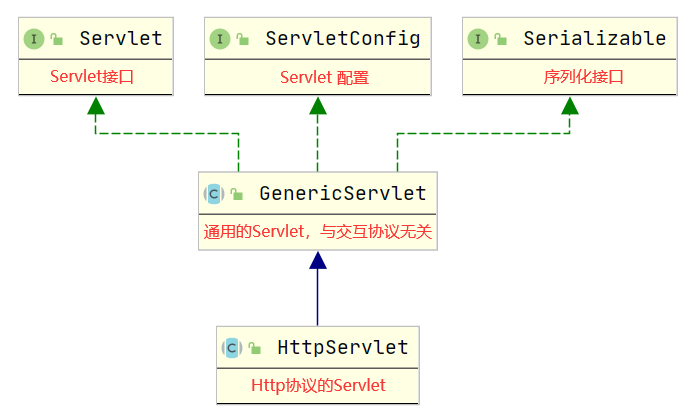
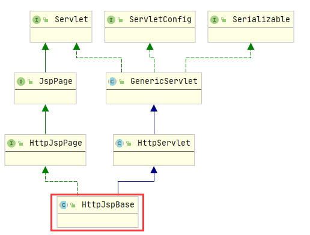
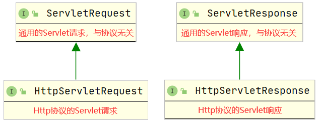
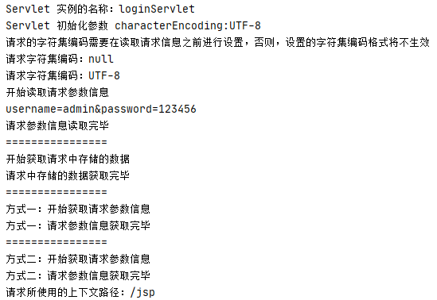
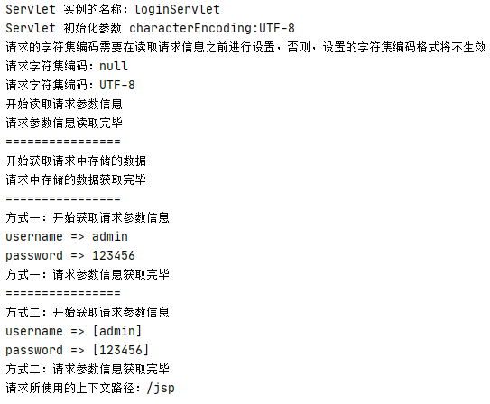
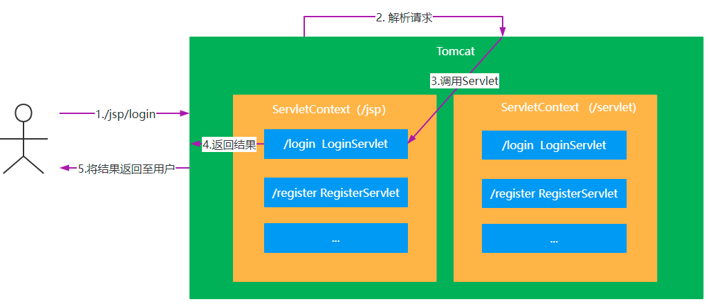
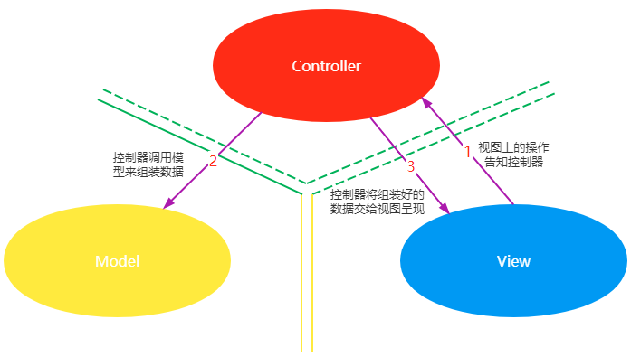
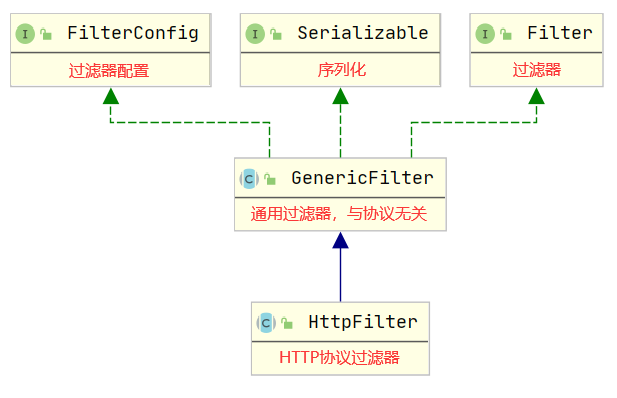
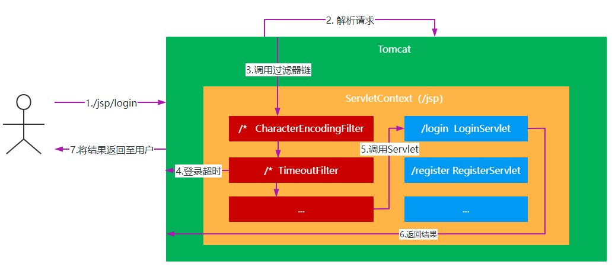

# Servlet 与 MVC

## 1. Servlet

### 1.1 概念

Servlet 是在服务器上运行的能够对客户端请求进行处理，并返回处理结构的程序

### 1.2 Servlet 体系结构



#### 1.2.1 Servlet 接口

```java
// Servlet对象的初始化，Servlet 对象初始化后才能处理请求，由 Servlet 容器调用
public void init(ServletConfig config) throws ServletException;
// 获取 Servlet 配置信息
public ServletConfig getServletConfig();
// 处理客户端的请求，由 Servlet 容器调用
public void service(ServletRequset req, ServletResponse res) throws ServletException, IOException;
// 返回有关 Servlet 的信息，比如作者、版本和版权
public String getServletInfo();
// 销毁Servlet，由Servlet容器调用
public void destroy;
```

#### 1.2.2 ServletConfig 接口

```java
// 获取Servlet的实例名称
public String getServletName();
// 返回正在执行的Servlet所在的上下文对象
public ServletContext getServletContext();
// 获取Servlet中给定名称的初始化参数
public String getInitParameter(String name);
// 获取Servlet中所有的初始化参数
public Enumeration<String> getInitParameterNames();
```

#### 1.2.3 Servlet 案例

```java
package com.sonnet.Servlet;

import jakarta.servlet.*;

import java.io.IOException;
import java.util.Enumeration;

public class FirstServlet implements Servlet {

    private ServletConfig servletConfig;

    // Servlet 的实例在该Servlet处理的第一次请求的时候才会创建，创建之后立刻调用初始化方法，完成Servlet初始化
    public FirstServlet() {
        System.out.println("create Servlet instance");
    }

    // Servlet初始化，只有初始化完成的Servlet才能提供处理请求的服务
    // init方法在该Servlet对象第一次处理请求的时候才调用
    @Override
    public void init(ServletConfig servletConfig) throws ServletException {
        this.servletConfig = servletConfig;
        // 获取Servlet配置的所有参数名称
        Enumeration<String> initParameterNames = servletConfig.getInitParameterNames();
        while (initParameterNames.hasMoreElements()) {
            // 获取下一个参数名
            // 即便是第一个元素，也必须先执行 nextElement()，
            // 因为集合在刚初始化完成时，游标处于第一个元素之前（可以理解为停留在位置 -1）。
            String parameterName = initParameterNames.nextElement();
            // 获取给定参数名称的参数值
            String parameterValue = servletConfig.getInitParameter(parameterName);
            System.out.println(parameterName + " -> " + parameterValue);
        }
        System.out.println("Servlet init complete");
    }

    // 获取Servlet配置
    @Override
    public ServletConfig getServletConfig() {
        return servletConfig;
    }

    // 处理请求的服务方法
    @Override
    public void service(ServletRequest servletRequest, ServletResponse servletResponse) throws ServletException, IOException {
        System.out.println("Servlet handle request and response");
        servletResponse.setContentType("text/html;charset=UTF-8");
        //servletResponse.getWriter().write("FirstServlet 运行成功");
    }

    @Override
    public String getServletInfo() {
        return "";
    }

    // Servlet销毁，不在提供服务
    // 在tomcat服务器关闭之前，Servlet被销毁
    @Override
    public void destroy() {
        System.out.println("Servlet destroy, no longer provide service");
    }
}
```

```xml
<?xml version="1.0" encoding="UTF-8"?>
<web-app xmlns="https://jakarta.ee/xml/ns/jakartaee"
         xmlns:xsi="http://www.w3.org/2001/XMLSchema-instance"
         xsi:schemaLocation="https://jakarta.ee/xml/ns/jakartaee https://jakarta.ee/xml/ns/jakartaee/web-app_6_0.xsd"
         version="6.0">
    <servlet>
        <servlet-name>firstServlet</servlet-name>
        <servlet-class>com.sonnet.Servlet.FirstServlet</servlet-class>
        <init-param>
            <param-name>characterEncoding</param-name>
            <param-value>UTF-8</param-value>
        </init-param>
        <init-param>
            <param-name>secondParameter</param-name>
            <param-value>2</param-value>
        </init-param>
        <load-on-startup>1</load-on-startup>
    </servlet>

    <servlet-mapping>
        <servlet-name>firstServlet</servlet-name>
        <url-pattern>/first</url-pattern>
    </servlet-mapping>
</web-app>

```

<font color = blue>结论</font>

<font color = "red">**Servlet 在第一次被请求的时候，由容器（如 Tomcat）创建实例，紧接着就由该容器调用该 Servlet 的 `init`方法完成初始化，然后由容器调用该 Servlet 的`service`方法进行请求处理，请求处理完成后，Servlet 并不会消亡，而是跟随容器共存亡，在容器关闭之前，由容器调用 Servlet 的`destroy`方法进行销毁**</font>	

<font color = "blue">JSP本质</font>

```java
package org.apache.jsp;
import javax.servlet.*;
import javax.servlet.http.*;
import javax.servlet.jsp.*;
public final class index_jsp extends org.apache.jasper.runtime.HttpJspBase
    implements org.apache.jasper.runtime.JspSourceDependent,
org.apache.jasper.runtime.JspSourceImports {
}
```




由此可以得出：<font color = "red">JSP  的本质就是Servlet，只是 JSP 注重的是页面展示的内容，而Servlet注重的是业务逻辑的处理</font>

### 1.3 请求处理与响应

#### 1.3.1 体系结构



#### 1.3.2 请求接口

##### 1.3.2.1 ServletRequest 接口常用方法

```java
//从请求中获取给定属性名对应的属性值
Object getAttribute(String attributeName);
//将给定的属性值以给定的属性名存储在请求中
void setAttribute(String attributeName, Object attributeValue);
//从请求中将给定的属性名移除
void removeAttribute(String attributeName);
//获取请求中存储的所有属性名
Enumeration<String> getAttributeNames();
//从请求中获取给定参数名对应的参数值（参数值是单个数据）
String getParameter(String parameterName);
//从请求中获取给定参数名对应的参数值（参数值是多个数据）
String[] getParameterValues(String parameterName);
//从请求中获取所有的参数名
Enumeration<String> getParameterNames();
//从请求中获取所有的参数名和参数值形成的映射
Map<String, String[]> getParameterMap();
//从请求中获取字符集编码
String getCharacterEncoding();
//设置请求的字符集编码
void setCharacterEncoding(String charset) throws
UnsupportedEncodingException;
//从请求中获取字符流，该字符流只能读取请求体中的数据信息，与下面的 getInputStream 方法只能二选一
BufferedReader getReader() throws IOException;
//从请求中获取字节流，该字节流只能读取请求体中的数据信息
ServletInputStream getInputStream() throws IOException;
//从请求中获取当前Servlet所在的上下文对象
ServletContext getServletContext();
//从请求中获取请求转发的对象
RequestDispatcher getRequestDispatcher(String path);
```

<font color = "blue">示例</font>

`FirstServlet`

```java
package com.sonnet.Servlet;

import jakarta.servlet.*;

import java.io.BufferedReader;
import java.io.IOException;
import java.util.Arrays;
import java.util.Enumeration;
import java.util.Map;
import java.util.function.DoubleToIntFunction;

public class FirstServlet implements Servlet {

    private ServletConfig servletConfig;

    // Servlet 的实例在该Servlet处理的第一次请求的时候才会创建，创建之后立刻调用初始化方法，完成Servlet初始化
    public FirstServlet() {
        System.out.println("create Servlet instance");
    }

    // Servlet初始化，只有初始化完成的Servlet才能提供处理请求的服务
    // init方法在该Servlet对象第一次处理请求的时候才调用
    @Override
    public void init(ServletConfig servletConfig) throws ServletException {
        this.servletConfig = servletConfig;
        // 获取Servlet配置的所有参数名称
        Enumeration<String> initParameterNames = servletConfig.getInitParameterNames();
        while (initParameterNames.hasMoreElements()) {
            // 获取下一个参数名
            // 即便是第一个元素，也必须先执行 nextElement()，
            // 因为集合在刚初始化完成时，游标处于第一个元素之前（可以理解为停留在位置 -1）。
            String parameterName = initParameterNames.nextElement();
            // 获取给定参数名称的参数值
            String parameterValue = servletConfig.getInitParameter(parameterName);
            System.out.println(parameterName + " -> " + parameterValue);
        }
        System.out.println("Servlet init complete");
    }

    // 获取Servlet配置
    @Override
    public ServletConfig getServletConfig() {
        return servletConfig;
    }

    // 处理请求的服务方法
    @Override
    public void service(ServletRequest servletRequest, ServletResponse servletResponse) throws ServletException, IOException {
        System.out.println("Servlet handle request and response");
        servletResponse.setContentType("text/html;charset=UTF-8");
        // 从请求中获取字符集编码
        String characterEncoding = servletRequest.getCharacterEncoding();
        System.out.println(characterEncoding);
        // 设置字符集编码
        servletRequest.setCharacterEncoding("UTF-8");
        characterEncoding = servletRequest.getCharacterEncoding();
        System.out.println(characterEncoding);
        System.out.println("======================");
        // 获取servletRequest对象中存储的属性名称
        Enumeration<String> attributeNames = servletRequest.getAttributeNames();
        System.out.println("attribute:");
        while (attributeNames.hasMoreElements()) {
            String attributeName = attributeNames.nextElement();
            Object attribute = servletRequest.getAttribute(attributeName);
            System.out.println(attributeName + " => " + attribute);
        }
        System.out.println("======================");
        // 获取servletRequest对象中存储的参数名称
        Enumeration<String> parameterNames = servletRequest.getParameterNames();
        System.out.println("parameter:");
        while (parameterNames.hasMoreElements()) {
            String parameterName = parameterNames.nextElement();
            String parameter = servletRequest.getParameter(parameterName);
            System.out.println(parameterName + " => " + parameter);
        }
        System.out.println("==========================");
        // 从请求中获取字符流
        BufferedReader reader = servletRequest.getReader();
        String line;
        while ((line = reader.readLine()) != null) {
            System.out.println(line);
        }
        System.out.println("============================");
        Map<String, String[]> parameterMap = servletRequest.getParameterMap();
        parameterMap.forEach((k, v) -> System.out.println(k + " => " + Arrays.toString(v)));
    }

    @Override
    public String getServletInfo() {
        return "";
    }

    // Servlet销毁，不在提供服务
    // 在tomcat服务器关闭之前，Servlet被销毁
    @Override
    public void destroy() {
        System.out.println("Servlet destroy, no longer provide service");
    }
}
```

`web.xml`

```xml
<?xml version="1.0" encoding="UTF-8"?>
<web-app xmlns="https://jakarta.ee/xml/ns/jakartaee"
         xmlns:xsi="http://www.w3.org/2001/XMLSchema-instance"
         xsi:schemaLocation="https://jakarta.ee/xml/ns/jakartaee https://jakarta.ee/xml/ns/jakartaee/web-app_6_0.xsd"
         version="6.0">
    <servlet>
        <servlet-name>firstServlet</servlet-name>
        <servlet-class>com.sonnet.Servlet.FirstServlet</servlet-class>
        <init-param>
            <param-name>characterEncoding</param-name>
            <param-value>UTF-8</param-value>
        </init-param>
        <init-param>
            <param-name>secondParameter</param-name>
            <param-value>2</param-value>
        </init-param>
        <load-on-startup>1</load-on-startup>
    </servlet>

    <servlet-mapping>
        <servlet-name>firstServlet</servlet-name>
        <url-pattern>/first</url-pattern>
    </servlet-mapping>
</web-app>

```

`index.jsp`

```jsp
<%--
  Created by IntelliJ IDEA.
  User: sonnet
  Date: 2026/9/3
  Time: 16:59
  To change this template use File | Settings | File Templates.
--%>
<%@ page contentType="text/html;charset=UTF-8" language="java" %>
<html>
<head>
    <title>welcome</title>
</head>
<body>
<form action="first" method="post">
    <div>
        <input type="text" name="username">
    </div>
    <div>
        <input type="password" name="password">
    </div>
    <div>
        <input type="submit" value="login">
    </div>
</form>
</body>
</html>
```

##### 1.3.2.2 POST请求测试



##### 1.3.2.3 GET请求测试



**<font color = "red">使用GET方式发送的请求，只能通过 getParameter 方法获取；使用PSOST方式发送的请求，只能使用流来获取。这是因为使用GET方式发送的请求，参数在URL地址中，解析这些参数的时候将其存放在一个Map集合中，因此可以直接获取。而POST方式发送的请求，参数在请求体中，这部分内容只能通过流来读取，然后再进行处理</font>**

#### 1.3.3 响应接口

ServletResponse 接口常用方法：

```java
//获取响应的字符集编码
String getCharacterEncoding();
//设置响应的字符集编码
void setCharacterEncoding(String charset);
//获取响应的内容类型
String getContentType();
//设置响应的内容类型
void setContentType(String contentType);
//获取输出流，主要用于下载文件
ServletOutputStream getOutputStream() throws IOException;
//获取打印流，主要用于向页面传输信息
PrintWriter getWriter() throws IOException;
```

<font color = "blue">示例</font>

```java
System.out.println("响应的字符集编码： " + servletResponse.getCharacterEncoding());
servletResponse.setCharacterEncoding("UTF-8");
System.out.println("响应的字符集编码： " + servletResponse.getCharacterEncoding());
System.out.println("响应的字符集类型： " + servletResponse.getContentType());
servletResponse.setContentType("text/html;charset=utf-8");
// 向页面输出数据的输出流
PrintWriter writer = servletResponse.getWriter();
writer.println("login request processed");
writer.flush();
writer.close();
```

#### 1.3.4 HTTP 请求和响应

##### 1.3.4.1 HttpServletRequest 接口常用方法

```java
//从请求中获取Cookie信息
Cookie[] getCookies();
//从请求中获取给定请求头名称对应的属性值
String getHeader(String headerName);
//从请求中获取所有的请求头名称
Enumeration<String> getHeaderNames();
//获取请求的方式：GET、POST、PUT、DELETE等
String getMethod();
//从请求中获取上下文路径
String getContextPath();
//从请求中获取session
HttpSession getSession();
//获取请求地址
String getRequestURI();
```

##### 1.3.4.2 HttpServletResponse 接口常用方法

```java
//添加客户端存储的Cookie信息
void addCookie(Cookie cookie);
//返回错误状态及错误信息
void sendError(int status, String errorMsg) throws IOException;
//返回错误状态
void sendError(int status) throws IOException;
//重定向至新的资源
void sendRedirect(String redirectURL) throws IOException;
//设置响应头信息
void setHeader(String headerName, String headerValue);
//添加响应头信息
void addHeader(String headerName, String headerValue);
//设置响应状态
void setStatus(int status);
```

##### 1.3.4.3 HttpServlet常用方法（支持 HTTP 协议的Servlet）

```java
//对父类抽象方法的实现，该方法是对HTTP协议的交互信息的实现，调用的是下面的 service 方法
void service(ServletRequest req,ServletResponse res);
//HTTP协议的交互信息的实现，该方法主要针对不同的请求方式进行处理。GET请求会调用 doGet 方
法处理，
//POST请求会调用 doPost 处理， PUT请求会调用 doPut 方法处理， DELETE请求会调用
doDelete 方法处理
void service(HttpServletRequest req, HttpServletResponseres);
//GET请求处理
void doGet(HttpServletRequestreq,HttpServletResponse res);
//POST请求处理
void doPost(HttpServletRequestreq,HttpServletResponse res);
//PUT请求处理
void doPut(HttpServletRequestreq,HttpServletResponse res);
//DELETE请求处理
void doDelete(HttpServletRequestreq,HttpServletResponse res);
```

##### 1.3.4.4 案例

```java
System.out.println("======================");
System.out.println("响应的字符集编码： " + servletResponse.getCharacterEncoding());
servletResponse.setCharacterEncoding("UTF-8");
System.out.println("响应的字符集编码： " + servletResponse.getCharacterEncoding());
System.out.println("响应的字符集类型： " + servletResponse.getContentType());
servletResponse.setContentType("text/html;charset=utf-8");
System.out.println("响应的字符集类型： " + servletResponse.getContentType());
// 向页面输出数据的输出流
PrintWriter writer = servletResponse.getWriter();
writer.println("login request processed");
writer.flush();
writer.close();
```

#### 1.3.5 Servlet 交互流程



### 1.4 ServletContext

常用方法：

```java
//获取上下问参数
String getContextPath();
//获取给定相对路径对应的绝对路径
String getRealPath(String path);
//获取上下文初始化参数中给定参数名对应的参数值
String getInitParameter(String parameterName);
//获取上下文初始化参数中所有的参数名
Enumeration<String> getInitParameterNames();
//获取上下文存储的数据中给定属性名对应的属性值
Object getAttribute(String attributeName);
//获取上下文存储的数据中所有的属性名
Enumeration<String> getAttributeNames();
//将给定的属性值使用给定的属性名存储在上下文中
void setAttribute(String attributeName, Object attributeValue);
//从上下文存储的数据中将给定的属性名移出
void removeAttribute(String attributeName);
```

<font color = "blue">示例</font>


## 2. MVC

### 2.1 什么是MVC

模型-视图-控制器（MVC模式）是一种非常经典的软件架构模式，在UI框架和UI设计思路中扮演着非常

重要的角色。从设计模式的角度来看，MVC模式是一种复合模式，它将多个设计模式在一种解决方案中

结合起来，用来解决许多设计问题。MVC模式把用户界面交互分拆到不同的三种角色中，使应用程序被

分成三个核心部件：Model（模型）、View（视图）、Control（控制器）



* 模型：模型持有所有的数据、状态和程序逻辑。模型独立于视图和控制器。
* 视图：用来呈现模型。视图通常直接从模型中取得它需要显示的状态与数据。对于相同的信息可以有多个不同的显示形式或视图。
* 控制器：位于视图和模型中间，负责接受用户的输入，将输入进行解析并反馈给模型

MVC模式将它们分离以提高系统的灵活性和复用性，不使用MVC模式，用户界面设计往往将这些对象混在一起。MVC模式实现了模型和视图的分离，使得其具有以下优点：

* 一个模型提供不同的多个视图表现形式，也能够为一个模型创建新的视图而无须重写模型。一旦模型的数据发生变化，模型将通知有关的视图，每个视图相应地刷新自己。
* 模型可复用。因为模型是独立于视图的，所以可以把一个模型独立地移植到新的平台工作。
* 提高开发效率。在开发界面显示部分时，仅仅需要考虑的是如何布局一个好的用户界面；开发模型时，仅仅要考虑的是业务逻辑和数据维护，这样能使开发者专注于某一方面的开发，提高开发效率。

### 2.2 JSP 中的 MVC

在 JSP 中 Servlet 扮演的是控制器， JSP 页面扮演的是视图，Java Bean 扮演的是模型。

<font color = "blue">示例</font>

将用户信息呈现在页面上


## 3. 过滤器

### 3.1 什么是过滤器

过滤器是一个服务器端的组件，可以拦截客户端的请求和响应信息并对这些信息进行过滤。

### 3.2 过滤器体系结构



#### 3.2.1 Filter 接口

```java
//过滤器初始化
default void init(FilterConfig filterConfig) throws ServletException {
}
//过滤操作，与协议无关
void doFilter(ServletRequest req, ServletResponse resp, FilterChain chain)
throws IOException, ServletException;
//过滤器销毁
default void destroy() {
}
```

#### 3.2.2 FilterConfig 接口

```java
//获取过滤器实例的名称
String getFilterName();
//获取Servlet上下文
ServletContext getServletContext();
//从过滤器初始化配置中获取给定属性名对应的属性值
String getInitParameter(String parameterName);
//获取过滤器初始化配置中所有的属性名
Enumeration<String> getInitParameterNames();
```

#### 3.2.3 案例


#### 3.2.4 HttpFilter 抽象类

```java
//重写无协议过滤器操作，调用下面支持HTTP协议请求过滤操作的方法
public void doFilter(ServletRequest request, ServletResponse response,
FilterChain chain) throws IOException, ServletException {}
//HTTP协议请求过滤操作的方法
protected void doFilter(HttpServletRequest request, HttpServletResponse
response, FilterChain chain) throws IOException, ServletException {}
```

<font color = "blue">示例</font>

使用过滤器完成登录超时处理


#### 3.2.5 Filter 交互流程



