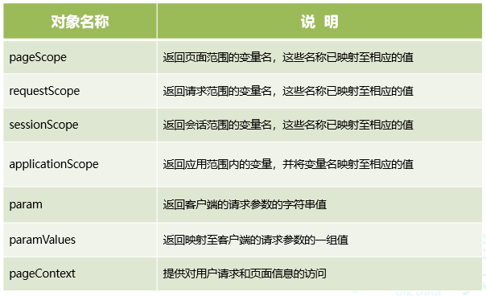
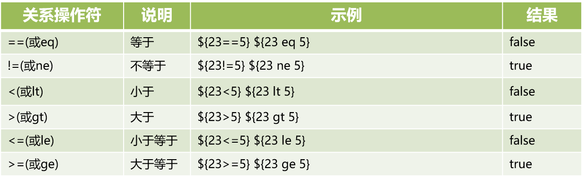
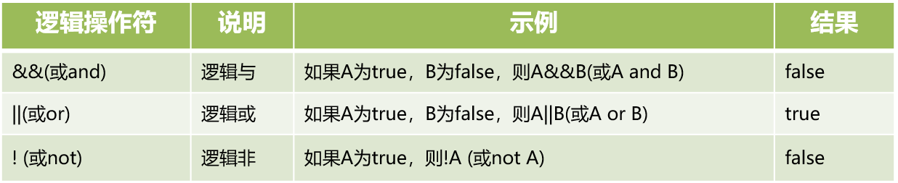
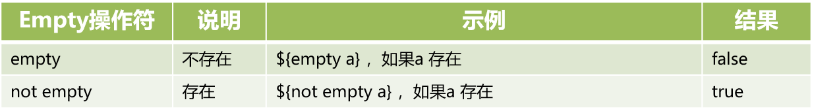
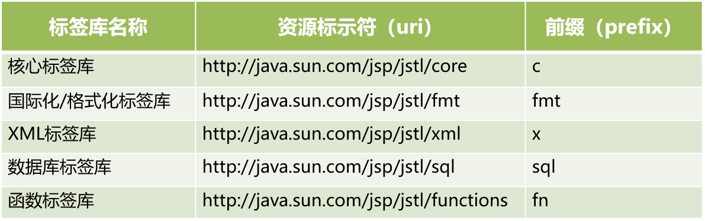
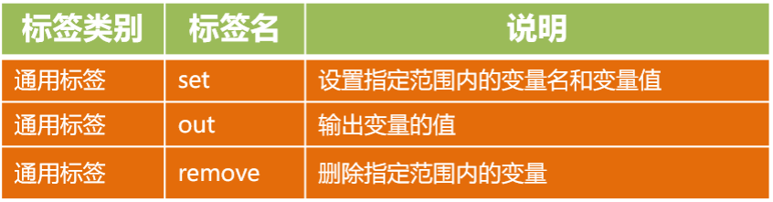

# EL 表达式和JSTL 标签

## 1. EL 表达式

### 1.1 什么是 EL 表达式

EL 全称为 Expression Language（表达式语言）

### 1.2  为什么要使用 EL 表达式

在 jsp 页面中编写小脚本，会存在以下不足：

* 代码结构混乱
* 脚本与HTML混合，容易出错
* 代码不易于维护
* 获取javaBean属性必须要实例化及强制类型转化

为了解决这些不足 JSP 提供了 EL 表达式来简化编码，可以使用 EL 表达式来替换 jsp 页面中的小脚本，使得页面和业务逻辑处理相分离，同时还能实现数据类型的自动转型

### 1.3 如何使用 EL 表达式

#### 1.3.1 EL 获取变量的值

<font color = "blue">语法</font>

```jsp
${变量名}
```

<font color = "blue">示例</font>

*使用session存储：*

`ManageServlet`

```java
package com.sonnet.jsp.servlet;

import jakarta.servlet.ServletException;
import jakarta.servlet.annotation.WebServlet;
import jakarta.servlet.http.HttpServlet;
import jakarta.servlet.http.HttpServletRequest;
import jakarta.servlet.http.HttpServletResponse;

import java.io.IOException;

@WebServlet("/showData")
public class ManagerServlet extends HttpServlet {

    @Override
    protected void doPost(HttpServletRequest req, HttpServletResponse resp) throws ServletException, IOException {
        req.getSession().setAttribute("user", "张三");
        // 转发，地址栏不变，依旧是showData
        //req.getRequestDispatcher("manage.jsp").forward(req, resp);

        // 重定向，地址栏会改变，变为manage.jsp
        resp.sendRedirect("manage.jsp");
    }
}
```

`index.jsp`

```jsp
<%--
  Created by IntelliJ IDEA.
  User: sonnet
  Date: 2026/9/5
  Time: 16:02
  To change this template use File | Settings | File Templates.
--%>
<%@ page contentType="text/html;charset=UTF-8" language="java" %>
<html>
<head>
    <title>首页</title>
</head>
<body>
    <form action="showData" method="post">
        <input type="submit" value="显示数据">
    </form>
</body>
</html>
```

`manage.jsp`

```jsp
<%--
  Created by IntelliJ IDEA.
  User: sonnet
  Date: 2026/9/5
  Time: 16:04
  To change this template use File | Settings | File Templates.
--%>
<%@ page contentType="text/html;charset=UTF-8" language="java" %>
<html>
<head>
    <title>管理页面</title>
</head>
<body>
    ${user}
</body>
</html>
```

*使用request转发：*

```java
package com.sonnet.jsp.servlet;

import jakarta.servlet.ServletException;
import jakarta.servlet.annotation.WebServlet;
import jakarta.servlet.http.HttpServlet;
import jakarta.servlet.http.HttpServletRequest;
import jakarta.servlet.http.HttpServletResponse;

import java.io.IOException;

@WebServlet("/showData")
public class ManagerServlet extends HttpServlet {

    @Override
    protected void doPost(HttpServletRequest req, HttpServletResponse resp) throws ServletException, IOException {
        // 使用session存储
        //req.getSession().setAttribute("user", "张三");

        // 使用request存储
        req.setAttribute("user", "admin");

        // 转发，地址栏不变，依旧是showData
        req.getRequestDispatcher("manage.jsp").forward(req, resp);

        // 重定向，地址栏会改变，变为manage.jsp
        //resp.sendRedirect("manage.jsp");
    }
}
```

<font color = "blue">结论</font>

不论变量是存储在request中，还是存储在 session 中，都可以使用 EL 表达式进行取值。

<font color = "blue">思考</font>

如果 request 和 session 中都存有相同的属性值，那么使用 EL 取值的时候，是从哪个对象中取值呢？

```java
package com.sonnet.jsp.servlet;

import jakarta.servlet.ServletException;
import jakarta.servlet.annotation.WebServlet;
import jakarta.servlet.http.HttpServlet;
import jakarta.servlet.http.HttpServletRequest;
import jakarta.servlet.http.HttpServletResponse;

import java.io.IOException;

@WebServlet("/showData")
public class ManagerServlet extends HttpServlet {

    @Override
    protected void doPost(HttpServletRequest req, HttpServletResponse resp) throws ServletException, IOException {
        // 使用session存储
        req.getSession().setAttribute("user", "张三");

        // 使用request存储
        req.setAttribute("user", "admin");

        // 转发，地址栏不变，依旧是showData
        req.getRequestDispatcher("manage.jsp").forward(req, resp);

        // 重定向，地址栏会改变，变为manage.jsp
        //resp.sendRedirect("manage.jsp");
    }
}
```

<font color = "blue">结论</font>

如果 request 和 session 中都存有相同属性的变量，那么 EL 表达式会从 request 中进行取值。如果需要从 session 中取值的话，需要使用 EL 隐式对象

#### 1.3.2 EL 隐式对象



*Scope 表示作用范围*

可以通过隐式对象来指定 EL 的取值的范围：

```jsp
<!--在session范围内取值-->
${sessionScope.user}
```

<font color = "blue">示例</font>

```jsp
<%--
  Created by IntelliJ IDEA.
  User: sonnet
  Date: 2026/9/5
  Time: 16:04
  To change this template use File | Settings | File Templates.
--%>
<%@ page contentType="text/html;charset=UTF-8" language="java" %>
<html>
<head>
    <title>管理页面</title>
</head>
<body>
    ${requestScope.user}<br>
    ${sessionScope.user}
</body>
</html>
```

```tex
admin
张三
```

如果 EL 未指定隐式对象，则取值默认从 pageScope 取值，如果未找到，则从requestScope取值，如果还是未找到，则从 sessionScope 取值，如果仍然未找到，则从applicationScope 取值，如果最终都未找到，那么返回null值

#### 1.3.3 EL 获取对象的属性值

<font color = "blue">语法</font>

```jsp
<!--Java中的访问方式-->
${ 对象名.属性名 }

<!--JS中的访问方式-->
${ 对象名["属性名"] }
```

<font color = "blue">示例</font>

`User`

```java
package com.sonnet.jsp.pojo;

public class User {

    private String name;

    private String sex;

    public User(String name, String sex) {
        this.name = name;
        this.sex = sex;
    }

    public String getName() {
        return name;
    }

    public void setName(String name) {
        this.name = name;
    }

    public String getSex() {
        return sex;
    }

    public void setSex(String sex) {
        this.sex = sex;
    }
}
```

`ManageServlet`

```java
package com.sonnet.jsp.servlet;

import com.sonnet.jsp.pojo.User;
import jakarta.servlet.ServletException;
import jakarta.servlet.annotation.WebServlet;
import jakarta.servlet.http.HttpServlet;
import jakarta.servlet.http.HttpServletRequest;
import jakarta.servlet.http.HttpServletResponse;

import java.io.IOException;

@WebServlet("/showData")
public class ManagerServlet extends HttpServlet {

    @Override
    protected void doPost(HttpServletRequest req, HttpServletResponse resp) throws ServletException, IOException {
        // 使用session存储
        req.getSession().setAttribute("user", new User("李四", "女"));

        // 使用request存储
        req.setAttribute("user", new User("张三", "男"));

        // 转发，地址栏不变，依旧是showData
        req.getRequestDispatcher("manage.jsp").forward(req, resp);

        // 重定向，地址栏会改变，变为manage.jsp
        //resp.sendRedirect("manage.jsp");
    }
}
```

`manage.jsp`

```jsp
<%--
  Created by IntelliJ IDEA.
  User: sonnet
  Date: 2026/9/5
  Time: 16:04
  To change this template use File | Settings | File Templates.
--%>
<%@ page contentType="text/html;charset=UTF-8" language="java" %>
<html>
<head>
    <title>管理页面</title>
</head>
<body>
    <div>
        ${requestScope.user.name} &nbsp;&nbsp; ${requestScope.user["sex"]}
    </div>
    <div>
        ${sessionScope.user.name} &nbsp;&nbsp; ${sessionScope.user["sex"]}
    </div>

</body>
</html>
```

#### 1.3.4 EL 获取 List 集合中的值

<font color = "blue">语法</font>

```jsp
${ 集合名称[下标] }
```

<font color = "blue">示例</font>

```jsp
<%--
  Created by IntelliJ IDEA.
  User: sonnet
  Date: 2026/9/5
  Time: 16:04
  To change this template use File | Settings | File Templates.
--%>
<%@ page contentType="text/html;charset=UTF-8" language="java" %>
<html>
<head>
    <title>管理页面</title>
</head>
<body>
    <div>
        ${requestScope.user.name} &nbsp;&nbsp; ${requestScope.user["sex"]}
    </div>
    <div>
        ${sessionScope.user.name} &nbsp;&nbsp; ${sessionScope.user["sex"]}
    </div>

    <div>
        ${sessionScope.users[0].name} &nbsp;&nbsp; ${sessionScope.users[0]["sex"]}
    </div>
    <div>
        ${sessionScope.users[1].name} &nbsp;&nbsp; ${sessionScope.users[1]["sex"]}
    </div>

</body>
</html>
```

#### 1.3.5 EL 获取 Map 集合中的值

<font color = "blue">语法</font>

```jsp
<!--Java中的访问方式-->
${ 集合名称.键名 }

<!--JS中的访问方式-->
${ 集合名称["键名"] }
```

<font color = "blue">示例</font>

```jsp
<div>
    ${sessionScope.data.admin}
</div>
<div>
    ${sessionScope.data.test}
</div>
```

#### 1.3.6 EL 表达式中的操作字符







*同时还支持三元运算符*

## 2. JSTL 标签

### 2.1 什么是 JSTL

JSTL 全称为 JavaServerPages Standard Tag Library，意味 JSP标准标签库

### 2.2 为什么要使用 JSTL

EL 能够简化 jsp 页面编码，但是，却不能进行逻辑判断，也不能进行循环处理，为了弥补 EL 这方面的不足，jsp 提供了 JSTL 标签，JSTL 标签通常都会与 EL 配合使用，解决页面的逻辑问题。

### 2.3 JSTL 标签库分类



经常使用的标签就是**核心标签**和**格式化标签库**

### 2.4 JSTL 标签库的使用步骤

* 引入 JSTL 标签库支持的jar包：`jstl.jar`和`standard.jar`
* jsp 页面引入标签，如`<%@ taglib prefix="c" uri="jakarta.tags.core" %>`

### 2.5 JSTL 核心标签库

#### 2.5.1 通用标签



* `<c:set>`标签

  <font color = "blue">语法</font>

  ```jsp
  <!--将value值存储到范围为scope的变量variable中-->
  <c:set var="变量名"value="变量值"scope="变量的作用范围"/>
  <!--将value值设置到对象的属性中-->
  <c:set target="目标对象"property="对象属性"value="对象属性值"/>
  ```

  <font color = "blue">示例</font>

  ```jsp
  <%@ page import="com.sonnet.jsp.pojo.User" %><%--
    Created by IntelliJ IDEA.
    User: sonnet
    Date: 2026/9/5
    Time: 18:49
    To change this template use File | Settings | File Templates.
  --%>
  <%@ page contentType="text/html;charset=UTF-8" language="java" %>
  <%--引入jstl标签库--%>
  <%@ taglib prefix="c" uri="jakarta.tags.core"%>
  <html>
  <head>
      <title>jstl</title>
  </head>
  <body>
  <%
      User user = new User();
  %>
      <div>
          <%--这相当于在页面创建了一个名为test的变量--%>
          <c:set var="test" value="测试" scope="page" />
          <c:set target="<%=user%>" value="管理员" property="name"/>
      </div>
  
      <div>
          页面范围内的变量：${pageScope.test}
      </div>
      <div>
          <%=user.getName()%>
      </div>
  </body>
  </html>
  ```

* `<c:remove>`标签

  <font color = "blue">语法</font>

  ```jsp
  <c:removevar="变量名"scope="变量的作用范围"/>
  ```

  <font color = "blue">示例</font>
  
  ```jsp
  <%@ page import="com.sonnet.jsp.pojo.User" %><%--
    Created by IntelliJ IDEA.
    User: sonnet
    Date: 2026/9/5
    Time: 18:49
    To change this template use File | Settings | File Templates.
  --%>
  <%@ page contentType="text/html;charset=UTF-8" language="java" %>
  <%--引入jstl标签库--%>
  <%@ taglib prefix="c" uri="jakarta.tags.core"%>
  <html>
  <head>
      <title>jstl</title>
  </head>
  <body>
  <%
      User user = new User();
  %>
      <div>
          <%--这相当于在页面创建了一个名为test的变量--%>
          <c:set var="test" value="测试" scope="page" />
          <c:set target="<%=user%>" value="管理员" property="name"/>
      </div>
  
      <div>
          页面范围内的变量：${pageScope.test}
      </div>
      <div>
          <%=user.getName()%>
      </div>
  
      <%--移除页面范围内的test变量--%>
      <c:remove var="test" scope="page"/>
      <div>
          页面范围内的变量：${pageScope.test}
      </div>
  
  </body>
  </html>
  ```

#### 2.5.2 条件标签

* `<c : if>`标签

  <font color = "blue">语法</font>

  ```jsp
  <c:if test="条件表达式" var="存储表达式的结果的变量" scope="变量的作用范围">
      
  </c:if>
  ```

  <font color = "blue">示例</font>

  `Score`

  ```java
  package com.sonnet.jsp.pojo;
  
  public class Score {
  
      private String name;
  
      private Double score;
  
      public Score(String name, Double score) {
          this.name = name;
          this.score = score;
      }
  
      public Score() {}
  
      public String getName() {
          return name;
      }
  
      public void setName(String name) {
          this.name = name;
      }
  
      public Double getScore() {
          return score;
      }
  
      public void setScore(Double score) {
          this.score = score;
      }
  }
  ```

  `ScoreServlet`

  ```java
  package com.sonnet.jsp.servlet;
  
  import com.sonnet.jsp.pojo.Score;
  import jakarta.servlet.ServletException;
  import jakarta.servlet.annotation.WebServlet;
  import jakarta.servlet.http.HttpServlet;
  import jakarta.servlet.http.HttpServletRequest;
  import jakarta.servlet.http.HttpServletResponse;
  
  import java.io.IOException;
  
  @WebServlet("/showScore")
  public class ScoreServlet extends HttpServlet {
  
      @Override
      protected void doGet(HttpServletRequest req, HttpServletResponse resp) throws ServletException, IOException {
          req.getSession().setAttribute("zhangsan", new Score("张三", 80.5));
          resp.sendRedirect("score.jsp");
      }
  }
  ```

  `index.jsp`

  ```jsp
  <%--
    Created by IntelliJ IDEA.
    User: sonnet
    Date: 2026/9/5
    Time: 16:02
    To change this template use File | Settings | File Templates.
  --%>
  <%@ page contentType="text/html;charset=UTF-8" language="java" %>
  <html>
  <head>
      <title>首页</title>
  </head>
  <body>
      <form action="showData" method="post">
          <input type="submit" value="显示数据">
      </form>
  
      <a href="showScore">展示成绩</a>
  </body>
  </html>
  ```

  `score.jsp`

  ```jsp
  <%--
    Created by IntelliJ IDEA.
    User: sonnet
    Date: 2026/9/5
    Time: 20:10
    To change this template use File | Settings | File Templates.
  --%>
  <%@ page contentType="text/html;charset=UTF-8" language="java" %>
  <%@ taglib prefix="c" uri="jakarta.tags.core" %>
  <html>
  <head>
      <title>成绩信息展示</title>
  </head>
  <body>
      <c:if test="${sessionScope.zhangsan.score > 80}" var="result" scope="request">
          <div>成绩高于80</div>
      </c:if>
      <div>成绩高于80吗? ${requestScope.result}</div>
  </body>
  </html>
  ```

* `<c:choose>标签`

  <font color = "blue">语法</font>

  ```jsp
  <c:choose>
      <c:when test="条件表达式"></c:when>
      <c:when test="条件表达式"></c:when>
      <c:otherwise></c:otherwise>
  </c:choose>
  ```

  <font color = "blue">示例</font>	

  ```jsp
  <c:choose>
      <c:when test="${sessionScope.zhangsan.score > 80}">
          <div>成绩良好</div>
      </c:when>
      <c:when test="${sessionScope.zhangsan.score > 70}">
          <div>成绩中等</div>
      </c:when>
      <c:otherwise>
          <div>成绩较差</div>
      </c:otherwise>
  </c:choose>
  ```

* `<c:forEach>`标签

  <font color = "blue">语法</font>

  ```jsp
  <c:forEach items="遍历的集合" var="每次遍历的对象" begin="遍历开始的位置" end="遍历结束的位置" step="遍历的步长">
  </c:forEach>
  ```

  <font color = "blue">示例</font>

  ```jsp
  <%--
    Created by IntelliJ IDEA.
    User: sonnet
    Date: 2026/9/5
    Time: 20:10
    To change this template use File | Settings | File Templates.
  --%>
  <%@ page contentType="text/html;charset=UTF-8" language="java" %>
  <%@ taglib prefix="c" uri="jakarta.tags.core" %>
  <html>
  <head>
      <title>成绩信息展示</title>
      <style>
          table, th, td {
              border: 1px solid black;
          }
      </style>
  </head>
  <body>
      <c:if test="${sessionScope.zhangsan.score > 80}" var="result" scope="request">
          <div>成绩高于80</div>
      </c:if>
      <div>成绩高于80吗? ${requestScope.result}</div>
  
  
      <c:choose>
          <c:when test="${sessionScope.zhangsan.score > 80}">
              <div>成绩良好</div>
          </c:when>
          <c:when test="${sessionScope.zhangsan.score > 70}">
              <div>成绩中等</div>
          </c:when>
          <c:otherwise>
              <div>成绩较差</div>
          </c:otherwise>
      </c:choose>
  
      <table>
          <thead>
          <tr>
              <th>姓名</th>
              <th>成绩</th>
          </tr>
          </thead>
          <tbody>
          <c:forEach items="${sessionScope.scores}" var="score" begin="2" step="3" end="14">
              <tr>
                  <td>
                      ${score.name}
                  </td>
                  <td>
                      ${score.score}
                  </td>
              </tr>
          </c:forEach>
          </tbody>
      </table>
  </body>
  </html>
  ```

### 2.6 格式化标签


* `<fmt:formaDate>`标签

  <font color = "blue">语法</font>

  ```jsp
  <fmt:formatDate value="日期对象" pattern="日期格式" />
  ```

  <font color = "blue">示例</font>

* `<fmt:formatNumber>`标签

  <font color = "blue">语法</font>

  ```jsp
  <!-- 货币格式的数字 -->
  <fmt:formatNumber value="数字" type="currency" />
  <!-- 数字格式化 -->
  <fmt:formatNumber value="数字" type="number" maxIntegerDigits="整数部分位数"/>
  <fmt:formatNumber value="数字" type="number" maxFractionDigits="小数部分位数"/>
  <fmt:formatNumber value="数字" type="number" pattern="数字格式" />
  <!-- 数字百分比 -->
  <fmt:formatNumber value="数字" type="percent" maxIntegerDigits="整数部分位数"/>
  <fmt:formatNumber value="数字" type="percent" maxFractionDigits="小数部分位数"/>
  ```

  <font color = "blue">示例</font>

  

