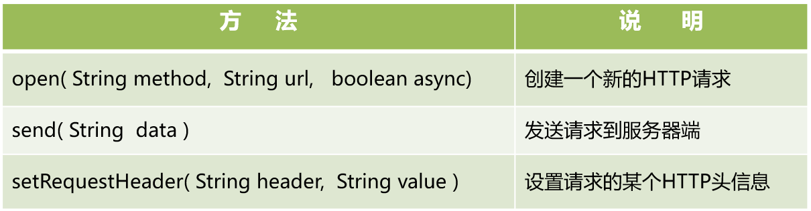

# AJAX 与 JSON

## 1. AJAX

### 1.1 什么是ajax

AJAX 全称为 `Asynchronous JavaScript And Xml` ，表示异步的Java脚本和 `Xml` 文件，是一种异步刷新技术。

### 1.2 为什么要使用ajax

Servlet 进行网页的变更往往是通过请求转发或者是重定向来完成，这样的操作更新的是整个网页，如果我们只需要更新网页的局部内容，就需要使用到AJAX来处理了。因为只是更新局部内容，因此，Servlet 传输的数据量就减少了，这不仅有效的利用了带宽，提高效率的同时还增加了用户的体验度，操作起来更为方便。

### 1.3 AJAX的核心

*   IE浏览器：`ActiveXObject`
*   其他浏览器：`XMLHttpRequest`

AJAX的核心是一个对象，既然是对象，那么就应该存在属性和方法。

<font color = "blue">常用方法</font>



<font color = "blue">常用属性</font>

*   `onreadystatechange` : 监听就绪状态改变的事件，必须给定一个函数
*   `readyState` : XMLHttpRequest 的状态信息
*   `status` : HTTP的状态码
*   `responseText` : 以文本形式获得响应的内容
*   `responseXML` : 将XML格式的响应内容解析成DOM对象

### 1.4 应用场景

#### 1.4.1 用户名检测

使用 ajax 完成注册时用户名是否可用

`CheckUsernameServlet`

```java
package com.sonnet.ajax.servlet;

import jakarta.servlet.ServletException;
import jakarta.servlet.annotation.WebServlet;
import jakarta.servlet.http.HttpServlet;
import jakarta.servlet.http.HttpServletRequest;
import jakarta.servlet.http.HttpServletResponse;

import java.io.IOException;
import java.io.PrintWriter;

@WebServlet("/checkUsername")
public class CheckUsernameServlet extends HttpServlet {

    @Override
    protected void doGet(HttpServletRequest req, HttpServletResponse resp) throws ServletException, IOException {
        PrintWriter writer = resp.getWriter();
        String username = req.getParameter("username");
        if ("admin".equals(username)) {
            // 这里不可以使用println，使用println传输的数据是"1/r/n"
            writer.print(1);  // 1表示用户名已经存在
        } else {
            writer.print(0);  // 用户名可以注册
        }
        writer.flush();
        writer.close();
    }
}
```

`register.jsp`

```jsp
<%--
  Created by IntelliJ IDEA.
  User: sonnet
  Date: 2026/9/6
  Time: 14:28
  To change this template use File | Settings | File Templates.
--%>
<%@ page contentType="text/html;charset=UTF-8" language="java" %>
<html>
<head>
    <title>用户注册</title>
</head>
<body>
    <form action="" method="post">
        <span>用户名：</span>
        <input type="text" name="username" id="username">
        <span style="color: red" id="tip"></span>
    </form>
</body>
<script type="text/javascript">
    let element = document.getElementById("username");
    // 为username元素添加一个失去焦点的事件
    element.onblur = function () {
        let value = element.value;
        if (value !== "") {
            let xmlHttpRequest;
            if (window.ActiveXObject) { // 检测window中是否存在ActiveXObject这个对象
                // 微软的IE需要这种方式来获取Ajax核心对象
                xmlHttpRequest = new ActiveXObject("Microsoft.XMLHTTP")
            } else {
                xmlHttpRequest = new XMLHttpRequest();
            }
            xmlHttpRequest.onreadystatechange = function () {
                // 就绪状态为4的时候表示已经将服务器传输回来
                if (xmlHttpRequest.readyState === 4) {
                    // HTTP状态码为200的时候，说明该请求处理成功
                    if (xmlHttpRequest.status === 200) {
                        let tip = document.getElementById("tip");
                        let responseText = xmlHttpRequest.responseText;
                        // 这里需要对结果进行处理
                        if (responseText === "1") { // 用户名已经存在
                            tip.innerText = "该账号已经被注册";
                            tip.style.color = "red";
                        } else {
                            tip.innerText = "该账号可以注册";
                            tip.style.color = "green";
                        }
                    }
                }
            }
            // GET请求发送数据的方式是在URL地址后面进行数据的拼接
            // true表示异步，false表示同步
            xmlHttpRequest.open("get", "checkUsername?username=" + value, true)
            // 这个表四发送数据，GET请求方式直接为空即可
            xmlHttpRequest.send();
        }

    }
</script>
</html>
```

#### 1.4.2 登录

使用 ajax 完成登录

`login.jsp`

```jsp
<%--
  Created by IntelliJ IDEA.
  User: sonnet
  Date: 2026/9/6
  Time: 16:05
  To change this template use File | Settings | File Templates.
--%>
<%@ page contentType="text/html;charset=UTF-8" language="java" %>
<html>
<head>
    <title>Ajax登录</title>
</head>
<body>
    <form action="login" method="post">
        <div>
            <input type="text" name="username" id="username">
        </div>
        <div>
            <input type="password" name="password" id="password">
        </div>
        <div>
            <input type="button" value="登录" id="loginBtn">
        </div>
    </form>
</body>
<script type="text/javascript">
    document.getElementById("loginBtn").onclick = function () {
        let username = document.getElementById("username").value;
        let password = document.getElementById("password").value;
        let xmlHttpRequest;
        // 检测window中是否存在ActiveXObject这个对象
        // 微软的IE需要这种方式来获取Ajax核心对象
        if (window.ActiveXObject) {
            xmlHttpRequest = new ActiveXObject("Microsoft.XMLHTTP");
        } else {
            xmlHttpRequest = new XMLHttpRequest();
        }
        xmlHttpRequest.onreadystatechange = function () {
            if (xmlHttpRequest.readyState === 4) {
                if (xmlHttpRequest.status === 200) {
                    let result = xmlHttpRequest.responseText;
                    if (result === "3") {
                        alert("账号密码错误");
                    } else if (result==="4") {
                        alert("登录成功");
                    } else {
                        alert("1111")
                    }
                }
            }
        };
        xmlHttpRequest.open("post", "login", true);
        // POST 方式发送请求时，携带数据一定要请求头，设置传输数据的类型为
        // application/x-www-form-urlencoded其作用将键值对的参数用&连接起来
        // 如果有空格，如果有空格将空格转换为+加号，将特殊符号转化为ASCII HEX值
        xmlHttpRequest.setRequestHeader("Content-type", "application/x-www-form-urlencoded;charset=UTF-8")
        // post请求发送数据需要在send方法中
        // 使用 encodeURIComponent() 可以正确处理中文、空格、&、= 等特殊字符。
        xmlHttpRequest.send("username=" + encodeURIComponent(username) + "&password=" + encodeURIComponent(password))
    }
</script>
</html>
```

`LoginServlet`

```java
package com.sonnet.ajax.servlet;

import jakarta.servlet.ServletException;
import jakarta.servlet.annotation.WebServlet;
import jakarta.servlet.http.HttpServlet;
import jakarta.servlet.http.HttpServletRequest;
import jakarta.servlet.http.HttpServletResponse;

import java.io.IOException;
import java.io.PrintWriter;

@WebServlet("/login")
public class LoginServlet extends HttpServlet {

    @Override
    protected void doPost(HttpServletRequest req, HttpServletResponse resp) throws ServletException, IOException {
        String username = req.getParameter("username");
        String password = req.getParameter("password");
        int flag = 3;
        if ("admin".equals(username) && "123456".equals(password)) {
            flag = 4;
        }
        PrintWriter writer = resp.getWriter();
        writer.print(flag);
        writer.flush();
        writer.close();
    }
}
```

#### 1.4.3 Ajax 封装

`login.jsp`

```jsp
<%--
  Created by IntelliJ IDEA.
  User: sonnet
  Date: 2026/9/6
  Time: 16:05
  To change this template use File | Settings | File Templates.
--%>
<%@ page contentType="text/html;charset=UTF-8" language="java" %>
<html>
<head>
    <title>Ajax登录</title>
</head>
<body>
    <form action="login" method="post">
        <div>
            <input type="text" name="username" id="username">
        </div>
        <div>
            <input type="password" name="password" id="password">
        </div>
        <div>
            <input type="button" value="登录" id="loginBtn">
        </div>
    </form>
</body>
<script type="text/javascript" src="js/ajax.js"></script>
<script type="text/javascript">
    document.getElementById("loginBtn").onclick = function () {
        let username = document.getElementById("username").value;
        let password = document.getElementById("password").value;

        ajax({
            url: "login",
            method: "post",
            contentType: "application/x-www-form-urlencoded;charset=UTF-8",
            data: {username:username,password:password},
            success: function (resp) {
                if (resp === "3") {
                    alert("账号密码错误");
                } else {
                    alert("登录成功");
                }
            }
        })

        // let xmlHttpRequest;
        // // 检测window中是否存在ActiveXObject这个对象
        // // 微软的IE需要这种方式来获取Ajax核心对象
        // if (window.ActiveXObject) {
        //     xmlHttpRequest = new ActiveXObject("Microsoft.XMLHTTP");
        // } else {
        //     xmlHttpRequest = new XMLHttpRequest();
        // }
        // xmlHttpRequest.onreadystatechange = function () {
        //     if (xmlHttpRequest.readyState === 4) {
        //         if (xmlHttpRequest.status === 200) {
        //             let result = xmlHttpRequest.responseText;
        //             if (result === "3") {
        //                 alert("账号密码错误");
        //             } else if (result==="4") {
        //                 alert("登录成功");
        //             } else {
        //                 alert("1111")
        //             }
        //         }
        //     }
        // };
        // xmlHttpRequest.open("post", "login", true);
        // // POST 方式发送请求时，携带数据一定要请求头，设置传输数据的类型为
        // // application/x-www-form-urlencoded其作用将键值对的参数用&连接起来
        // // 如果有空格，如果有空格将空格转换为+加号，将特殊符号转化为ASCII HEX值
        // xmlHttpRequest.setRequestHeader("Content-type", "application/x-www-form-urlencoded;charset=UTF-8")
        // // post请求发送数据需要在send方法中
        // // 使用 encodeURIComponent() 可以正确处理中文、空格、&、= 等特殊字符。
        // xmlHttpRequest.send("username=" + encodeURIComponent(username) + "&password=" + encodeURIComponent(password))
    }
</script>
</html>
```

`register.jsp`

```jsp
<%--
  Created by IntelliJ IDEA.
  User: sonnet
  Date: 2026/9/6
  Time: 14:28
  To change this template use File | Settings | File Templates.
--%>
<%@ page contentType="text/html;charset=UTF-8" language="java" %>
<html>
<head>
    <title>用户注册</title>
</head>
<body>
    <form action="checkUsername" method="post">
        <span>用户名：</span>
        <input type="text" name="username" id="username">
        <span style="color: red" id="tip"></span>
    </form>
</body>
<script type="text/javascript" src="js/ajax.js"></script>
<script type="text/javascript">
    let element = document.getElementById("username");
    // 为username元素添加一个失去焦点的事件
    element.onblur = function () {
        let value = element.value;
        if (value !== "") {
            ajax({
                url: "checkUsername",
                method: "get",
                data: {
                    username: value
                },
                success: function (resp) {
                    let tip = document.getElementById("tip");
                    // 这里需要对结果进行处理
                    if (resp === "1") { // 用户名已经存在
                        tip.innerText = "该账号已经被注册";
                        tip.style.color = "red";
                    } else {
                        tip.innerText = "该账号可以注册";
                        tip.style.color = "green";
                    }
                }
            })

            // let xmlHttpRequest;
            // if (window.ActiveXObject) { // 检测window中是否存在ActiveXObject这个对象
            //     // 微软的IE需要这种方式来获取Ajax核心对象
            //     xmlHttpRequest = new ActiveXObject("Microsoft.XMLHTTP")
            // } else {
            //     xmlHttpRequest = new XMLHttpRequest();
            // }
            // xmlHttpRequest.onreadystatechange = function () {
            //     // 就绪状态为4的时候表示已经将服务器传输回来
            //     if (xmlHttpRequest.readyState === 4) {
            //         // HTTP状态码为200的时候，说明该请求处理成功
            //         if (xmlHttpRequest.status === 200) {
            //             let tip = document.getElementById("tip");
            //             let responseText = xmlHttpRequest.responseText;
            //             // 这里需要对结果进行处理
            //             if (responseText === "1") { // 用户名已经存在
            //                 tip.innerText = "该账号已经被注册";
            //                 tip.style.color = "red";
            //             } else {
            //                 tip.innerText = "该账号可以注册";
            //                 tip.style.color = "green";
            //             }
            //         }
            //     }
            // }
            // // GET请求发送数据的方式是在URL地址后面进行数据的拼接
            // // true表示异步，false表示同步
            // xmlHttpRequest.open("get", "checkUsername?username=" + value, true)
            // xmlHttpRequest.setRequestHeader("Content-type", "application/x-www-form-urlencoded;charset=UTF-8")
            //
            // // 这个表示发送数据，GET请求方式直接为空即可
            // xmlHttpRequest.send();
        }
    }
</script>
</html>
```

`ajax.js`

```javascript
function ajax(option) {
    ajax1(option);
}

function ajax1 (option) {
    let xmlHttpRequest;
    if (window.ActiveXObject) { // 检测window中是否存在ActiveXObject这个对象
        // 微软的IE需要这种方式来获取Ajax核心对象
        xmlHttpRequest = new ActiveXObject("Microsoft.XMLHTTP")
    } else {
        xmlHttpRequest = new XMLHttpRequest();
    }
    xmlHttpRequest.onreadystatechange = function () {
        // 就绪状态为4的时候表示已经将服务器传输回来
        if (xmlHttpRequest.readyState === 4) {
            // HTTP状态码为200的时候，说明该请求处理成功
            if (xmlHttpRequest.status >= 200 && xmlHttpRequest.status < 300) {
                // 这个是服务器端返回回来的结果
                let result = xmlHttpRequest.responseText;
                if (typeof option.success === 'function') {
                    // 调用传递进来的函数，这个函数就被称作为回调函数
                    option.success(result);
                }
            } else {
                if (typeof option.error === 'function') {
                    option.error(xmlHttpRequest.responseText);
                }
            }
        }
    };
    if (option.method.toLowerCase() === "get") {
        let param = "?";
        // 获取对象中所有属性名形成的一个集合
        // {username: admin, password: 123456} => username=admin&password=123456
        let keys = Object.keys(option.data);
        keys.forEach(key => {
            param += key + "=" + option.data[key] + "&";
        })
        param = param.substring(0, param.length - 1);
        option.url += param;
    }
    // GET请求发送数据的方式是在URL地址后面进行数据的拼接
    // true表示异步，false表示同步
    xmlHttpRequest.open(option.method, option.url, true);
    if (option.contentType) // 如果ContentType不为NULL，也不为undefined，那么就设置请求头
        xmlHttpRequest.setRequestHeader("Content-type", option.contentType);
    let dataInfo = null;
    if (option.method.toLowerCase() !== "get") {
        dataInfo = option.data;
        if (option.contentType && option.contentType.indexOf("application/x-www-form-urlencoded") >= 0) {
            let param = "";
            // 获取对象中所有属性名形成的一个集合
            // {username: admin, password: 123456} => username=admin&password=123456
            let keys = Object.keys(option.data);
            keys.forEach(key => {
                param += key + "=" + option.data[key] + "&";
            })
            param = param.substring(0, param.length - 1);
            dataInfo = param;
        }
    }
    xmlHttpRequest.send(dataInfo);
}
```

`gpt建议的ajax.js`

```javascript
function ajax(option) {
    ajax1(option);
}

function ajax1(option) {
    let xmlHttpRequest;

    if (window.ActiveXObject) {
        xmlHttpRequest = new ActiveXObject("Microsoft.XMLHTTP");
    } else {
        xmlHttpRequest = new XMLHttpRequest();
    }

    xmlHttpRequest.onreadystatechange = function () {
        if (xmlHttpRequest.readyState === 4) {
            if (
                xmlHttpRequest.status >= 200 &&
                xmlHttpRequest.status < 300
            ) {
                let result = xmlHttpRequest.responseText;

                if (typeof option.success === "function") {
                    option.success(result);
                }
            } else {
                if (typeof option.error === "function") {
                    option.error(xmlHttpRequest.responseText);
                }
            }
        }
    };

    let parameter = "";

    if (option.data) {
        let keys = Object.keys(option.data);

        keys.forEach(function (key) {
            parameter += encodeURIComponent(key)
                + "="
                + encodeURIComponent(option.data[key])
                + "&";
        });

        if (parameter !== "") {
            parameter = parameter.substring(
                0,
                parameter.length - 1
            );
        }
    }

    if (
        option.method.toLowerCase() === "get" &&
        parameter !== ""
    ) {
        option.url += "?" + parameter;
    }

    xmlHttpRequest.open(option.method, option.url, true);

    if (option.contentType) {
        xmlHttpRequest.setRequestHeader(
            "Content-Type",
            option.contentType
        );
    }

    let dataInfo = null;

    if (option.method.toLowerCase() !== "get") {
        dataInfo = parameter;
    }

    xmlHttpRequest.send(dataInfo);
}

```


## 2. jQuery ajax

### 2.1 为什么要使用 jQuery ajax

原生ajax使用步骤繁琐，接收的数据格式需要处理，使用过程中涉及到的函数调用及状态验证较多，还需要处理浏览器的兼容性问题。而 jQuery ajax对原生ajax进行了封装，使用起来非常方便，深受开发者的喜爱。

### 2.2 如何使用jQuery ajax

```javascript
$.ajax({
    url: '', //请求提交的URL地址
    type: '',//请求类型
    data: {},//请求携带的数据
    contentType: '',//请求的数据类型
    dataType: '',//服务器端传回的数据类型，默认是application/text
    //成功时执行的回调函数，resp用于接收服务器端传递回来的数据
    success: function (resp) {},
    //请求过程中出现错误后执行的回掉函数，xhr用于接收失败后相关状态信息
    error: function(xhr, textStatus, errorThrown) {}
});
```

### 2.3 应用场景

#### 2.3.1 用户名检测

```jsp
<%--
  Created by IntelliJ IDEA.
  User: sonnet
  Date: 2026/9/6
  Time: 14:28
  To change this template use File | Settings | File Templates.
--%>
<%@ page contentType="text/html;charset=UTF-8" language="java" %>
<html>
<head>
    <title>用户注册</title>
</head>
<body>
    <form action="checkUsername" method="post">
        <span>用户名：</span>
        <input type="text" name="username" id="username">
        <span style="color: red" id="tip"></span>
    </form>
</body>
<%--<script type="text/javascript" src="js/ajax.js"></script>--%>
<script type="text/javascript" src="js/jquery-3.1.1.js"></script>
<script type="text/javascript">

    $(function () {
        $("#username").blur(function () {
            $.ajax({
                url: "checkUsername",
                type: "get",
                data: {
                    username: $("#username").val()
                },
                success: function (resp) {
                    let tip = $("#tip");
                    // 这里需要对结果进行处理
                    if (resp === "1") { // 用户名已经存在
                        tip.text("该账号已经被注册");
                        tip.css("color","red");
                    } else {
                        tip.text("该账号可以注册");
                        tip.css("color", "green");
                    }
                }
            })
        })
    })

    // let element = document.getElementById("username");
    // // 为username元素添加一个失去焦点的事件
    // element.onblur = function () {
    //     let value = element.value;
    //     if (value !== "") {
    //         ajax({
    //             url: "checkUsername",
    //             method: "get",
    //             data: {
    //                 username: value
    //             },
    //             success: function (resp) {
    //                 let tip = document.getElementById("tip");
    //                 // 这里需要对结果进行处理
    //                 if (resp === "1") { // 用户名已经存在
    //                     tip.innerText = "该账号已经被注册";
    //                     tip.style.color = "red";
    //                 } else {
    //                     tip.innerText = "该账号可以注册";
    //                     tip.style.color = "green";
    //                 }
    //             }
    //         })

            // let xmlHttpRequest;
            // if (window.ActiveXObject) { // 检测window中是否存在ActiveXObject这个对象
            //     // 微软的IE需要这种方式来获取Ajax核心对象
            //     xmlHttpRequest = new ActiveXObject("Microsoft.XMLHTTP")
            // } else {
            //     xmlHttpRequest = new XMLHttpRequest();
            // }
            // xmlHttpRequest.onreadystatechange = function () {
            //     // 就绪状态为4的时候表示已经将服务器传输回来
            //     if (xmlHttpRequest.readyState === 4) {
            //         // HTTP状态码为200的时候，说明该请求处理成功
            //         if (xmlHttpRequest.status === 200) {
            //             let tip = document.getElementById("tip");
            //             let responseText = xmlHttpRequest.responseText;
            //             // 这里需要对结果进行处理
            //             if (responseText === "1") { // 用户名已经存在
            //                 tip.innerText = "该账号已经被注册";
            //                 tip.style.color = "red";
            //             } else {
            //                 tip.innerText = "该账号可以注册";
            //                 tip.style.color = "green";
            //             }
            //         }
            //     }
            // }
            // // GET请求发送数据的方式是在URL地址后面进行数据的拼接
            // // true表示异步，false表示同步
            // xmlHttpRequest.open("get", "checkUsername?username=" + value, true)
            // xmlHttpRequest.setRequestHeader("Content-type", "application/x-www-form-urlencoded;charset=UTF-8")
            //
            // // 这个表示发送数据，GET请求方式直接为空即可
            // xmlHttpRequest.send();
    //     }
    // }
</script>
</html>
```

#### 2.3.2 登录

```jsp
<%--
  Created by IntelliJ IDEA.
  User: sonnet
  Date: 2026/9/6
  Time: 16:05
  To change this template use File | Settings | File Templates.
--%>
<%@ page contentType="text/html;charset=UTF-8" language="java" %>
<html>
<head>
    <title>Ajax登录</title>
</head>
<body>
    <form action="login" method="post">
        <div>
            <input type="text" name="username" id="username">
        </div>
        <div>
            <input type="password" name="password" id="password">
        </div>
        <div>
            <input type="button" value="登录" id="loginBtn">
        </div>
    </form>
</body>
<%--<script type="text/javascript" src="js/ajax.js"></script>--%>
<script type="text/javascript" src="js/jquery-3.1.1.js"></script>
<script type="text/javascript">

    $(function () {
        $("#loginBtn").click(function () {
           $.ajax({
               url: "login",
               type: "post",
               contentType: "application/x-www-form-urlencoded;charset=UTF-8",
               data: {
                   username: $("#username").val(),
                   password: $("#password").val()
               },
               success: function (resp) {
                   if (resp === "3") {
                       alert("账号密码错误");
                   } else {
                       alert("登录成功");
                   }
               }
           })
        });
    })

    // document.getElementById("loginBtn").onclick = function () {
    //     let username = document.getElementById("username").value;
    //     let password = document.getElementById("password").value;
    //
    //     ajax({
    //         url: "login",
    //         method: "post",
    //         contentType: "application/x-www-form-urlencoded;charset=UTF-8",
    //         data: {username:username,password:password},
    //         success: function (resp) {
    //             if (resp === "3") {
    //                 alert("账号密码错误");
    //             } else {
    //                 alert("登录成功");
    //             }
    //         }
    //     })

        // let xmlHttpRequest;
        // // 检测window中是否存在ActiveXObject这个对象
        // // 微软的IE需要这种方式来获取Ajax核心对象
        // if (window.ActiveXObject) {
        //     xmlHttpRequest = new ActiveXObject("Microsoft.XMLHTTP");
        // } else {
        //     xmlHttpRequest = new XMLHttpRequest();
        // }
        // xmlHttpRequest.onreadystatechange = function () {
        //     if (xmlHttpRequest.readyState === 4) {
        //         if (xmlHttpRequest.status === 200) {
        //             let result = xmlHttpRequest.responseText;
        //             if (result === "3") {
        //                 alert("账号密码错误");
        //             } else if (result==="4") {
        //                 alert("登录成功");
        //             } else {
        //                 alert("1111")
        //             }
        //         }
        //     }
        // };
        // xmlHttpRequest.open("post", "login", true);
        // // POST 方式发送请求时，携带数据一定要请求头，设置传输数据的类型为
        // // application/x-www-form-urlencoded其作用将键值对的参数用&连接起来
        // // 如果有空格，如果有空格将空格转换为+加号，将特殊符号转化为ASCII HEX值
        // xmlHttpRequest.setRequestHeader("Content-type", "application/x-www-form-urlencoded;charset=UTF-8")
        // // post请求发送数据需要在send方法中
        // // 使用 encodeURIComponent() 可以正确处理中文、空格、&、= 等特殊字符。
        // xmlHttpRequest.send("username=" + encodeURIComponent(username) + "&password=" + encodeURIComponent(password))
    // }
</script>
</html>
```

#### 2.3.3 表格刷新

表格刷新主要利用的是 jQuery的 load() 方法进行表格刷新，这也是一种 ajax 的封装。load() 方法可以对页面的局部内容进行更新，load() 方法使用有两种方式：

```javascript
// 这种方式是GET请求方式
$("选择器").load("请求地址", data);

// 这种方式是POST请求
$("选择器").load("请求地址"， data);
```

<font color = "blue">使用 load()对页面表格内容进行刷新</font>

`Agent`

```java
package com.sonnet.ajax.pojo;

public class Agent {

    private int aid;

    private String ano;

    private String aname;

    private String aregion;

    public int getAid() {
        return aid;
    }

    public void setAid(int aid) {
        this.aid = aid;
    }

    public String getAno() {
        return ano;
    }

    public void setAno(String ano) {
        this.ano = ano;
    }

    public String getAname() {
        return aname;
    }

    public void setAname(String aname) {
        this.aname = aname;
    }

    public String getAregion() {
        return aregion;
    }

    public void setAregion(String aregion) {
        this.aregion = aregion;
    }
}
```

`AgentServlet`

```java
package com.sonnet.ajax.servlet;

import com.sonnet.ajax.pojo.Agent;
import jakarta.servlet.ServletException;
import jakarta.servlet.annotation.WebServlet;
import jakarta.servlet.http.HttpServlet;
import jakarta.servlet.http.HttpServletRequest;
import jakarta.servlet.http.HttpServletResponse;

import java.io.IOException;
import java.util.ArrayList;
import java.util.List;
import java.util.Random;

@WebServlet("/searchAgents")
public class AgentServlet extends HttpServlet {

    @Override
    protected void doGet(HttpServletRequest req, HttpServletResponse resp) throws ServletException, IOException {
        String region = req.getParameter("region");
        List<Agent> agents = new ArrayList<>();
        Random random = new Random();
        // 随机返回20条以内的数据
        int count = random.nextInt(20);
        for (int i = 0; i < count; i++) {
            Agent agent = new Agent();
            agent.setAid(1 + i);
            agent.setAno("ano" + (1 + i));
            agent.setAname("代理商" + (1 + i));
            agent.setAregion(region);
            agents.add(agent);
        }
        req.getSession().setAttribute("agents", agents);
        // 返回一个页面，这个页面就会被前端的load函数接收到
        resp.sendRedirect("data.jsp");
    }
}
```

`data.jsp`

```jsp
<%--
  Created by IntelliJ IDEA.
  User: sonnet
  Date: 2026/9/7
  Time: 17:10
  To change this template use File | Settings | File Templates.
--%>
<%@ page contentType="text/html;charset=UTF-8" language="java" %>
<%@ taglib prefix="c" uri="jakarta.tags.core" %>
<c:forEach items="${agents}" var="agent" >
    <tr>
        <td>${agent.aid}</td>
        <td>${agent.ano}</td>
        <td>${agent.aname}</td>
        <td>${agent.aregion}</td>
    </tr>
</c:forEach>
```

`table.jsp`

```jsp
<%--
  Created by IntelliJ IDEA.
  User: sonnet
  Date: 2026/9/7
  Time: 17:06
  To change this template use File | Settings | File Templates.
--%>
<%@ page contentType="text/html;charset=UTF-8" language="java" %>
<html>
<head>
    <title>表格刷新</title>
</head>
<body>
<input type="text" id="region">
<input type="button" value="查询" id="search">
<table>
    <thead>
    <tr>
        <th>代理商ID</th>
        <th>代理商编号</th>
        <th>代理商名称</th>
        <th>代理商区域</th>
    </tr>
    </thead>
    <tbody id="dataBox">

    </tbody>
</table>
</body>
<script type="text/javascript" src="js/jquery-3.1.1.js"></script>
<script type="text/javascript">
    $(function () {
        $("#search").click(function () {
            // 发生GEt方式的请求
            // 使用定位的元素去加载searchAgents这个请求的处理结果
            $("#dataBox").load("searchAgents?region=" + $("#region").val());
        })
    })
</script>
</html>
```


## 3. JSON

JSON 全称为 JavaScript Object Notation，表示 Javascript 对象符号，是一种网络数据交换的格式，通常在服务器端和客户端之间使用。

<font color = "blue">语法</font>

```json
//JSON格式的对象
let json = {
    "属性名1": "属性值1",
    "属性名2": "属性值2",
    "属性名3": "属性值3",
    ...
};
    //JSON格式的数组
    let jsonArray = [值1,值2,值3, ...];
//JSON格式的对象数组
let jsonObjectArray = [
    {"属性名1": "数值1","属性名2": "数值2", ...},
     {"属性名1": "数值1","属性名2": "数值2", ...}
]
```

<font color = "blue">示例</font>

```java
public String toJson() {
    return "{ \"aid\":" + ",\"ano\":\"" + ano + "\",\"aname\":\"" + aname + "\",\"aregion\":\"" + aregion + "\"}";
}
```

```java
package com.sonnet.ajax.tets;

import com.alibaba.fastjson.JSONObject;
import com.sonnet.ajax.pojo.Agent;

public class JsonTest {

    public static void main(String[] args) {
        Agent agent = new Agent();
        agent.setAid(1);
        agent.setAno("ano");
        agent.setAname("代理商");
        agent.setAregion("成都");
        System.out.println(agent.toJson());
        // 将一个对象转换为JSON格式的字符串
        System.out.println(JSONObject.toJSONString(agent));
    }
}
```

*修改表格刷新*

`AgentServlet`

```java
package com.sonnet.ajax.servlet;

import com.alibaba.fastjson.JSONObject;
import com.sonnet.ajax.pojo.Agent;
import jakarta.servlet.ServletException;
import jakarta.servlet.annotation.WebServlet;
import jakarta.servlet.http.HttpServlet;
import jakarta.servlet.http.HttpServletRequest;
import jakarta.servlet.http.HttpServletResponse;

import java.io.IOException;
import java.io.PrintWriter;
import java.util.ArrayList;
import java.util.List;
import java.util.Random;

@WebServlet("/searchAgents")
public class AgentServlet extends HttpServlet {

    @Override
    protected void doGet(HttpServletRequest req, HttpServletResponse resp) throws ServletException, IOException {
        String region = req.getParameter("region");
        List<Agent> agents = new ArrayList<>();
        Random random = new Random();
        // 随机返回20条以内的数据
        int count = random.nextInt(20);
        for (int i = 0; i < count; i++) {
            Agent agent = new Agent();
            agent.setAid(1 + i);
            agent.setAno("ano" + (1 + i));
            agent.setAname("代理商" + (1 + i));
            agent.setAregion(region);
            agents.add(agent);
        }
        //req.getSession().setAttribute("agents", agents);
        //// 返回一个页面，这个页面就会被前端的load函数接收到
        //resp.sendRedirect("data.jsp");

        resp.setCharacterEncoding("UTF-8");
        // 设置响应头信息:返回的数据类型是JSON格式的数据类型
        resp.setContentType("application/json");
        PrintWriter writer = resp.getWriter();
        writer.print(JSONObject.toJSONString(agents));
        writer.flush();
        writer.close();
    }
}
```

`table.jsp`

```jsp
<%--
  Created by IntelliJ IDEA.
  User: sonnet
  Date: 2026/9/7
  Time: 17:06
  To change this template use File | Settings | File Templates.
--%>
<%@ page contentType="text/html;charset=UTF-8" language="java" %>
<html>
<head>
    <title>表格刷新</title>
</head>
<body>
<input type="text" id="region">
<input type="button" value="查询" id="search">
<table>
    <thead>
    <tr>
        <th>代理商ID</th>
        <th>代理商编号</th>
        <th>代理商名称</th>
        <th>代理商区域</th>
    </tr>
    </thead>
    <tbody id="dataBox">

    </tbody>
</table>
</body>
<script type="text/javascript" src="js/jquery-3.1.1.js"></script>
<script type="text/javascript">
    $(function () {
        $("#search").click(function () {
            // 发生GEt方式的请求
            // 使用定位的元素去加载searchAgents这个请求的处理结果
            // $("#dataBox").load("searchAgents?region=" + $("#region").val());
            $.ajax({
                url:"searchAgents",
                type:"get",
                data: {
                    region: $("#region").val()
                },
                success: function (resp) {
                    let tbody = $("#dataBox");
                    // 既然是刷新，那么首先就应该清空tbody中的所有内容
                    tbody.empty();
                    for (let i = 0; i < resp.length; i++) {
                        let tr = $("<tr></tr>");
                        tr.append($("<td>" + resp[i].aid + "</td>"));
                        tr.append($("<td>" + resp[i].ano + "</td>"));
                        tr.append($("<td>" + resp[i].aname + "</td>"));
                        tr.append($("<td>" + resp[i].aregion + "</td>"));
                        tbody.append(tr);
                    }
                }
            })
        })
    })
</script>
</html>
```
