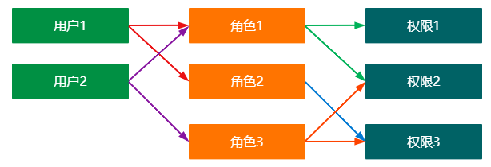

# 监听器、`RBAC`权限模型

## 1. 监听器

### 1.1 什么是监听器

监听器顾名思义就是监听某种事件的发生，一旦监听的事件触发，那么监听器就将开始执行。例如：在上课的时候，老师会观察每一位学生的听课情况，如果有学生上课打瞌睡，那么老师就会提醒他。这个场景中，老师就是一个监听器，监听的是学生是否打瞌睡，一旦学生出现打瞌睡的情况，监听器就开始执行（老师提醒学生）

### 1.2` ServletContextListener`

`ServletContextListener` 是 `Servlet` 上下文的监听器，该监听器主要监听的是`Servlet`上下文的初始化和销毁。一旦 `Servlet` 上下文初始化或者销毁`ServletContextListener` 就执行响应的操作。

```java
public interface ServletContextListener extends EventListener {
    //Servlet上下文初始化
    default void contextInitialized(ServletContextEvent sce) {
    }
    //Servlet上下文销毁
    default void contextDestroyed(ServletContextEvent sce) {
    }
}
```

<font color = "blue">示例</font>


### 1.3  `DruidDataSource`

`DruidDataSource`是阿里巴巴开发的一款高性能的数据源。利用``Servlet`上下文监听器建立工程中需要的数据源


## 2. `RBAC` 权限模型

### 2.1 什么是 `RBAC`

`RBAC`全称为``Role-Based Access Control`，表示基于角色的访问控制。在`RBAC`中，有三个最常用的术语：

*   用户：系统资源的操作者
*   角色：具有一类相同操作权限的用户的总称
*   权限：能够访问资源的资格

资源：服务器上的一切数据都是资源，比如静态文件，查询的动态数据等。

`RBAC`的设计主要是控制服务器端的资源访问。

`RBAC`怎么与用户建立联系？服务器感知用户是通过`session`来感知的，因此，`RBAC`的实现需要与`session`配合。前提是用户需要登录，登录后将用户信息存储在`session`中，这样才能在`session`中获取用户的信息

### 2.2` RBAC`简单结构图

