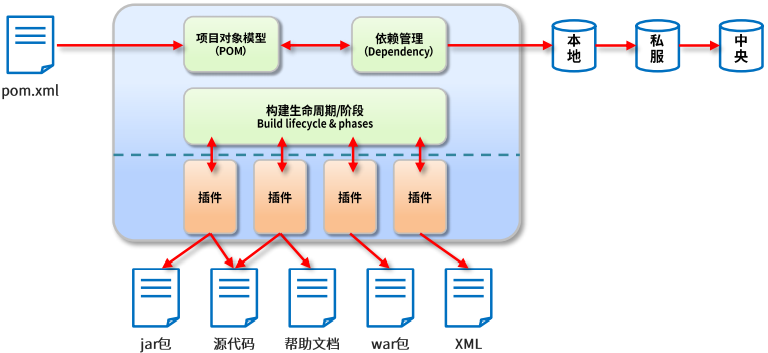
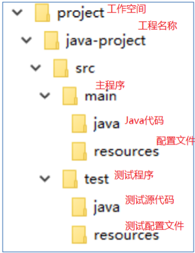
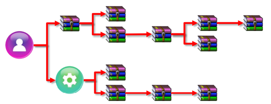
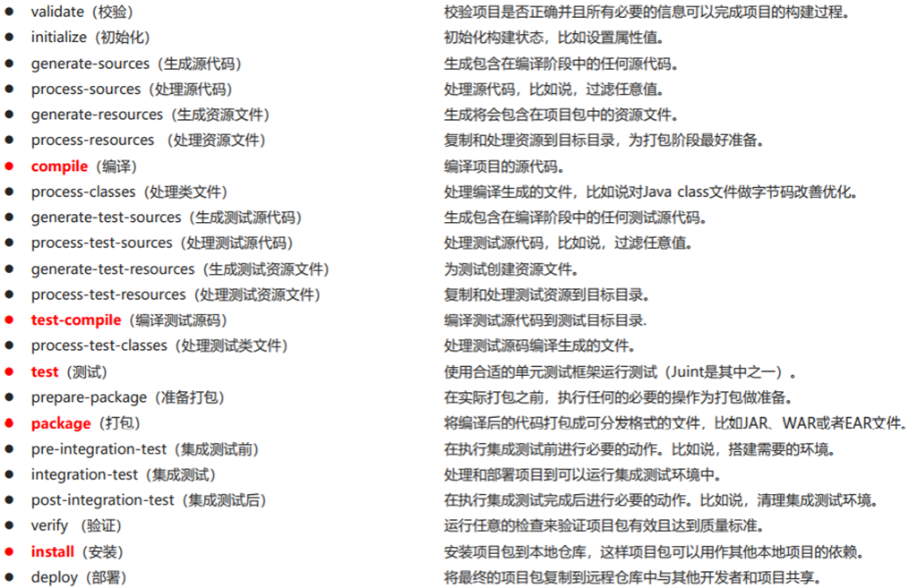
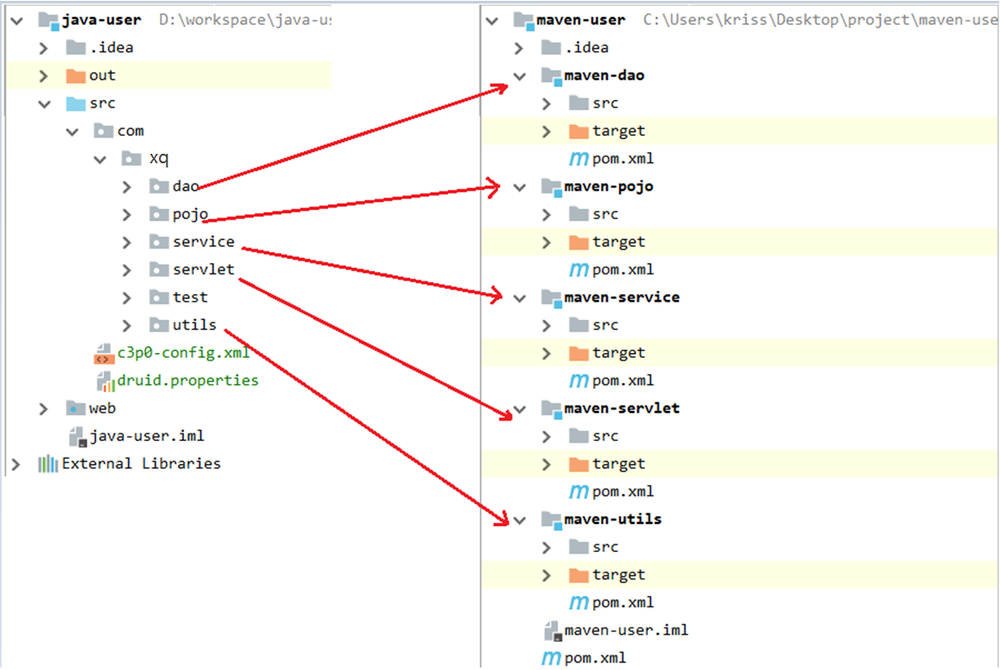

# 01_Maven

## 1. Maven 简介

### 1.1 传统项目管理状态分析

在传统项目于中不可避免的要用到一些jar包。这种手动导入jar包的弊端：

1.   需要提前准备很多jar包，非常繁琐
2.   jar包与jar包之间存在版本冲突的问题，要求我们手动收集的jar包版本之间必须兼容
3.   导入很多jar包之后的项目变得庞大，不利于后期的部署和维护

解决方案：Maven

### 1.2 什么是 Maven

Maven 在美国是一个口语化的词语，代表专家、内行的意思。 一个对Maven 比较正式的定义是这么说的：Maven 是一个项目管理工具，它包含了一个项目对象模型(POM：Project Object Model)，一组标准集合，一个项目生命周期(Project Lifecycle)，一个依赖管理系统(Dependency Management System)，和用来运行定义在生命周期阶段(phase)中插件(plugin)目标 (goal)的逻辑。



### 1.3 Maven 项目结构



*   src/main/java —— 存放项目的.java 文件
*   src/main/resources —— 存放项目资源文件，如 spring, hibernate 配置文件
*   src/test/java —— 存放所有单元测试.java 文件，如 JUnit 测试类
*   src/test/resources —— 测试资源文件 target —— 项目输出位置，编译后的 class 文件会输出到此目录
*   pom.xml——maven 项目核心配置文件 注意：如果是普通的 java 项目，那么就没有 webapp 目录。

### 1.4 maven 常用命令

*   `mvn compile` 编译的命令，将src/main/java目录下面的文件编译成.class的字节码文件。并将这些文件放在target目录下面

*   `mvn claen` 清理命令，将编译好的.class字节码文件清理。将target目录删除
*   `mvn test` 测试命令，将测试代码进行执行，并产生测试结构报告
*   `mvn package` 打包的命令，同时编译主程序的代码，并且执行测试代码。编译测试成功之后，再将对应的工程打包。普通工程打jar包，web工程打wer包
*   `mvn install` 安装的命令，先执行编译测试打包的命令。这些命令执行成功之后，在将打包好的包发布到本地仓库

### 1.5 依赖管理

#### 1.5.1 依赖配置与依赖传递

依赖指的是当前项目运行所需要的jar，一个项目可以有很多个依赖。

<font color = "blue">格式</font>

```xml
<dependencies>
    <dependency>
        <groupId>junit</groupId>
        <artifactId>junit</artifactId>
        <version>4.10</version>
    </dependency>
    <dependency>
        <groupId>log4j</groupId>
        <artifactId>log4j</artifactId>
        <version>1.2.17</version>
    </dependency>
</dependencies>
```

依赖具有传递性

直接依赖：在当前项目于中吗，通过依赖配置建立的依赖关系

间接依赖：被依赖的资源，如果还有其他资源，那么当前项目间接依赖其他资源



#### 1.5.2 解决依赖冲突的问题

依赖冲突是指项目依赖的某一个jar包，有多个不同的版本，因而造成类包版本冲突。

如下所示：

```xml
<dependencies>
    <dependency>
        <groupId>org.springframework</groupId>
        <artifactId>spring-context</artifactId>
        <version>5.2.7.RELEASE</version>
    </dependency>
    <dependency>
        <groupId>org.springframework</groupId>
        <artifactId>spring-aop</artifactId>
        <version>5.2.0.RELEASE</version>
    </dependency>
</dependencies>
```

通过查看依赖，我们发现spring-aop和spring-context都依赖了一个叫spring-core的依赖。此时spring

core的版本有两个。这样就产生了依赖冲突，解决方式：

**1、使用第一声明优先的原则**

谁先定义的就用谁的传递依赖，即在pom.xml文件自上而下，先声明的jar坐标，就先引用该jar的传递

依赖。因此我们如果要使用5.2.0版本的spring core包，我们可以改成如下声明：

```xml
<dependency>
    <groupId>org.springframework</groupId>
    <artifactId>spring-aop</artifactId>
    <version>5.2.0.RELEASE</version>
</dependency>
<dependency>
    <groupId>org.springframework</groupId>
    <artifactId>spring-context</artifactId>
    <version>5.2.7.RELEASE</version>
</dependency>
```

**2 、路径近优先原则—直接依赖高于间接依赖**

即直接依赖级别高于传递依赖。因此我们可以在最先的pom.xml添加如下内容

```xml
<dependencies>
    <dependency>
        <groupId>org.springframework</groupId>
        <artifactId>spring-aop</artifactId>
        <version>5.2.0.RELEASE</version>
    </dependency>
    <dependency>
        <groupId>org.springframework</groupId>
        <artifactId>spring-context</artifactId>
        <version>5.2.7.RELEASE</version>
    </dependency>
    <dependency>
        <groupId>org.springframework</groupId>
        <artifactId>spring-core</artifactId>
        <version>5.2.0.RELEASE</version>
    </dependency>
</dependencies>
```

#### 1.5.3 排除依赖原则

在不影响项目运行的情况下，如果依赖冲突，可以把被冲突的依赖排除掉，注意排除的依赖不需要添加依赖的版本号。

```xml
<dependency>
    <groupId>org.springframework</groupId>
    <artifactId>spring-context</artifactId>
    <version>5.2.7.RELEASE</version>
    <exclusions>
        <exclusion>
            <artifactId>spring-core</artifactId>
            <groupId>org.springframework</groupId>
        </exclusion>
    </exclusions>
</dependency>
<dependency>
    <groupId>org.springframework</groupId>
    <artifactId>spring-aop</artifactId>
    <version>5.2.0.RELEASE</version>
</dependency>
```

#### 1.5.4 版本锁定

使用dependencyManagement 进行版本锁定，dependencyManagement可以统一管理项目的版本号，确保应用的各个项目的依赖和版本一致。如果我们项目中只想使用spring core 5.2.0的包，pom.xml可以改为如下

```xml
<dependencyManagement>
    <dependencies>
        <dependency>
            <groupId>org.springframework</groupId>
            <artifactId>spring-core</artifactId>
            <version>5.2.0.RELEASE</version>
        </dependency>
    </dependencies>
</dependencyManagement>
<dependencies>
    <dependency>
        <groupId>org.springframework</groupId>
        <artifactId>spring-context</artifactId>
        <version>5.2.7.RELEASE</version>
    </dependency>
    <dependency>
        <groupId>org.springframework</groupId>
        <artifactId>spring-aop</artifactId>
        <version>5.2.0.RELEASE</version>
    </dependency>
</dependencies>
```

### 1.6 生命周期与插件

#### 1.6.1 生命周期

maven 对项目周期的构建分为3套

*   clean：清理工作阶段
    *   pre-clean 执行一些需要才clean之前完成的工作
    *   clean 移除所有上一次构建生成的文件
    *   post-clean 执行一些需要在clean之后立刻完成的工作
*   default：核心工作阶段，比如编译，测试，打包，部署
    *   
*   site：产生报告，发布站点等
    *   pre-site 执行一些需要在生成站点文档之前完成的工作
    *   site 生成项目的站点文档
    *   post-site 执行一些需要在生成站点文档之后完成的工作，并且为部署做准备
    *   site-deploy 将生成的站点文档部署到特定的服务器

#### 1.6.2 插件

插件与生命周期内的阶段绑定，在执行到对应生命周期时，执行对应的插件功能

默认maven在各个生命周期阶段上绑定有预设功能

通过插件可以自定义其他功能

这个插件就是 在生成测试代码的时候，给主程序源代码打包、同时给测试源代码打包。

```xml
<plugin>
    <groupId>org.apache.maven.plugins</groupId>
    <artifactId>maven-source-plugin</artifactId>
    <version>2.2.1</version>
    <executions>
        <execution>
            <goals>
                <goal>jar</goal>
                <goal>test-jar</goal>
            </goals>
            <phase>generate-test-resources</phase>
        </execution>
    </executions>
</plugin>
```


# 2. Maven 分模块开发与设计

### 2.1 创建父工程



```xml
<dependencies>
    <!-- servlet依赖的jar包start -->
    <dependency>
        <groupId>javax.servlet</groupId>
        <artifactId>javax.servlet-api</artifactId>
        <version>3.1.0</version>
        <scope>provided</scope>
    </dependency>
    <!-- servlet依赖的jar包start -->
    <!-- jsp依赖jar包start -->
    <dependency>
        <groupId>javax.servlet.jsp</groupId>
        <artifactId>javax.servlet.jsp-api</artifactId>
        <version>2.3.1</version>
        <scope>provided</scope>
    </dependency>
    <!-- jsp依赖jar包end -->
    <!--jstl标签依赖的jar包start -->
    <dependency>
        <groupId>javax.servlet</groupId>
        <artifactId>jstl</artifactId>
        <version>1.2</version>
        <!--<scope>provided</scope>-->
    </dependency>
    <!-- JSTL实现包 -->
    <dependency>
        <groupId>org.apache.taglibs</groupId>
        <artifactId>taglibs-standard-impl</artifactId>
        <version>1.2.5</version>
    </dependency>
    <!--jstl标签依赖的jar包end -->
    <dependency>
        <groupId>c3p0</groupId>
        <artifactId>c3p0</artifactId>
        <version>0.9.1.2</version>
    </dependency>
    <!--beanUtils的依赖-->
    <dependency>
        <groupId>commons-beanutils</groupId>
        <artifactId>commons-beanutils</artifactId>
        <version>1.8.3</version>
    </dependency>
    <!--dbutils组件 封装了原生的jdbc-->
    <dependency>
        <groupId>commons-dbutils</groupId>
        <artifactId>commons-dbutils</artifactId>
        <version>1.6</version>
    </dependency>
    <!--logging-->
    <dependency>
        <groupId>commons-logging</groupId>
        <artifactId>commons-logging</artifactId>
        <version>1.1.1</version>
    </dependency>
    <!--mysql驱动-->
    <dependency>
        <groupId>mysql</groupId>
        <artifactId>mysql-connector-java</artifactId>
        <version>5.1.18</version>
    </dependency>
</dependencies>
<build>
    <plugins>
        <plugin>
            <groupId>org.apache.tomcat.maven</groupId>
            <artifactId>tomcat7-maven-plugin</artifactId>
            <version>2.1</version>
            <configuration>
                <port>8088</port>
                <path>/</path>
            </configuration>
        </plugin>
    </plugins>
</build>
```

### 2.2 maven-pojo

```java
package com.sonnet.pojo;

public class User {

    private Integer id;

    private String name;

    private String sex;

    private Integer age;

    private String address;

    private String email;

    private String qq;

    private String username;

    private String password;

    @Override
    public String toString() {
        return "User{" +
                "id=" + id +
                ", name='" + name + '\'' +
                ", sex='" + sex + '\'' +
                ", age=" + age +
                ", address='" + address + '\'' +
                ", email='" + email + '\'' +
                ", qq='" + qq + '\'' +
                ", username='" + username + '\'' +
                ", password='" + password + '\'' +
                '}';
    }

    public Integer getId() {
        return id;
    }

    public void setId(Integer id) {
        this.id = id;
    }

    public String getName() {
        return name;
    }

    public void setName(String name) {
        this.name = name;
    }

    public String getSex() {
        return sex;
    }

    public void setSex(String sex) {
        this.sex = sex;
    }

    public Integer getAge() {
        return age;
    }

    public void setAge(Integer age) {
        this.age = age;
    }

    public String getAddress() {
        return address;
    }

    public void setAddress(String address) {
        this.address = address;
    }

    public String getEmail() {
        return email;
    }

    public void setEmail(String email) {
        this.email = email;
    }

    public String getQq() {
        return qq;
    }

    public void setQq(String qq) {
        this.qq = qq;
    }

    public String getUsername() {
        return username;
    }

    public void setUsername(String username) {
        this.username = username;
    }

    public String getPassword() {
        return password;
    }

    public void setPassword(String password) {
        this.password = password;
    }
}
```

### 2.3 maven-utils

```java
package com.sonnet.utils;

import com.mchange.v2.c3p0.ComboPooledDataSource;

import javax.sql.DataSource;
import java.sql.Connection;
import java.sql.SQLException;

/**
 * 封装数据库常用工具类
 */
public class DataSourceConfig {

    // 我们必须在resources目录里定义一个名字叫c3p0-config.xml配置文件
    // 在初始化ComboPooledDataSource对象的时候，会去自动加载这个c3p0-config.xml配置文件
    static ComboPooledDataSource comboPooledDataSource = new ComboPooledDataSource();

    // 获取数据源的方法
    public static DataSource getDataSources() {
        return comboPooledDataSource;
    }

    // 获取数据连接的对象
    public static Connection getConnection() throws SQLException {
        return comboPooledDataSource.getConnection();
    }
}
```

```xml
<?xml version="1.0" encoding="UTF-8"?>
<project xmlns="http://maven.apache.org/POM/4.0.0"
         xmlns:xsi="http://www.w3.org/2001/XMLSchema-instance"
         xsi:schemaLocation="http://maven.apache.org/POM/4.0.0 http://maven.apache.org/xsd/maven-4.0.0.xsd">
    <modelVersion>4.0.0</modelVersion>
    <parent>
        <groupId>com.sonnet.parent</groupId>
        <artifactId>maven-user</artifactId>
        <version>1.0-SNAPSHOT</version>
        <relativePath>../pom.xml</relativePath>
    </parent>

    <groupId>com.sonnet.utils</groupId>
    <artifactId>maven-user-utills</artifactId>

    <properties>
        <maven.compiler.source>17</maven.compiler.source>
        <maven.compiler.target>17</maven.compiler.target>
        <project.build.sourceEncoding>UTF-8</project.build.sourceEncoding>
    </properties>

</project>
```

### 2.4 maven-dao


```java
package com.sonnet.dao.com.sonnet.dao;

import com.sonnet.pojo.User;

import java.util.List;

public interface UserDao {

    // 查询用户所有信息的方法
    public List<User> findAll();
}
```

```java
package com.sonnet.dao.com.sonnet.dao.impl;

import com.sonnet.dao.com.sonnet.dao.UserDao;
import com.sonnet.pojo.User;
import com.sonnet.utils.DataSourceConfig;
import org.apache.commons.dbutils.QueryRunner;
import org.apache.commons.dbutils.handlers.BeanListHandler;

import java.sql.SQLException;
import java.util.List;

public class UserDaoImpl implements UserDao {

    // 构建QueryRunner对象，这个对象主要就是进行数据表的CRUD操作
    QueryRunner queryRunner = new QueryRunner(DataSourceConfig.getDataSources());

    @Override
    public List<User> findAll() {
        String sql = "select * from user";
        BeanListHandler<User> userList = new BeanListHandler<>(User.class);
        try {
            return queryRunner.query(sql, userList);
        } catch (SQLException e) {
            throw new RuntimeException(e);
        }
    }
}
```

### 2.5 maven-service

```java
package com.sonnet.service.com.sonnet.service;

import com.sonnet.pojo.User;

import java.util.List;

public interface UserService {

    public List<User> findAllUser();
}
```

```java
package com.sonnet.service.com.sonnet.service.impl;

import com.sonnet.dao.com.sonnet.dao.UserDao;
import com.sonnet.dao.com.sonnet.dao.impl.UserDaoImpl;
import com.sonnet.pojo.User;
import com.sonnet.service.com.sonnet.service.UserService;

import java.util.List;

public class UserServiceImpl implements UserService {

    UserDao userDao = new UserDaoImpl();

    @Override
    public List<User> findAllUser() {
        return userDao.findAll();
    }
}
```

### 2.6 maven-web

```java
package com.sonnet.web;

import com.sonnet.pojo.User;
import com.sonnet.service.com.sonnet.service.UserService;
import com.sonnet.service.com.sonnet.service.impl.UserServiceImpl;

import javax.servlet.ServletException;
import javax.servlet.annotation.WebServlet;
import javax.servlet.http.HttpServlet;
import javax.servlet.http.HttpServletRequest;
import javax.servlet.http.HttpServletResponse;
import java.io.IOException;
import java.util.List;

@WebServlet("/show")
public class UserServlet extends HttpServlet {

    UserService userService = new UserServiceImpl();

    @Override
    protected void doGet(HttpServletRequest req, HttpServletResponse resp) throws ServletException, IOException {
        // 设置向浏览器响应数据的类型和编码格式
        resp.setContentType("text/html;charset=utf-8");
        List<User> userList = userService.findAllUser();
        // 将list集合放在作用域
        req.setAttribute("list", userList);
        // 转发跳转到目标页面
        req.getRequestDispatcher("list.jsp").forward(req, resp);
    }
}
```

```jsp
<%--
  Created by IntelliJ IDEA.
  User: sonnet
  Date: 2026/9/20
  Time: 19:44
  To change this template use File | Settings | File Templates.
--%>
<%@ page contentType="text/html;charset=UTF-8" language="java" %>
<%@taglib prefix="c" uri="http://java.sun.com/jsp/jstl/core" %>
<html>
<head>
    <title>list</title>
</head>
<body>
    <ul>
        <c:forEach items="${list}" var="user">
            用户id：${user.id} &nbsp;&nbsp; 用户名：${user.username}
        </c:forEach>
    </ul>
</body>
</html>
```
