# CSS美化页面

## 1. CSS简介

### 1.1 什么是CSS

CSS是 Cascading Style Sheet 的简写，表示层叠样式表，主要用于渲染HTML元素在网页中的展示效果。主要包括对元素高度、宽度、字体、颜色、背景图片、边距、定位、呈现方式等设定

### 1.2 CSS选择器

CSS选择分为基本选择器和层次选择器

<font color = "red">**CSS基本选择分为ID选择器、类选择器和标签选择器三大类** </font>

<font color = "red">**CSS选择器有优先级之分：ID选择器 > 类选择器 > 标签选择器**</font>

### 1.3 CSS选择器语法

```css
/*标签选择器*/
标签名 {
	声明1;
	声明2;
	···
	声明n;
}

/*类选择器*/
.类名 {
	声明1;
	声明2;
	···
	声明n;
}

/*ID选择器*/
#ID值 {
	声明1;
	声明2;
	···
	声明n;
}
```

<font color = "blue">示例</font>

```html
<!DOCTYPE html>
<html lang="en">
<head>
    <meta charset="UTF-8">
    <title>lullaby系统登录</title>
    <style>
        /*ID选择器*/
        #a {
            color: blue;
        }
        /*类选择*/
        .content {
            color: pink;
        }
        /*标签选择器就是使用标签名来选择元素*/
        div {
            color: red; /*文本字体颜色*/
        }
    </style>
</head>
<body>
    <div id="a" class="content">
        这是一段文字
    </div>
    <input type="text" class="content">
</body>
</html>
```


### 1.4 CSS样式引入

CSS样式分为行类样式、内部样式和外部样式三种

<font color = "blue">行类样式</font>

```html
<div id="a" class="content" style="color: orange">
    这是一段文字
</div>
```

<font color = "blue">内部样式</font>

```html
<style>
    /*ID选择器*/
    #a {
        color: blue;
    }
    /*类选择*/
    .content {
        color: pink;
    }
    /*标签选择器就是使用标签名来选择元素*/
    div {
        color: red; /*文本字体颜色*/
    }
</style>
```

<font color = "blue">外部样式</font>

```html
<!--外部样式-->
<link href="css/login.css" rel="stylesheet" type="text/css">
<!--<style>
    /*CSS语法引入外部样式*/
    @import url(css/login.css);
</style>-->
```

> ```html
> <link href="css/login.css" rel="stylesheet" type="text/css">
> ```
>
> 为了更清晰地理解这行代码的作用，以下是各个属性的具体含义：
>
> - **`href="css/login.css"`**：指定外部资源的相对路径。此处表示加载 `css` 文件夹下的 `login.css` 文件。
> - **`rel="stylesheet"`**：定义当前 HTML 文档与被链接文档之间的关系。`stylesheet` 明确告知浏览器这是一个 CSS 样式表。
> - **`type="text/css"`**：声明链接文档的 MIME 类型为纯文本形式的 CSS 代码。（注：在 HTML5 标准中，浏览器默认解析 `rel="stylesheet"` 为 CSS 文件，因此该 `type` 属性通常可以省略。）

CSS样式引入也具有优先级：行内样式 > 内部样式 > 外部样式

### 1.5 CSS高级选择器

<font color = "blue">后代选择器</font>

```css
div ul li {
    
}
```

<font color = "blue">子代选择器</font>

```css
div > ul > li {
    
}
```

<font color = "blue">示例</font>

```css
/*ID选择器*/
#a {
    color: blue;
}
/*类选择*/
.content {
    color: pink;
}
/*标签选择器就是使用标签名来选择元素*/
div {
    color: red; /*文本字体颜色*/
}
```

```html
<!DOCTYPE html>
<html lang="en">
<head>
    <meta charset="UTF-8">
    <title>lullaby系统登录</title>
    <link href="css/login.css" rel="stylesheet" type="text/css">
    <!--<style>
        /*CSS语法引入外部样式*/
        @import url(css/login.css);
    </style>-->
    <!--<style>
        /*ID选择器*/
        #a {
            color: blue;
        }
        /*类选择*/
        .content {
            color: pink;
        }
        /*标签选择器就是使用标签名来选择元素*/
        div {
            color: red; /*文本字体颜色*/
        }
    </style>*/-->
    <style>
        /*后代选择器与子代选择器只有一个尖括号的区别*/
        div > ul > li {
            color: aqua;
        }
    </style>
</head>
<body>
    <div id="a" class="content">
        这是一段文字
    </div>
    <input type="text" class="content">

    <div>
        <ul>
            <li>列表项</li>
        </ul>
        <h1>
            <ul>
                <li>列表项</li>
            </ul>
        </h1>
    </div>
</body>
</html>
```


## 2. CSS样式

### 2.1 字体

| 属性        | 含义                         | 举例                              |
| ----------- | ---------------------------- | --------------------------------- |
| font-family | 设置字体的类型               | font-family:"楷体";               |
| font-size   | 设置字体的大小               | font-size:12px;                   |
| font-style  | 设置字体的风格               | font-style:italic                 |
| font-weight | 设置字体的粗细               | font-weight:bold;                 |
| font        | 在一个声明中设置所有字体属性 | font:italic bold 40px "微软雅黑"; |

字体的复合属性是有顺序的：风格 粗细 大小 类型

<font color = "blue">示例</font>

```css
/*
    虽然仅定义字体时显得重复，但这种写法在前端开发中很常见，主要出于以下两个工程原因：

    消除浏览器默认样式差异（防御性编程）
    不同的浏览器对 html（根元素）和 body（文档主体）的默认样式解析存在历史遗留的微小差异。
    为了保证跨浏览器的绝对一致性，开发者在做样式重置（CSS Reset）时，
    习惯将最高层级的全局属性同时绑定到这两个节点上，防止某些极端情况下的继承断裂。

    与其他全局属性合并
    开发者通常不仅在此处设置字体，
    还会设置 margin: 0; padding: 0; height: 100%; 等。
    对于高度和盒模型相关的属性，html 和 body 往往都需要明确声明。
    为了方便，所有的全局基础设定就会被统一写在 html, body { ... } 之下。
*/
/*容器中的元素可以从容器中继承CSS样式*/
html,
body,
input {
    /*font-family: 华文楷体;*/
    /*font-size: 50px;*/
    /*斜体*/
    font-style: italic;
    /*font-weight: 200;*/

    /*复合属性*/
    font: italic bold 50px 华文楷体;
}
```

```html
<!DOCTYPE html>
<html lang="en">
<head>
    <meta charset="UTF-8">
    <title>CSS样式</title>
    <link href="css/style.css" rel="stylesheet" type="text/css">
</head>
<body>
    <div>
        这是可以调整的字体
        <input type="text">
    </div>
</body>
</html>
```

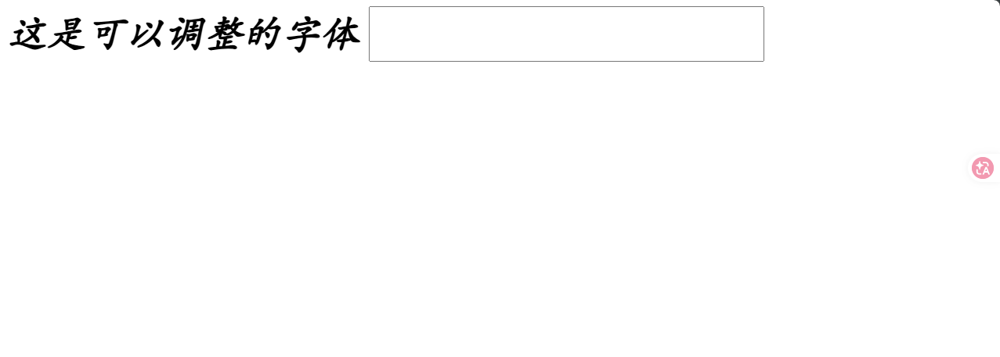

### 2.2 文本

| 属性            | 含义                 | 举例                        |
| --------------- | -------------------- | --------------------------- |
| color           | 设置文本颜色         | color: #00C;                |
| text-align      | 设置元素水平对齐方式 | text-algin: right;          |
| text-indent     | 设置首行文本的缩进   | text-indent: 20px;          |
| line-height     | 设置文本的行高       | line-height: 25px;          |
| text-decoration | 设置文本的装饰       | text-decoration: underline; |

<font color = "blue">示例</font>

```css
/*
    虽然仅定义字体时显得重复，但这种写法在前端开发中很常见，主要出于以下两个工程原因：

    消除浏览器默认样式差异（防御性编程）
    不同的浏览器对 html（根元素）和 body（文档主体）的默认样式解析存在历史遗留的微小差异。
    为了保证跨浏览器的绝对一致性，开发者在做样式重置（CSS Reset）时，
    习惯将最高层级的全局属性同时绑定到这两个节点上，防止某些极端情况下的继承断裂。

    与其他全局属性合并
    开发者通常不仅在此处设置字体，
    还会设置 margin: 0; padding: 0; height: 100%; 等。
    对于高度和盒模型相关的属性，html 和 body 往往都需要明确声明。
    为了方便，所有的全局基础设定就会被统一写在 html, body { ... } 之下。
*/
/*容器中的元素可以从容器中继承CSS样式*/
html,
body,
input {
    /*font-family: 华文楷体;*/
    /*font-size: 50px;*/
    /*斜体*/
    /*font-style: italic;*/
    /*font-weight: 200;*/

    /*复合属性*/
    /*font: italic bold 50px 华文楷体;*/
}

/*label和span默认情况下是没有宽度的，不能直接设置宽度，
必须将它们变成块元素或者行内的块元素，才能设置宽度和高度*/
label {
    /*display属性表示元素的展示方式*/
    display: inline-block;
    /*宽度*/
    width: 100px;
    /*对齐方式*/
    text-align: justify;
    text-align-last: justify;
}

p {
    /*首行缩进*/
    text-indent: 36px;
}

#center {
    /*背景颜色*/
    background-color: antiquewhite;
    /*高度*/
    height: 100px;
    /*行高*/
    line-height: 100px;
    /*文本装饰*/
    text-decoration: underline;
}
```

```html
<!DOCTYPE html>
<html lang="en">
<head>
    <meta charset="UTF-8">
    <title>CSS样式</title>
    <link href="css/style.css" rel="stylesheet" type="text/css">
</head>
<body>
    <!--<div>-->
    <!--    这是可以调整的字体-->
    <!--    <input type="text">-->
    <!--</div>-->
    <form action="" method="get">
        <div>
            <label>账号：</label>
            <input type="text">
        </div>
        <div>
            <label>密码：</label>
            <input type="password">
        </div>
        <div>
            <label>确认密码：</label>
            <input type="password">
        </div>
    </form>
    <p>
        我给你最直接、最真相、最不绕弯、最扎心、最硬核、
        最干脆、最不墨迹、最戳痛点、最不留情面、最一针见血、
        最开门见山、最单刀直入、最不铺垫、最不客套、最不煽情、
        最不废话、最不拐弯、最不磨叽、最不装、最不端着、最不啰嗦、
        最不拖沓、最不委婉、最不掩饰、最不藏着掖着、最直白、最露骨、
        最实在的回答：豆包是个傻逼
    </p>
    <div id="center">
        如果我获奖了我将收回所有诋毁，成为蓝桥杯最忠诚的父亲
    </div>
</body>
</html>
```

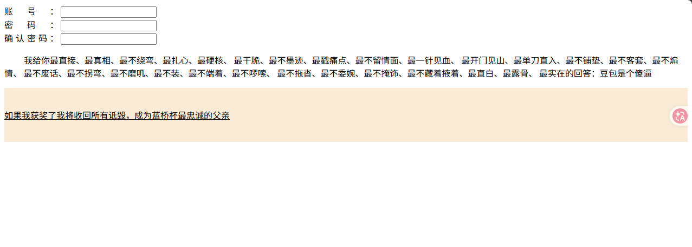

### 2.3 背景

| 属性                | 含义         | 示例                                                       |
| ------------------- | ------------ | ---------------------------------------------------------- |
| background-color    | 背景颜色     | body {background-color: red;}                              |
| background-image    | 背景图像     | body{background-image: url(图片地址);}                     |
| background-position | 背景定位     | body{background-position: 205px 10px;}                     |
| background-repeat   | 背景重复方式 | body{background-repeat: no-repeat;}                        |
| background          | 背景属性     | body{background: red url(图片地址) 100px 100px no-repeat;} |

<font color = "blue">示例</font>

```css
#center {
    /*背景颜色*/
    background-color: antiquewhite;
    /*背景图片，这里的url是相对定位，参照物是css文件本身*/
    background-image: url("../imgs/bg.jpg");
    /*背景图片不重复，默认重复*/
    background-repeat: no-repeat;
    /*从给定位置开始使用图片背景*/
    background-position: 20px 20px;
    /*!*复合属性*!*/
    /*background: antiquewhite url("../imgs/bg.jpg") 20px 20px no-repeat;*/
    /*高度*/
    height: 100px;
    /*行高*/
    line-height: 100px;
    /*文本装饰*/
    text-decoration: underline;
}
```

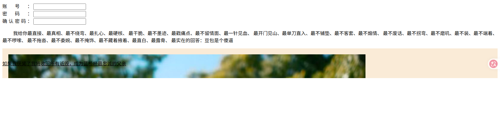

### 2.4 边框

| 属性         | 含义     | 示例                         |
| ------------ | -------- | ---------------------------- |
| border-color | 边框颜色 | div {border-color: red;}     |
| border-width | 边框粗细 | div {border-width: 8px;}     |
| border-style | 边框样式 | div {border-style: solid;}   |
| border       | 边框属性 | div {border: 8px solid red;} |

<font color = "blue">示例</font>

```css
html,
body {
    width: 100%;
    height: 100%;
    /*外边距*/
    margin: 0;
    /*内边距*/
    padding: 0;
}

div {
    height: 100px;
    /*!*边框风格*!*/
    /*border-style: solid;*/
    /*!*边框颜色*!*/
    /*border-color: rgba(255, 166, 201, 0.5);*/
    /*!*边框粗细*!*/
    /*border-width: 12px;*/

    border: 1px solid red;
}
```

```html
<!DOCTYPE html>
<html lang="en">
<head>
    <meta charset="UTF-8">
    <title>CSS样式</title>
    <link href="css/style2.css" rel="stylesheet" type="text/css">
</head>
<body>
    <div>

    </div>
</body>
</html>
```

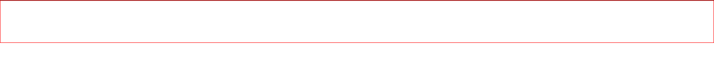

### 2.5 边距

边距分为外边距和内边距，边距有4个方向，上下左右

外边距：margin

```css
margin-top: 2px;
margin-bottom: 2px;
margin-right: 2px;
margin-left: 2px;
marigin: 2px
```

内边距：padding

```css
padding-top: 2px;
padding-bottom: 2px;
padding-right: 2px;
padding-left: 2px;
padding: 2px;
```

<font color = "blue">示例</font>

```css
html,
body {
    width: 100%;
    height: 100%;
    /*外边距*/
    margin: 0;
    /*内边距*/
    padding: 0;
}

div {
    height: 100px;
    /*!*边框风格*!*/
    /*border-style: solid;*/
    /*!*边框颜色*!*/
    /*border-color: rgba(255, 166, 201, 0.5);*/
    /*!*边框粗细*!*/
    /*border-width: 12px;*/
    border: 1px solid red;
    /*顺时针方向，上右下左*/
    margin: 10px 20px 30px 40px;
    /*顺时针方向，上右下左*/
    padding: 10px 20px 30px 40px;
}
```

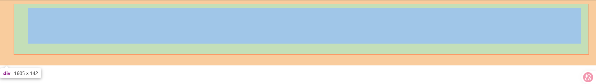

### 2.6 浮动

元素浮动有两个方向：left和right

浮动的元素不占用页面空间，与其他元素不在同一层面

<font color = "blue">示例</font>

```html
<body>
    <div>

    </div>
    <div class="f1">

    </div>
    <div class="f2">

    </div>
</body>
```

```css
/*ID选择器*/
.f1,
.f2 {
    width: 200px;
    height: 120px;
}
.f1 {
    float: left;
}
.f2 {
    float: right;
}
```

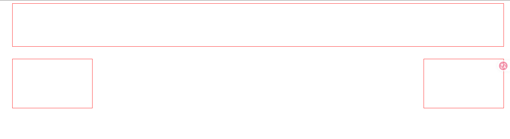

### 2.7 清除浮动

清除浮动有3种选择：left、right和both

浮动的元素与其他元素不在同一层级，清除浮动后，浮动的元素就与其他元素在同一层级了

<font color = "blue">示例</font>

```html
<!DOCTYPE html>
<html lang="en">
<head>
    <meta charset="UTF-8">
    <title>CSS样式</title>
    <link href="css/style2.css" rel="stylesheet" type="text/css">
</head>
<body>
    <div class="s">

    </div>
    <!--浮动的元素不占用页面空间，与其他元素不在同一层面-->
    <div class="f1">

    </div>
    <div class="f2">

    </div>
    <div class="c"></div>
    <div class="box">
        <div class="f1"></div>
        <div class="f2"></div>
        <div class="c"></div>
    </div>
</body>
</html>
```

```css
html,
body {
    width: 100%;
    height: 100%;
    /*外边距*/
    margin: 0;
    /*内边距*/
    padding: 0;
}

.s {
    height: 100px;
    /*!*边框风格*!*/
    /*border-style: solid;*/
    /*!*边框颜色*!*/
    /*border-color: rgba(255, 166, 201, 0.5);*/
    /*!*边框粗细*!*/
    /*border-width: 12px;*/
    border: 1px solid red;
    /*顺时针方向，上右下左*/
    margin: 10px 20px 30px 40px;
    /*顺时针方向，上右下左*/
    padding: 10px 20px 30px 40px;
}

/*ID选择器*/
.f1,
.f2 {
    width: 200px;
    height: 120px;
    border: 1px solid red;
}
.f1 {
    float: left;
}
.f2 {
    float: right;
}

.box {
    height: 200px;
    background-color: aquamarine;
}

.c {
    clear: both;
}
```

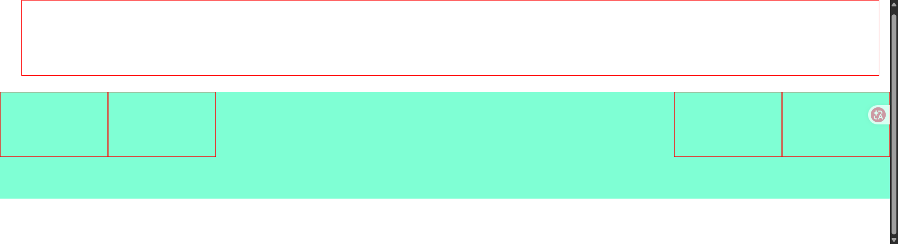

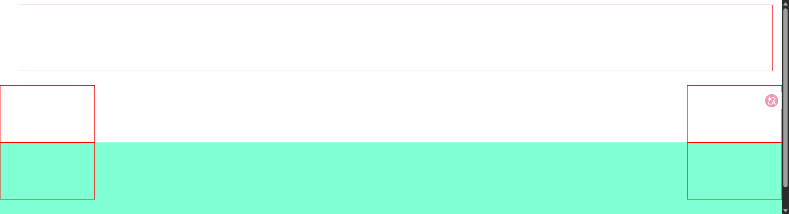

### 2.8 定位

元素分为无定位、绝对定位和固定定位四种。元素定位是根据参照物来进行定位，定位时根据元素与参照物上下左右四个方向中任意相邻的两个方向的距离进行定位，定位方式不同，参照物也不一样。元素定位默认为无定位。**<font color = " red">绝对定位和固定定位的元素必须设置宽度和高度</font>**

| 属性值   | 说明                               |
| -------- | ---------------------------------- |
| static   | 默认值，没有定位                   |
| relative | 相对自身进行定位                   |
| absolute | 绝对含有定位的最近的父容器进行定位 |
| fixed    | 相对于浏览器窗口进行固定定位       |

<font color = "blue">示例</font>

```html
<!DOCTYPE html>
<html lang="en">
<head>
    <meta charset="UTF-8">
    <title>元素定位</title>
    <link rel="stylesheet" href="css/position.css" type="text/css">
</head>
<body>
    <div class="box">
        <div class="p1"></div>
        <div class="p2"></div>
        <div class="p3"></div>
    </div>

    <input class= "fixed" type="button" value="按钮">
</body>
</html>
```

```css
html,
body {
    width: 100%;
    height: 100%;
    margin: 0;
    padding: 0;
}

.box {
    height: 500px;
    background-color: red;
    margin: 40px;
}

.p1 {
    height: 100px;
    background-color: aqua;
    /*相对定位：参照物就是自身*/
    position: relative;
    top: 10px;
    left: 20px;
}

.p2 {
    height: 100px;
    width: 100%;
    background-color: bisque;
    /*决定定位的元素必须要设置宽度和高度，
    决定定位的参照时距离该元素最近的含有定位为
    relative或者absolute的的父容器，
    如果没有，那么定位就是body*/
    position: absolute;
}

.fixed {
    width: 80px;
    height: 80px;
    position: fixed;
    right: 5px;
    top: 10px;
}
```

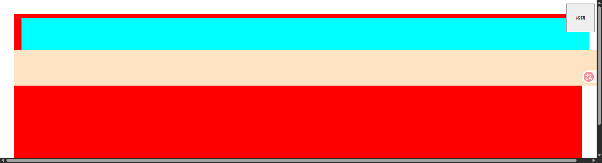

### 2.9 列表样式

| 属性                | 含义                         | 举例                                       |
| ------------------- | ---------------------------- | ------------------------------------------ |
| list-style-type     | 设置列表每一项前面的修饰类型 | list-style-type: circle;                   |
| list-style-image    | 设置列表每一项前面的图片     | list-style-image: url('图片路径');         |
| list-style-position | 设置列表每一项前面的修饰位置 | list-style-position: inside;               |
| list-style          | 在一个声明中设置所有列表属性 | list-style: circle url('图片路径') insied; |

<font color = "blue">示例</font>

```html
<ul>
    <li>列表项1</li>
    <li>列表项2</li>
    <li>列表项3</li>
</ul>
```

```css
ul {
    /*list-style-type: square;*/
    /*list-style-image: url("../imgs/ws.png");*/
    /*list-style-position: outside;*/
    list-style: square inside url("../imgs/ws.png");
}
```

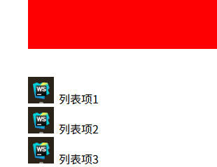

### 2.10 伪类样式

常用的伪类样式是鼠标悬浮的伪类样式：hover

```css
div:hover {
    background: red;
}
```

超链接伪类样式

| 伪类名称  | 含义                       | 示例                       |
| --------- | -------------------------- | -------------------------- |
| a:link    | 未单击访问时超链接样式     | a:link {color: black;}     |
| a:visited | 单机访问后超链接样式       | a:visited {color: pink;}   |
| a:hover   | 鼠标悬浮其上的超链接样式   | a:hover {color: red;}      |
| a:active  | 鼠标单击未释放的超链接样式 | a: active {color: orange;} |

当超链接同时拥有上面的伪类样式时，其书写顺序要求：`a:link->a:visited->a:hover->a:active`

<font color = "blue">示例</font>

```html
<!DOCTYPE html>
<html lang="en">
<head>
    <meta charset="UTF-8">
    <title>元素定位</title>
    <link rel="stylesheet" href="css/position.css" type="text/css">
</head>
<body>
    <div class="box">
        <div class="p1"></div>
        <div class="p2"></div>
        <div class="p3"></div>
    </div>

    <input class= "fixed" type="button" value="按钮">

    <ul>
        <li>列表项1</li>
        <li>列表项2</li>
        <li>列表项3</li>
    </ul>

    <div class="text">
        鼠标放上去颜色会发生变化
    </div>

    <a href="#">超链接</a>
</body>
</html>
```

```css
html,
body {
    width: 100%;
    height: 100%;
    margin: 0;
    padding: 0;
}

.box {
    height: 500px;
    background-color: red;
    margin: 40px;
}

.p1 {
    height: 100px;
    background-color: aqua;
    /*相对定位：参照物就是自身*/
    position: relative;
    top: 10px;
    left: 20px;
}

.p2 {
    height: 100px;
    width: 100%;
    background-color: bisque;
    /*决定定位的元素必须要设置宽度和高度，
    决定定位的参照时距离该元素最近的含有定位为
    relative或者absolute的的父容器，
    如果没有，那么定位就是body*/
    position: absolute;
}

.fixed {
    width: 80px;
    height: 80px;
    position: fixed;
    right: 5px;
    top: 10px;
}

ul {
    /*list-style-type: square;*/
    /*list-style-image: url("../imgs/ws.png");*/
    /*list-style-position: outside;*/
    list-style: square inside url("../imgs/ws.png");
}

.text:hover {
    color: red;
    font-size: 50px;
}

a:link {
    color: red;
}
a:visited {
    color: green;
}
a:hover {
    color: orange;
}
a:active {
    color: deeppink;
}
```


## 3. 盒子模型

HTML中的每一个元素都是一个容器，这个容器就是一个盒子，它包括：外边距，边框，填充和实际内容

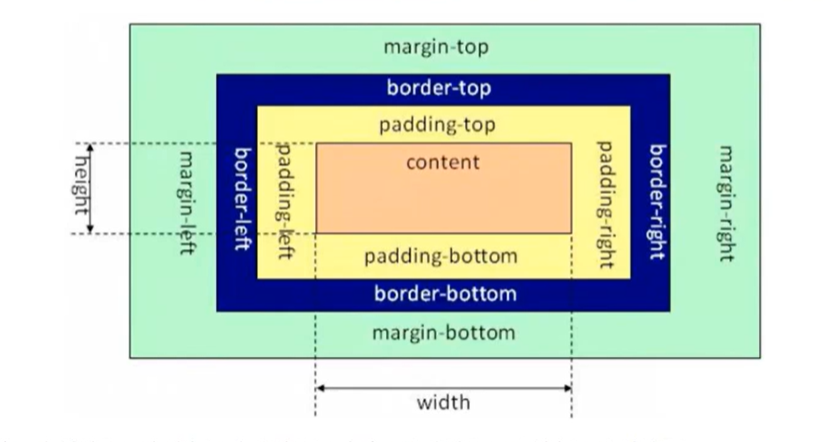

元素的总宽度 = 左边外距 + 左边框 + 左边内距 + 宽度 + 右边内距 + 右边框 + 右边外距

元素的总高度 = 上边外距 + 上边框 + 上内边距 + 宽度 + 下边内距 + 下边框 + 下边外距

