# CSS3及页面布局

## 1. CSS3新特性

### 1.1 边框

**border-radius**：用于创建圆角

<font color = "blue">示例</font>

```css
#border {
    width: 200px;
    height: 200px;
    background-color: black;
    border-radius: 10px;
}
```

### 1.2 盒子阴影

**box-shadow**：用来添加阴影

> box-shadow：阴影类型 水平阴影位置 垂直阴影位置 阴影模糊距离 阴影大小 阴影颜色；

<font color = "blue">示例</font>

```css
box-shadow: inset 2px 2px 2px 2px red;
```

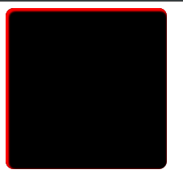

### 1.3 CSS3渐变

**线性渐变——Linear Gradients**：颜色沿着一条线过渡：从左到右、从右到左、从上到下

```css
linear-gradients(渐变方向，颜色1，···，颜色n)
```

<font color = "blue">示例</font>

```css
background-image: linear-gradient(to right top, red, green, blue);
```

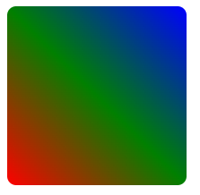

**径向渐变——radial gradients**：圆形或者椭圆形渐变，颜色不再沿着一条直线变化，而是从一个起点朝所有方向混合

```css
radial-gradient(center, shape size, start-color, ..., last-color);
```

> 居中 形状大小 开始颜色 ··· 结束颜色

<font color = "blue">示例</font>

```css
background-image: radial-gradient(circle, red 5%, yellow 15%, blue 60%);
```

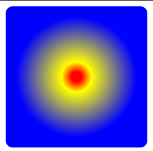

### 1.4 文本效果

**text-shadow**：向文本添加阴影

| 值       | 说明                           |
| -------- | ------------------------------ |
| h-shadow | 必需，水平阴影的位置，允许负值 |
| v-shadow | 必需，垂直阴影的位置，允许负值 |
| blur     | 可选，模糊距离                 |
| color    | 可选，阴影的颜色               |

<font color = "blue">示例</font>

```css
.text {
    /*文本阴影和盒子阴影的区别在于：文本阴影无内外之分，且文本阴影没有阴影大小的设置*/
    text-shadow: 2px 2px 2px red;
}
```

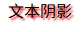

**text-over-flow**：当文本溢出包含元素时发生的事情

**超出部分显示省略符号**

* `white-space: nowrap` 文本不会换行，在同一行继续
* `over-flow: hidden` 溢出隐藏
* `text-overfolow: ellipsis` 用省略号代表被修建的文本

<font color = "blue">示例</font>

```css
.text2 {
    width: 100px;
    text-shadow: 2px 2px 2px red;
    /*文本溢出时不换行*/
    white-space: nowrap;
    /*元素溢出部分隐藏*/
    overflow: hidden;
    /*文本溢出部分使用省略号显示*/
    text-overflow: ellipsis;
}
```

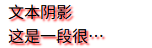

### 1.5 字体

```css
@font-face {
    font-family: 必需，规定字体的名称
        src：必需，定义字体文件的url
        font-weight：可选。定义字体的粗细，默认是"normal"
        font-style：可选。定义字体的样式，默认是"normal"
}
```

<font color = "blue">示例</font>

```html
<!DOCTYPE html>
<html lang="en">
<head>
    <meta charset="UTF-8">
    <title>登录</title>
    <link rel="stylesheet" type="text/css" href="css/font.css">
    <style>
        .group {
            position: relative;
        }
        .group > i {
            position: absolute;
            left: 4px;
            top: 6px;
            color: black;
        }
        .group > input {
            /*左内边距*/
            padding-left: 20px;
            /*无边框*/
            border: none;
            /*选中后不显示边框*/
            outline: none;
            /*下边框为下划线*/
            border-bottom: 1px solid black;
        }
    </style>
</head>
<body>
    <div class="group">
        <i class="fa fa-user"></i>
        <input type="text">
    </div>
    <div class="group">
        <i class="fa fa-lock"></i>
        <input type="password">
    </div>
    <div>
        <input type="button" value="登录">
    </div>
</body>
</html>
```

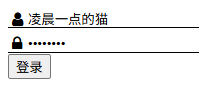

### 1.6 变形

CSS3变形是一些效果的集合。如平移、旋转、缩放、倾斜效果；每个效果都可以称为变形(transform)，它们可以分别操控元素发生平移、旋转、缩放、倾斜等变化。

```css
/*transform-function是一个变形函数，可以是一个，也可以是多个，中间以空格分开*/
transform:[transform-function];
```

#### 1.6.1 平移

**translate(x, y)**：平移函数，基于x、y坐标重新定义元素的位置

**translateX(x)**：表示只设置x轴的位移

**translateY(y)**：表示只设置y轴的位移

<font color = "blue">示例</font>

```css
/*平移函数，基于x、y坐标重新定义元素的位置*/
/*transform: translate(20px, 20px);*/
transform: translateX(30px) translateY(30px);
```

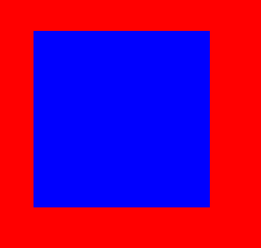

#### 1.6.2 2D缩放

**scale(x, y)**：缩放函数，可以使任意元素对象尺寸发生变化。当该函数只接收一个值时，表示同时设置x与y的值

**scaleX(x)**：表示只设置x轴的缩放

**scaleY(y)**：表示只设置y轴的缩放

<font color = "blue">示例</font>

```css
/*缩放函数*/
/*transform: scale(3, 0.7);*/
transform: scaleX(3) scaleY(0.7);
```


#### 1.6.3 旋转

**rotate(degree)**：旋转函数，取值是一个度数值。参数degree单位使用deg表示，参数degree取正值时元素相对原来中心顺时针旋转

<font color = "blue">示例</font>

```css
transform: rotate(10deg);
```

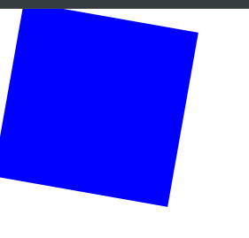

#### 1.6.4 倾斜

**skew(x, y)**：倾斜函数，取值是一个度数值

**skewX(x)**：表示只设置x轴的倾斜

**skewY(y)**：表示只设置y轴的倾斜

<font color = "blue">示例</font>

```css
/*倾斜函数*/
/*transform: skew(20deg, 60deg);*/
transform: skewX(45deg) skewY(45deg);
```

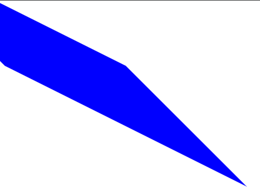

### 1.7 过渡

**transition**呈现的是一种过渡，是一种动画的转换的过程，如渐现、渐弱、动画快慢等

CSS3**transition**的过渡功能通过一些CSS的简单动作出发样式平滑过渡

```css
transition:[transition-property transition-duration transition-timing-function transiti-delay]
```

* `transition-property`：过渡或动态模拟的CSS属性，为了方便，一般都指定all，表示所有属性
* `transition-duration：完成过渡所需要的时间，即从设置旧属性到换新属性所花费的时候，单位为秒（s）
* transition-timing-function`：指定过渡元素
  * `linea`r：规定以相同速度开始至结束的过渡函数
  * `ease`：规定慢速开始，然后变快，然后慢速结束的过渡效果（默认）
  * `ease-in`：规定以慢速开始的过渡效果
  * `ease-out`：规定以慢速结束的过渡效果

* `transition-delay`：过渡开始出现的延迟时间。

  正值表示元素过渡效果立即触发，当过了设置的时间值后才会被触发。

  负值表示元素过渡效果会从该时间点开始显示，之前的动作被截断。

  0是默认值，元素过渡效果立即执行。

**过渡效果触发时机**

* 伪类触发：`:hover  :active  :focus  :checked`

* 媒体查询：通过@media属性判断设备的尺寸，方向等
* JavaScript触发：用JavaScript脚本触发

<font color = "blue">示例</font>

```html
<!DOCTYPE html>
<html lang="en">
<head>
    <meta charset="UTF-8">
    <title>过渡效果</title>
    <style>
        #tran {
            width: 200px;
            height: 200px;
            background-color: red;
            /*宽度发生变化时就会触发过渡效果*/
            transition: width .5s ease 0s;
        }
        #tran:hover {
            width: 800px;
        }
    </style>
</head>
<body>
    <div id="tran">

    </div>
</body>
</html>
```

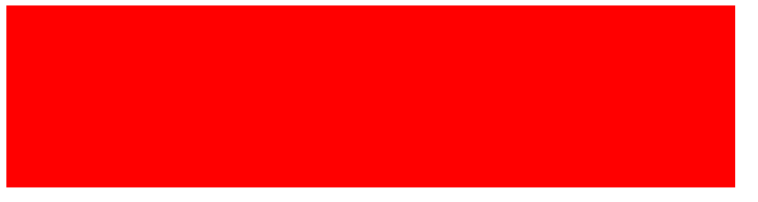

### 1.8 媒体查询

```css
@media mediatype and|not|only (media feature) {
    CSS-Code;
}
```

* `mediatype`：表示媒体类型

  * `all`：用于所有设备
  * `screen`：用于电脑屏幕，平板电脑，智能手机等

* `media feature`：表示媒体功能

  `max-width`：定义输出设备的页面最大可见区域宽度

  `max-width`：定义输出设别中页面最小可见区域宽度

<font color = "blue">示例</font>

```html
<!DOCTYPE html>
<html lang="en">
<head>
    <meta charset="UTF-8">
    <title>媒体查询</title>
    <style>
        .box {
            background-color: red;
            height: 50px;
        }

        @media screen and (max-width: 700px) {
            .box {
                width:200px;
            }
        }

        @media screen and (max-width: 900px) {
            .box {
                width:300px;
            }
        }

        @media screen and (max-width: 1200px) {
            .box {
                width:400px;
            }
        }
    </style>
</head>
<body>
    <div class="box">

    </div>
</body>
</html>
```


## 2. 网格布局

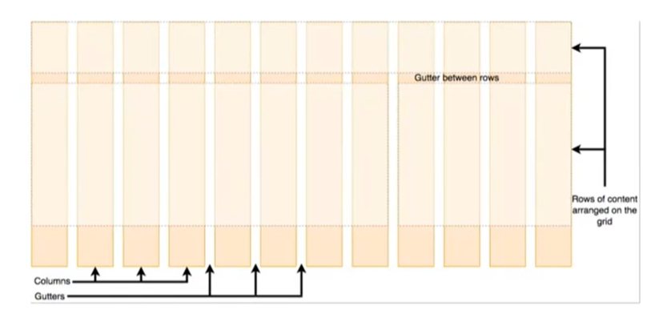

网格布局就是指通过水平和垂直创建的一种模式，可以在这个模式上排列元素，网格通常具有行（row）和列（column）以及间隙（列跟列之间的距离，gutter）

* fr（fraction，片段）布局单位

  fr单位被用于在一系列长度值中分配剩余空间，如果多个已指定了多个部分，则剩下的空间根据各自的数字按比例分配

* repeat

  CSS函数表示轨道列表中重复部分，可以更紧凑地写入列和行重复

<font color = "blue">示例</font>

```html
<!DOCTYPE html>
<html lang="en">
<head>
    <meta charset="UTF-8">
    <title>网格</title>
    <style>
        html,
        body {
            width: 100%;
            height: 100%;
            margin: 0;
            padding: 0;
        }
        .box {
            /*子元素以网格形式进行排列布局，默认按行排列*/
            display: grid;
            /*网格按列进行排列布局，每一行中有3列，每列占用一个fr*/
            /*grid-template-columns: repeat(3, 1fr);*/
            /*使用百分比分别设置每一列的宽度*/
            grid-template-columns: 10% 60% 30%;
            grid-gap: 10px;
            /*height: 100%;*/
        }
        .child {
            background-color: blue;
            color: #dddddd;
        }
    </style>
</head>
<body>
    <div class="box">
        <div class="child">1</div>
        <div class="child">2</div>
        <div class="child">3</div>
        <div class="child">4</div>
        <div class="child">5</div>
        <div class="child">6</div>
    </div>
</body>
</html>
```

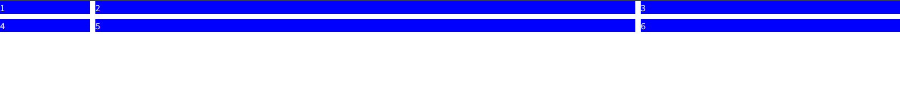

```html
<!DOCTYPE html>
<html lang="en">
<head>
    <meta charset="UTF-8">
    <title>grid</title>
    <style>
        html,
        body {
            width: 100%;
            height: 100%;
            margin: 0;
            padding: 0;
        }
        header {
            height: 40px;
            background-color: black;
        }
        main {
            display: grid;
            grid-template-columns: 200px calc(100% - 200px);
            height: calc(100% - 40px);
        }
        aside {
            background-color: blue;
        }
        section {
            display: grid;
            grid-template-rows: 40px calc(100% - 80px) 40px;
        }
        nav,
        footer {
            background-color: pink;
            height: 40px;
        }
    </style>

</head>
<body>
    <header>

    </header>
    <main>
        <aside>

        </aside>
        <section>
            <nav></nav>
            <article></article>
            <footer></footer>
        </section>
    </main>
</body>
</html>
```

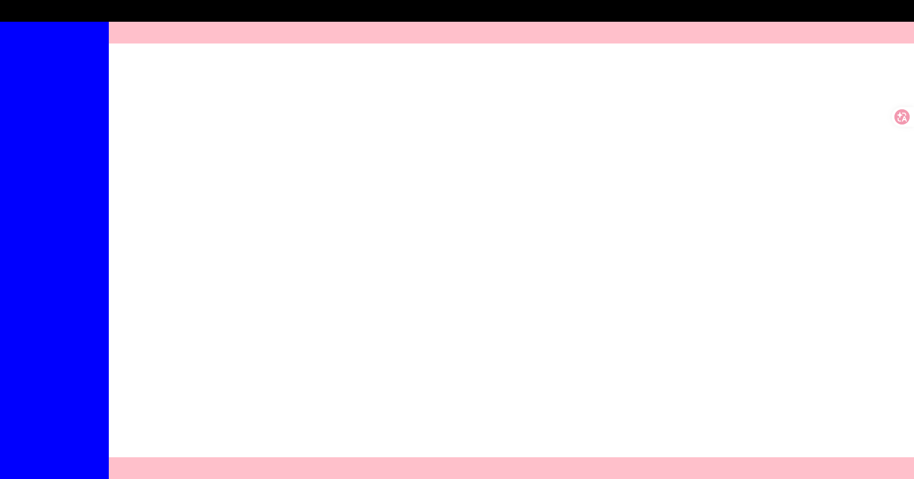


## 3. flex布局

### 3.1 Flex简介

Flex是 Flexible Box 的缩写，意为弹性布局。采用 Flex 布局的元素，称为 Flex 容器，简称容器。它的所有子元素自动成为容器成员，称为 Flex 项

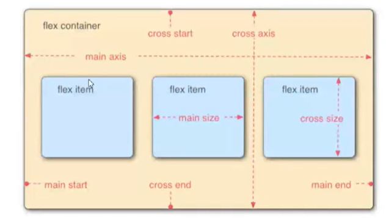

容器默认存在两根轴：水平的轴（main axis）和垂直的轴（cross axis）。主轴的开始位置（与边框的交叉点）叫做`main start`，结束的位置叫做`main end`；交叉的开始位置叫做`cross start`，结束的位置叫做`cross end`。

Flex 项默认沿主轴排列。单个项占据的主轴空间叫做`main size`，占据的交叉空间叫做`cross size`


### 3.2 容器的属性

以下6个属性设置在容器上

* `flex-direction`
* `flex-warp`
* `flex-flow`
* `justify-content`
* `align-items`
* `align-content`

#### 3.2.1 flex-direction属性

`flex-direction`属性决定主轴的方向（即项目的排列方向）

```css
.box {
    flex-dircetion: row | row-reverse | column | column-reverse;
}
```

* `row`：默认值，主轴为水平方向，起点在左端

* `row-reverse`：主轴为水平方向，起点在右端

* `column`：主轴为垂直方向，起点在上沿

* `column-reverse`：主轴为垂直方向，起点在下沿

  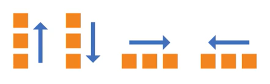

#### 3.2.2 flex-wrap 属性

默认情况下， Flex 项目都排列在一条线上（又称为轴线），`flex-wrap`定义，如果一条轴线排不下，如何换行。

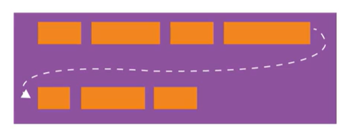

```css
.box {
    flex-wrap: nowrap | wrap | wrap-reverse;
}
```

* `nowarp`：不换行（默认）

  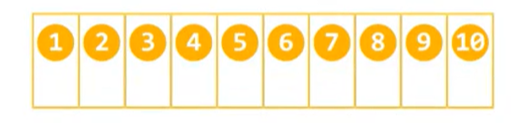

* `wrap`：换行，第一行在上方

  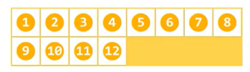

* `wrap-reverse`：换行，第一行在下方

  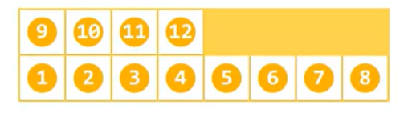

<font color = "blue">示例</font>

```html
<!DOCTYPE html>
<html lang="en">
<head>
    <meta charset="UTF-8">
    <title>flex布局</title>
    <style>
        html,
        body {
            width: 100%;
            height: 100%;
            margin: 0;
            padding: 0;
        }
        .container {
            /*容器内的元素使用flex布局*/
            display: flex;
            /*在水平方向排列，也可以理解为在一行中排列*/
            flex-direction: row;
            flex-wrap: wrap-reverse;
            height: 100%;
        }
        .child {
            background-color: aqua;
            color: white;
            width: 20%;
            height: 200px;
        }
    </style>
</head>
<body>
    <div class="container">
        <div class="child">1</div>
        <div class="child">2</div>
        <div class="child">3</div>
        <div class="child">4</div>
        <div class="child">5</div>
        <div class="child">6</div>
    </div>
</body>
</html>
```

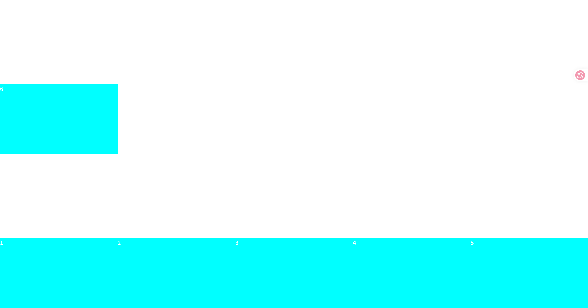

#### 3.2.3 flex-flow

`flex-flow`属性是`flex-direction`和`flex-wrap`属性的简写形式，默认值为`row nowrap`

```css
.box {
    flex-flow: <flex-direction> || <flex-wrap>;
}
```

<font color = "blue">示例</font>

```css
.container {
    /*容器内的元素使用flex布局*/
    display: flex;
    /*在水平方向排列，也可以理解为在一行中排列*/
    /*flex-direction: row;*/
    /*flex-wrap: wrap-reverse;*/
    /*flow属性是direction和wrap属性的简写形式，默认值为row nowrap*/
    flex-flow: row wrap;
    height: 100%;
}
```

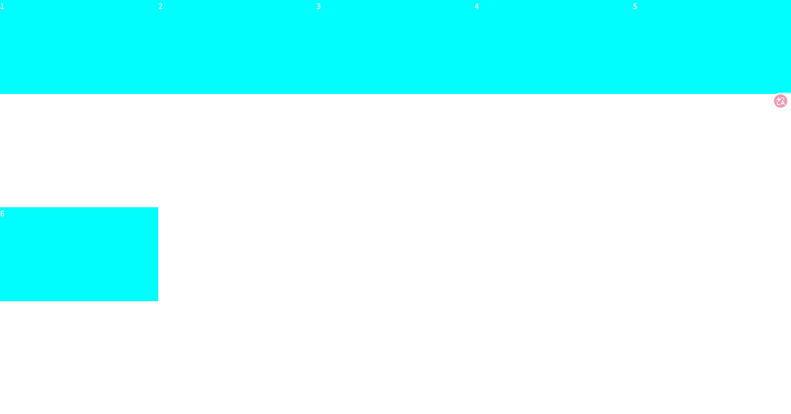

#### 3.2.4 justify-content属性

`justify-content`属性定义了项目在主轴上的对齐方式

```css
.box {
    justify-content: flex-start | flex-end | center | space-between | space-around;
}
```

* `flex-start`：左对齐（默认值）
* `flex-end`：右对齐
* `center`：居中
* `space-between`：两端对齐，项目之间的间隔都相等
* `space-around`：每个项目两侧的间隔相等。所以，项目之间的间隔比项目于与边框的间隔大一倍

<font color = "blue">示例</font>

```css
.container {
    /*容器内的元素使用flex布局*/
    display: flex;
    /*在水平方向排列，也可以理解为在一行中排列*/
    /*flex-direction: row;*/
    /*flex-wrap: wrap-reverse;*/
    /*flow属性是direction和wrap属性的简写形式，默认值为row nowrap*/
    flex-flow: row wrap;
    justify-content: space-around;
    height: 100%;
}
```

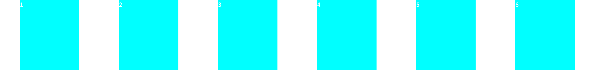

#### 3.2.5 align-items属性

`align-items`属性定义项目在交叉轴上如何对齐

```css
.box {
    align-items: flex-start | flex-end | center | baseline | stretch;
}
```

* `flex-start`：交叉轴的起点对齐
* `flex-end`：交叉轴的终点对齐
* `center`：交叉轴的中点对齐
* `baseline`：项目的第一行文字的基线对齐
* `stretch`：默认值，如果项目未设置高度或设为auto，将占满整个容器的高度

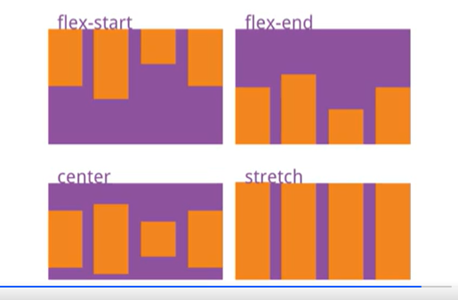

#### 3.2.6 align-content属性

`align-content`属性定义了多根轴线的对齐方式。如果项目只有一根轴线，该属性不起作用

```css
.box {
    align-content: flex-start | flex-end | center | space-between | space-around | stretch;
}
```

* `flex-start`：与交叉轴的起点对齐

* `flex-end`：与交叉轴的终点对齐

* `center`：与交叉轴的中点对齐

* `space-between`：与交叉轴的两端对齐，轴线之间的间隔平均分布

* `space-around`：每根轴线两侧的间隔都相等。所以。轴线之间的间隔比轴线与边框的间隔大一倍

* `stretch`：默认值，轴线占满整个交叉轴

  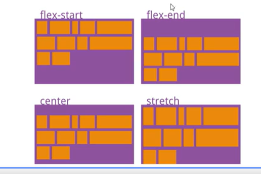

<font color = "blue">示例</font>

```css
.container {
    /*容器内的元素使用flex布局*/
    display: flex;
    /*在水平方向排列，也可以理解为在一行中排列*/
    /*flex-direction: row;*/
    /*flex-wrap: wrap-reverse;*/
    /*flow属性是direction和wrap属性的简写形式，默认值为row nowrap*/
    flex-flow: row wrap;
    justify-content: flex-start;
    align-items: stretch;
    align-content: space-around;
    height: 100%;
}
```

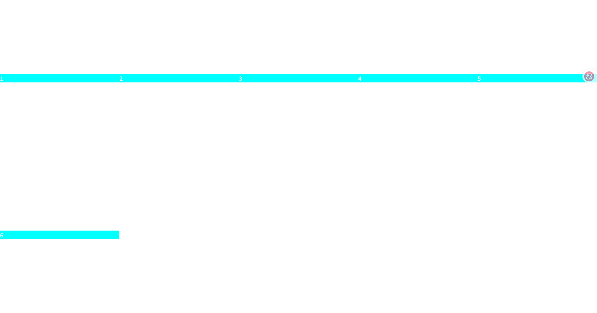

### 3.3 Flex 项的属性

以下六个属性设置在 flex 项上

* `order`
* `flex-grow`
* `flex-shrink`
* `flex-basis`
* `flex`
* `align-self`

#### 3.3.1 order属性

`order`属性定义项目的排列顺序。数值越小，排列越靠前，默认为0

```css
.item {
    order: <integer>;
}
```

<font color = "blue">示例</font>

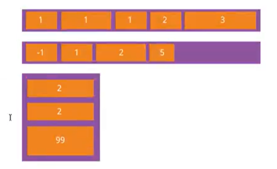

```html
<body>
    <div class="container">
        <div class="child" style="order: 3">1</div>
        <div class="child" style="order: 5">2</div>
        <div class="child" style="order: 2">3</div>
        <div class="child" style="order: 1">4</div>
        <div class="child" style="order: 4">5</div>
        <div class="child" style="order: 6">6</div>
    </div>
</body>
```

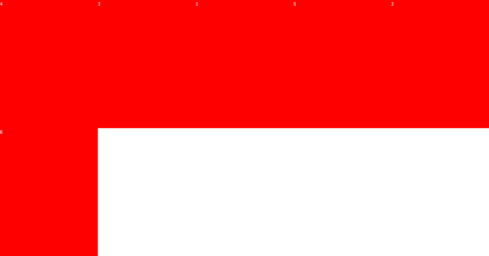

#### 3.3.2 flex-grow属性

`flex-grow`属性定义项目的方法比例，默认为0，即如果存在剩余空间，也不放大

```css
.item {
 	/*default: 0*/   
    flex-grow: <number>;
}
```

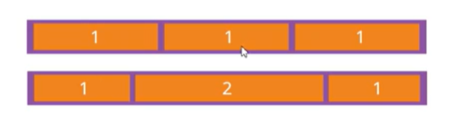

如果所有项目的`flex-grow`属性都为1，则它们将等分剩余空间（如果有的话）。如果一个项目的`flex-grow`属性为2，其他项目都为1，则前者占据的剩余空间将比其他多一倍。

<font color = "blue">示例</font>

```html
<div class="container">
    <div class="child" style="order: 3; flex-grow: 2.5">1</div>
    <div class="child" style="order: 5; flex-grow: 1.5">2</div>
    <div class="child" style="order: 2; flex-grow: 1.5">3</div>
    <div class="child" style="order: 1">4</div>
    <div class="child" style="order: 4">5</div>
    <div class="child" style="order: 6">6</div>
</div>
```

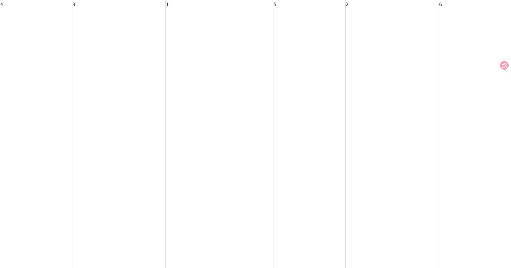

#### 3.3.3 flex-shrink属性

`flex-shrink`属性定义了项目的比例缩小，默认为1，即如果空间不足，该项目将缩小

```css 
.item {
    /*default: 1*/
    flex-shrink: <number>;
}
```

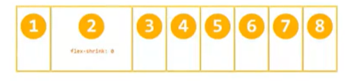

如果所有项目的`flex-shrink`属性都为1，当空间不足的时，都将等比例缩小。如果一个项目的`flex-shrink`属性为0，其他项目都为1，则空间不足时，前者不为缩小。

负值对该属性无效

#### 3.3.4 flex-basis属性

`flex-basis`属性定义了在分配多余空间之前，项目于占据的主轴空间（main size）。浏览器根据整个属性，计算主轴是否有多余空间。它的默认值为`auto`，即项目本来的大小

```css 
.item {
 	/*default: auto;*/   
    flex-basis: <length> | auto;
}
```

它可以设为`width`或`height`属性一样的值（比如350px），则项目将占据固定空间

#### 3.3.5 flex属性

`flex`属性时`flex-grow`,`flex-shrink`和`flex-basis`的简写，默认值为`0 1 auto`。后两个属性可选

```css
.item {
    flex: none | [<'flex-grow'> <'flex-shrink'>? || <'flex-basis'>]
}
```

该属性有两个快捷键：`auto(1 1 auto)` 和 none（`0 0 none`）

建议优先使用这个属性，而不是单独写三个分离的属性，因为浏览器会推算相关值

#### 3.3.6 align-self属性

`align-self`属性允许单个项目有与其他项目不一样的对齐方式，可覆盖`align-items`属性。默认值为`auto`，表示继承父元素的`align-items`属性，如果没有父元素，则等同于`stertch`

```css
.item {
    align-self: auto | flex-start | flex-end | center | baseline | stretch;
}
```

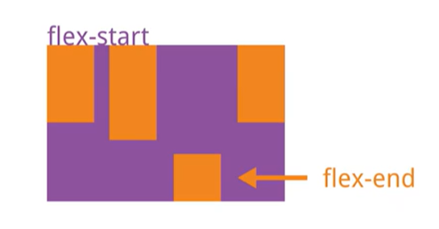

该属性可能取6个值，除了auto，其他都与`align-items`属性完全一致

```html
<body>
    <div class="container">
        <div class="child" style="order: 3; flex-grow: 2.5">1</div>
        <div class="child" style="order: 5; flex-grow: 1.5">2</div>
        <div class="child" style="order: 2; flex-grow: 1.5">3</div>
        <div class="child" style="order: 1; flex-basis: auto">4</div>
        <div class="child" style="order: 4; flex: 2.0 0.8 auto">5</div>
        <div class="child" style="order: 6; align-self: flex-end">6</div>
    </div>
</body>
```

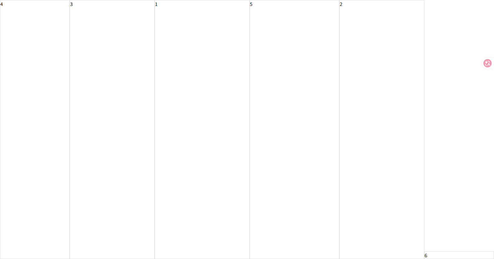


### 3.4 示例

```html
<!DOCTYPE html>
<html lang="en">
<head>
    <meta charset="UTF-8">
    <title>example</title>
    <style>
        html,
        body {
            width: 100%;
            height: 100%;
            margin: 0;
            padding: 0;
        }
        header {
            height: 40px;
            background-color: black;
        }
        main {
            height: calc(100% - 40px);
            width: 100%;
            display: flex;
            flex-direction: row;
        }
        aside {
            width: 200px;
            background-color: red;
        }
        section {
            width: calc(100% - 200px);
            display: flex;
            flex-direction: column;
        }
        nav,
        footer {
            background-color: green;
            height: 40px;
        }
        article {
            height: calc(100% - 40px - 40px);
        }
    </style>
</head>
<body>
    <header>

    </header>
    <main>
        <aside>

        </aside>
        <section>
            <nav></nav>
            <article></article>
            <footer></footer>
        </section>
    </main>
</body>
</html>
```

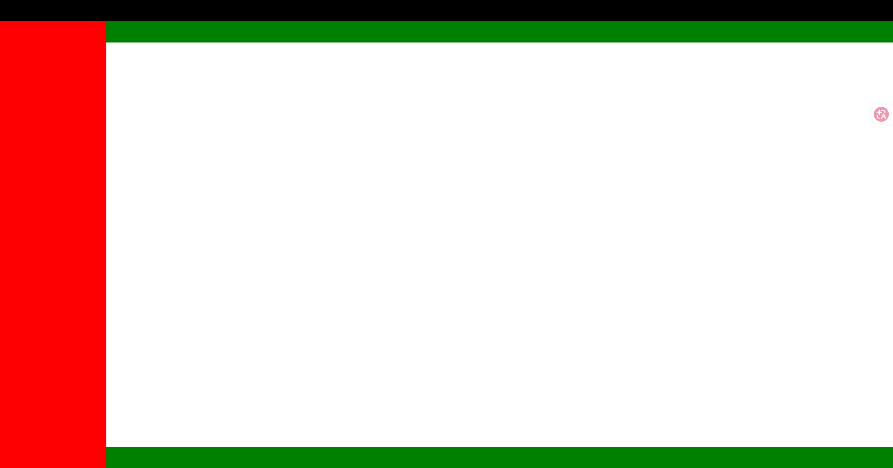
