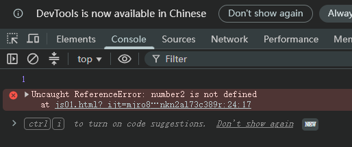
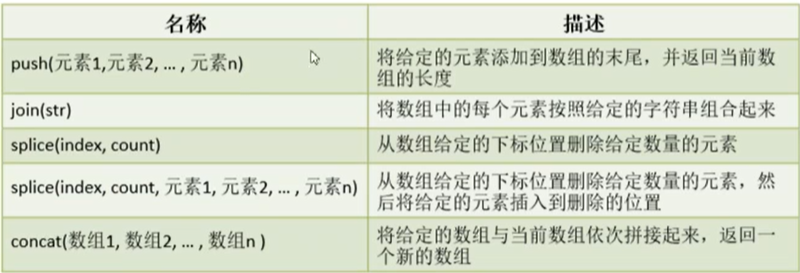
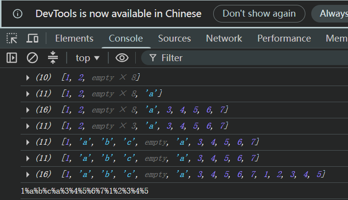
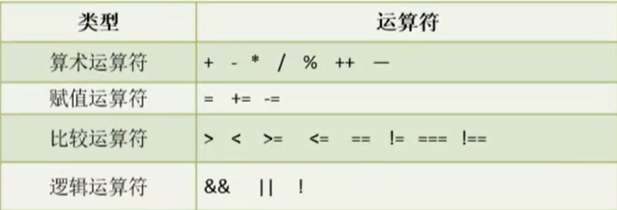
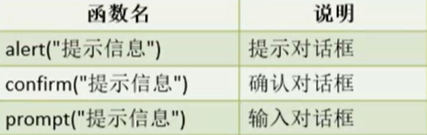
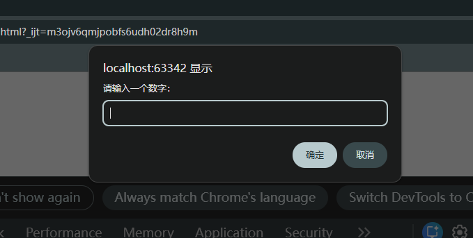
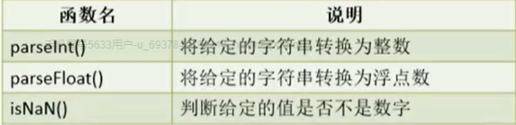
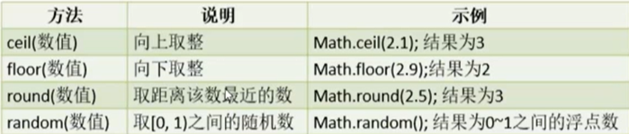
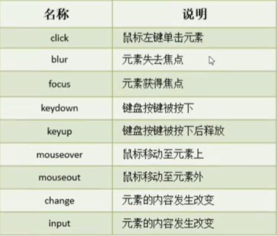

# JavaScript基础

## 1. JavaScript基础

### 1.1 JavaScript简介

JavaScript 是一种解释性脚本语言（不用编译），主要用于向 HTML 添加交互行为，语法与 Java 类似。JavaScript 由 ECMAScript（简称 ES）、DOM（Document Object Model）和 BOM（Broswer Object Model）三大部分组成。

### 1.2 JavaScript基本结构

```html
<script type="text/javascript">
    // JavaScript 代码
</script>
```

该结构可以在 HTML 中的任意位置书写，但必须保证 JavaScript 脚本中使用的元素必须在 JavaScript 脚本执行前完成加载。

### 1.3 JavaScript执行过程

用户从浏览器中发出页面请求，服务器接收请求并进行处理，处理完成后会将也买你返回至浏览器，浏览器开始解释执行该页面，如果页面中包含有 JavaScript 脚本，那么浏览器会再次向服务器发出 JavaScript 脚本获取请求，服务器接收请求并进行处理，处理完成后将 JavaScript 脚本返回至浏览器，浏览器开始解释执行 JavaScript 脚本。

### 1.4 JavaScript 引入方式

JavaScript 的引入方式与 CSS 样式引入方式是一致的，分为行内脚本、内部脚本和外部脚本

<font color = "blue">行内脚本</font>

```javascript
<input type="button" value="点击" onclick="alert('你点击了按钮')"
```

<font color = "blue">内部脚本</font>

```html
<input type="button" value="点击" id="btn">
<script type="text/javascript">
	document.getElementById("btn").onclick=function() {
        alert('你点击了按钮');
    }
</script>
```

<font color = blue>外部脚本</font>

```javascript
// demp.js
document.getElemnetById("btn").onclick=function() {
    alert('你点击了按钮');
}
```

```html
<!-- demo.html -->
<input type="button" value="点击" id="btn">
<script type="text/javascript" src="demo.js"></script>
```


## 2. JavaScript 语法

### 2.1 数据类型

| 数据类型  | 说明                                                         |
| --------- | ------------------------------------------------------------ |
| undefined | var msg；变量msg没有赋初始值，默认为undefined                |
| null      | 空值，与undefined值相同，但类型不同                          |
| number    | var num = 10;                                                |
| boolean   | var valid = true;                                            |
| string    | var name = "张三"; var sex = '男';                           |
| object    | var obj = new Object(); var stu = {name: "张三"; sex = "男"}; |


### 2.2 变量

#### 2.2.1 var 关键字定义变量

JavaScript 是一种弱类型语言（没有类型之分），因此，在定义变量的时候统一使用 <font color = "red">**var(variable)**</font> 关键字来定义。<font color = "red">**在 JavaScript 中，变量也是严格区分大小写的**</font>

```javascript
var msg = 20;		// 赋值数字
msg = "字符串";  	  // 赋值字符串
msg = true;			// 赋值布尔值
msg = new Object();	// 赋值对象
```

#### 2.2.2 let 关键字定义变量

```javascript
let name = "张三";
let number = 23;
```

#### 2.2.2.3 var 与 let 的区别

```javascript
<script type="text/javascript">
    // variable
    {   // 作用范围
        var number1 = 1;
        let number2 = 2;
    }
    // console表示控制台，log表示日志记录
    console.log(number1);
    // 无法访问number2
    console.log(number2);
</script>
```



由此可以得出：<font color = "red">**let 声明的变量只在它所在的代码块中有效。var 声明的变量作用与全局**</font>

### 2.3 字符串

#### 2.3.1 定义字符串

在JavaScript 中，凡是使用单引号或者双引号引起来的内容都属于字符串

<font color = "blue">示例</font>

```javascript
// 凡是双引号和单引号引起来的都是字符串
let s1 = "字符串";
let s2 = '也是字符串';
```

#### 2.3.2 字符串常用方法

| 方法名称                | 说明                                         |
| ----------------------- | -------------------------------------------- |
| charAt(index)           | 返回指定位置的字符                           |
| indexOf(str, index)     | 查找某个指定的字符串在字符串中首次出现的位置 |
| substring(start, end)   | 返回字符串中位于区间[start, end)的字符串     |
| split(str)              | 将字符串按照给定的字符串分割为字符串数组     |
| replace(oldStr, newStr) | 将字符串中指定的字符串使用新的字符串进行替换 |

<font color = "blue">示例</font>

```javascript
let c = s1.charAt(0);   // 返回值是一个字符串
console.log(c);
// typeof 表示···的类型
console.log(typeof c);

// 左闭右开
let sub = s1.substring(1, 3);
console.log(sub);

// 给定的字符串按照空白字符拆分
let arr = s1.split("");
console.log(arr);

let newStr = s1.replace("字", "zi");
console.log(newStr);
```

### 2.4 数组

#### 2.4.1 创建数组

```javascript
let 数组名 = new Array(数组长度);
let 数组名 = new Array(数组元素1， 数组元素2， ···， 数组元素n);
let 数组名 = [数组元素1， 数组元素2， ···， 数组元素n];
```

<font color = "blue">示例</font>

```javascript
<script type="text/javascript">
    // 构建一个长度为10的数组
    let array1 = new Array(10);
    // 构建一个数组，数组中存储元素12345
    let array2 = new Array(1, 2, 3, 4, 5);
    // 在JavaScript中，中括号表示数组
    let array3 = [1,2,3,4,5];
</script>
```

#### 2.4.2 数组元素赋值

```javascript
// 数组元素赋值与Java中相同
array1[0] = 1;
array1[1] = 2;
console.log(array1);
```

#### 2.4.3 数组常用方法



<font color = "blue">示例</font>

```javascript
// 将字符串a添加到数组的末尾
array1.push("a");
console.log(array1);
// 可以一次性将数组中添加多个元素
array1.push(3,4,5,6,7);
console.log(array1);

// 从下标为2的元素开始，删除5个元素
array1.splice(2, 5);
console.log(array1);
// 从下标为1的元素开始删除3个元素
// 然后将字符串"a""b""c"，从删除位置依次插入
array1.splice(1, 3, "a", "b", "c");
console.log(array1);

// 将array3中的元素追加到array1的末尾
// 需要注意，追加动作在新数组中进行
let concat = array1.concat(array3);
console.log(array1);
console.log(concat);

// 将concat数组中的所有元素，使用%拼接
let str = concat.join("%");
console.log(str);
```



### 2.5 对象

```javascript
// 创建一个对象
let o = new Object();
// 对象的属性可以直接设置
o.name = "张三";
o.age = 18;
o.sex = "男";

// 在JavaScript中，大括号表示对象
let stu = {
    // 属性名和属性值，使用冒号分隔开
    // 多个属性使用逗号分隔
    name: "张三",
    age: 20,
    sex: '男'
};
console.log(o);
console.log(stu);
```


## 3. 运算符



<font color = "blue">示例</font>

```html
<!DOCTYPE html>
<html lang="en">
<head>
    <meta charset="UTF-8">
    <title>操作符</title>
</head>
<body>

</body>
<script type="text/javascript">
    let a = 1;
    let b = 2;
    console.log(a++);
    console.log(a);
    console.log(++a);
    console.log(a);
    a += b;
    console.log(a);
    // 在Java中两个整数相除，所得的一定是整数
    // 但在JavaScript中，所得的可能是小数
    let res = a / b;
    console.log(res);
    console.log(a % b);

    let c = "2";
    // 两个等号进行比较，只比较内容是否相同
    console.log(c == b);
    // 三个等号进行比较，比较内容是否相同的同时，还要检查类型
    console.log(c === b);
    // 有一个等号的不等于，只比较内容是否相同
    console.log(b != c);
    // 有两个等号的不等于,比较内容是否相同的同时，还要检查类型
    console.log(b !== c);

    // 逻辑与
    let s1 = a > 1 && b === c;
    // 逻辑或
    let s2 = a > 1 || b === c;
    // 逻辑非
    let s3 = !a > 1;
    console.log(s1 + " " + s2 + " " + s3);
</script>
</html>
```


## 4. 流程控制语句

### 4.1 if 语句

```javascript
if (条件) {
    
} else {
    
}
```

<font color = "blue">示例</font>

```javascript
let a = 10;
if (typeof a === "number") {
    console.log("变量a是一个整数");
} else {
    console.log("变量a不是一个整数");
}
```

### 4.2 switch 语句

```javascript
switch(表达式) {
    case 常量1:break;
    case 常量2:break;
    ···
    case 常量n:break;
}
```

<font color = "blue">示例</font>

```javascript
switch (a % 3) {
    case 1:
        console.log(1);
        break;
    case 2:
        console.log(2);
        break;
    default:
        console.log(0);
}
```

### 4.3 循环语句

```javascript
for(循环变量初始化; 循环条件; 循环变量更新) {
    // 循环操作
}

while (循环条件) {
    // 循环操作
}

do {
  // 循环条件  
} while(循环条件);

for (let 变量名 in 对象或数组) {
    // 循环操作
}

// 循环语句中的break和continue
```

<font color = "blue">示例</font>

```javascript
for (let i = 0; i < 10; i++) {
    console.log(i);
}
let num = 0;
while (num++ < 10) {
    console.log(num);
}
do {
    console.log(num--);
} while (num > 0);

console.log("===================");
let arr = [1,2,3,4,5];
// 对于数组来说，使用for in 循环就是遍历数组的下标
for (let index in arr) {
    console.log(index + "=>" + arr[index]);
}
console.log("====================");
// 对于对象来说，使用for in 循环就是遍历对象的属性
let stu = {
    name: "张三",
    age: 25,
    score: 60
};
for (let prop in stu) {
    console.log(prop + "=>" + stu[prop]);
}
// 对象的属性取值，除了使用 . 操作之外，还可以使用中括号来取值
console.log(stu.name);
console.log(stu["name"]);
```


## 5. 函数

函数是用于完成特定功能的语句块，类似 Java 中的方法，函数分为系统函数和自定义函数

### 5.1 系统函数

#### 5.1.1 窗体函数



<font color = "blue">示例</font>

```javascript
<script type="text/javascript">
    // alert("这是提示信息");
    
    // 确认对话框会有一个返回值，该值表示用户是否进行了确认
    // let res = confirm("确定要删除这些信息吗")
    // console.log(res);
    
    // 输入对话框有一个返回值，该值为输入的信息
    // 如果用户没有进行输入，而进行了确认，结果为空字符串
    // 如果用书取消了输入，那么结果为null
    let input = prompt("请输入一个数字：");
    console.log(input);
</script>
```



#### 5.1.2 数字相关函数



<font color = "blue">示例</font>

```javascript
// 在JavaScript中，parseInt函数能够将以数字开头的任意字符串转化为整数
let a = parseInt("12a3");
console.log(a);
// 在JavaScript中，parseFloat函数能够将以数字以及‘.’号开头的任意字符串转化为浮点数
let b = parseFloat(".132a");
console.log(b);
// 是否不是数字
let res = isNaN("abc");
console.log(res);
```

#### 5.1.3 math 类相关



<font color = "blue">示例</font>

```javascript
// 向上取整
console.log(Math.ceil(0.225));
// 向下取整
console.log(Math.floor(0.9));
// 返回与给定数值最近的整数
console.log(Math.round(2.5));
console.log(Math.round(2.4));
console.log(Math.round(-2.4));
// 随机数
console.log(Math.random());
```

### 5.2 自定义函数

```javascript
function 函数名(参数1, 参数2, ···, 参数n) {
    // JavaScript语句
    return 返回值;
}

// 函数调用
函数名(参数值1，参数值2，···，参数值n);
```

<font color = "blue">示例</font>

```html
<!DOCTYPE html>
<html lang="en">
<head>
    <meta charset="UTF-8">
    <title>function</title>
</head>
<body>

</body>
<script type="text/javascript">
    // public int sum(int a, int b) {
    //      return a + b;
    // }
    // 没有类型
    function sum(a,b) {
        return a + b;
    }
    function show(a) {
        console.log(a);
    }
    show(sum(1,2));

    /**
     * 在JavaScript中，一个函数的返回值也可以是另一个函数
     * @param a
     * @param b
     * @param c
     * @returns {function(*): *}
     */
    function calc(a, b, c) {
        let res = a + b;
        return function (d) {
            return res + c * d;
        }
    }
    // 此时需要注意的是，calc函数执行的结果是一个函数
    // 也就是说，在JavaScript中，变量可以存储一个函数
    // 在这种情况，把变量当成一个函数即可
    let s = calc(1, 2, 3);
    console.log(s(4));
    // 闭包
    console.log(calc(1,2,3)(4));
</script>
</html>
```

### 5.3 元素事件与函数



开启元素事件只需要在事件名前面加上"on"即可，关闭元素事件只需要在事件前面加上"off"即可

<font color = "blue">示例</font>

```html
<!DOCTYPE html>
<html lang="en">
<head>
    <meta charset="UTF-8">
    <title>Title</title>
</head>
<body>
    <div>
        <input type="text" id="username" self="abc">
    </div>
    <div>
        <input type="password" id="password">
    </div>
    <div>
        <!--onclick表示开启所在元素的点击事件-->
        <input type="button" value="点击" onclick="login()">
    </div>
</body>
<script type="text/javascript">
    function showValue() {
        // document表示一个文档对象，是JavaScript内置对象，不需要new，直接就可以使用
        // document主要提供的功能就是操作页面元素，比如创建元素、查找元素
        let input = document.getElementById("username");
        // 凡是写在标签上的，都是属于标签的属性
        console.log(input.value);
        // 自定义属性需要使用方法来获取值
        console.log(input.getAttribute("self"));
    }

    let input = document.getElementById("username");
    // 给ID为username标签添加一个获得焦点事件
    input.onfocus = function () {
        console.log("input输入框获得了焦点");
    }
    // 给ID为username标签添加一个失去焦点事件
    input.onblur = function () {
        if (input.value === "") {
            console.log("input输入框没有进行任何的输入");
        } else {
            console.log(input.value);
        }
    }

    // 这里的参数e表示event，是一个事件对象
    input.onkeydown = function(e) {
        // 主要用于登录页面中用户输入信息完毕后,用enter进行登录
        if (e.code == 'Enter') {
            login();
        }
    }

    document.getElementById("password").onkeydown = function (e) {
        if (e.code == 'Enter') {
            login();
        }
    }

    function login() {
        console.log("正在登陆中");
    }

    // 键盘按下后释放
    input.onkeyup = function (e) {
        if (e.code === "KeyW") {
            console.log("松开W");
        }
    }

    // 按键盘
    input.onkeypress = function (e) {
        if (e.code === "enter") {
            login();
        }
    }
</script>
</html>
```

```html
<!DOCTYPE html>
<html lang="en">
<head>
    <meta charset="UTF-8">
    <title>鼠标事}件</title>
    <style>
        #box {
            width: 200px;
            height: 200px;
            background-color: red;
        }
        /*鼠标悬浮box上时，颜色由红色变为绿色*/
        /*#box:hover {*/
        /*    background-color: green;*/
        /*}*/
    </style>
</head>
<body>
    <div id="box">

    </div>
</body>
<script type="text/javascript">
    let box = document.getElementById("box");
    // 鼠标悬浮在元素上（冒泡）
    box.onmouseover = function() {
        box.style.background = "green";
    }
    // mouseenter（不冒泡），鼠标进入内部
    box.onmouseenter = function() {
        box.style.background = "green";
    }
    // 鼠标离开离开元素
    box.onmouseout = function () {
        box.style.background = "red";
    }
</script>
</html>
```

```html
<!DOCTYPE html>
<html lang="en">
<head>
    <meta charset="UTF-8">
    <title>输入内容改变事件</title>
</head>
<body>
    <input type="text" id="text">

    <select id="sex">
        <option>男</option>
        <option>女</option>
        <option>其他</option>
    </select>

    <input type="file" id="file">
</body>
<script type="text/javascript">
    let text = document.getElementById("text");
    // 在输入内容时，按下enter或者元素失去焦点时才会触发
    text.onchange = function () {
        console.log("change->" + text.value);
    }
    // 在输入内容改变时，立即触发，与是否按下enter无关
    text.oninput = function () {
        console.log("input->" + text.value);
    }

    let sex = document.getElementById("sex");
    sex.onchange = function () {
        console.log("change=>" + sex.value);
    }
    sex.oninput = function () {
        console.log("input=>" + sex.value);
    }

    let file = document.getElementById("file");
    file.onchange = function () {
        console.log("change=>" + file.files);
    }
    file.oninput = function () {
        console.log("input=>" + file.files);
    }
</script>
</html>
```
