# BOM 与 DOM

## 1. BOM

BOM(Browser Object Model)，即浏览器对象模型，BOM 提供了独立与内容的对象结构，可以与浏览器窗口进行互动

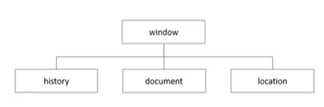

### 1.1 window 对象

window 对象包含了3个对象：history、document和location

#### 1.1.1 history 对象

history 对象主要用于控制页面的历史记录显示

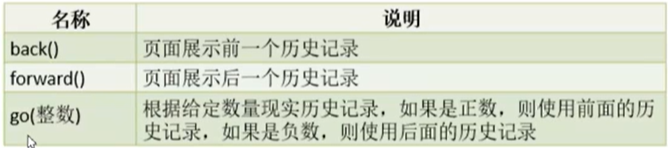

<font color = "blue">示例</font>

```html
<!DOCTYPE html>
<html lang="en">
<head>
    <meta charset="UTF-8">
    <title>page1</title>
</head>
<body>
    <a href="page2.html">去下一个页面</a>
    <a href=""></a>
</body>
</html>
```

```html
<!DOCTYPE html>
<html lang="en">
<head>
    <meta charset="UTF-8">
    <title>page2</title>
</head>
<body>
    <!--javascript: 后面的内容都是属于JavaScript脚本代码-->
    <a href="javascript: history.back()">返回上一个页面</a>
    <a href="javascript: history.forward()">去下一个页面1</a>
    <a href="page3.html">去下一个页面2</a>
</body>
</html>
```

```html
<!DOCTYPE html>
<html lang="en">
<head>
    <meta charset="UTF-8">
    <title>page3</title>
</head>
<body>
<!--javascript: 后面的内容都是属于JavaScript脚本代码-->
<a href="javascript: history.go(-2)">返回第一个页面</a>
</body>
</html>
```

#### 1.1.2 location 对象

location 对象主要用于获取以及更改浏览器地址栏信息

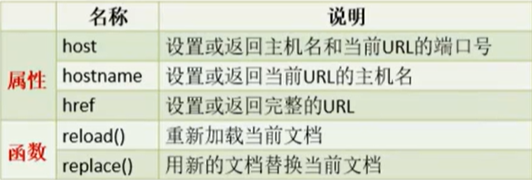

<font color = "blue">示例</font>

```html
<!DOCTYPE html>
<html lang="en">
<head>
    <meta charset="UTF-8">
    <title>location</title>
</head>
<body>
    <!--javascript: void(0)表示点击超链接时不会做任何事情 -->
    <a href="javascript: void(0)" onclick="showAddress()">显示地址栏信息</a>
    <a href="javascript: void(0)" onclick="refresh()">刷新页面</a>
    <a href="javascript: void(0)" onclick="changePage()">替换新页面</a>
</body>
<script type="text/javascript">
    function showAddress() {
        console.log(location.host);
        console.log(location.hostname);
        console.log(location.href);
    }

    function refresh() {
        location.reload();
    }

    function changePage() {
        location.replace("page2.html");
    }
</script>
</html>
```

#### 1.1.3 document 对象

document 对象主要用于操作页面元素

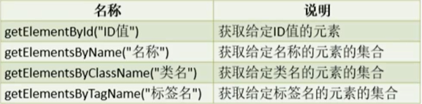

<font color = "blue">示例</font>

```html
<!DOCTYPE html>
<html lang="en">
<head>
    <meta charset="UTF-8">
    <title>document</title>
</head>
<body>
    <div id="a">a</div>
    <div id="b" class="c">b</div>
    <div class="c">c</div>
    <div name="d">d</div>
</body>
<script type="text/javascript">
    // 得到单个元素
    let div = document.getElementById("a");
    console.log(div);
    // 内部文本内容
    // div.innerText = "讲内容改变为b";
    // 内部HTML内容
    // div.innerHTML = "<h1>内容支持标签<h1>";
    // 作用与innerText一样
    div.textContent = "<h1>文本内容<h1>";
    console.log("================");
    // 通过标签名获取元素
    let divArr = document.getElementsByTagName("div");
    console.log(divArr);
    console.log("================");
    // 通过类名获取元素
    let arr = document.getElementsByClassName("c");
    console.log(arr);
    console.log("================");
    let nameArr = document.getElementsByClassName("d");
    console.log(nameArr);
</script>
</html>
```


## 2. Date 类

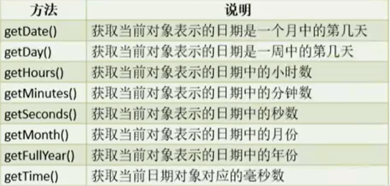

<font color = "blue">示例</font>

```html
<!DOCTYPE html>
<html lang="en">
<head>
    <meta charset="UTF-8">
    <title>date</title>
</head>
<body>

</body>
<script type="text/javascript">
    // 创建日期对象,默认时间为系统当前时间
    let now = new Date();
    // 获取年份
    let year = now.getFullYear();
    // 获取月份,月份在0~11之间
    let month = now.getMonth() + 1;
    // 获取日期是当前月的第几天
    let date = now.getDate();
    // 获取小时数
    let hour = now.getHours();
    // 获取分钟数
    let minute = now.getMinutes();
    // 获取秒数
    let second = now.getSeconds();
    let time = year + "-" + zerofill(month, 2) + "-" + zerofill(date, 2) + " " + zerofill(hour, 2) + ":" + zerofill(minute, 2) + ":" + zerofill(second, 2);
    console.log(time);
    // 获取当前日期是一周的第几天，一周的开始是周日，值为0
    let weekday = now.getDay();
    console.log(weekday);

    now.setMonth(month);
    now.setDate(0);
    // 需要注意，在取当前月最大天数时，需要将月份重新设置，日期设置为0
    console.log(now.getMonth() + " " + now.getDate());

    function zerofill(num, targetLen) {
        let str = num + "";
        while (str.length < targetLen) {
            str = "0" + str;
        }
        return str;
    }
</script>
</html>
```


## 3. 周期函数和延迟函数

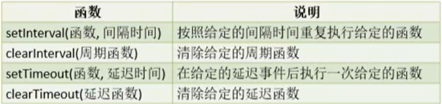

<font color = "blue"> 示例</font>

```html
<!DOCTYPE html>
<html lang="en">
<head>
    <meta charset="UTF-8">
    <title>interval</title>
</head>
<body>
    <div id="time1"></div>
    <div id="time2"></div>
</body>
<script type="text/javascript">
    // 周期函数
    setInterval(function () {
        // 创建日期对象,默认时间为系统当前时间
        let now = new Date();
        // 获取年份
        let year = now.getFullYear();
        // 获取月份,月份在0~11之间
        let month = now.getMonth() + 1;
        // 获取日期是当前月的第几天
        let date = now.getDate();
        // 获取小时数
        let hour = now.getHours();
        // 获取分钟数
        let minute = now.getMinutes();
        // 获取秒数
        let second = now.getSeconds();
        let time = year + "-" + zerofill(month, 2) + "-" + zerofill(date, 2) + " " + zerofill(hour, 2) + ":" + zerofill(minute, 2) + ":" + zerofill(second, 2);
        let div = document.getElementById("time1");
        div.textContent = time;
    }, 1000);

    let count = 0;
    function showTime() {
        // 创建日期对象,默认时间为系统当前时间
        let now = new Date();
        // 获取年份
        let year = now.getFullYear();
        // 获取月份,月份在0~11之间
        let month = now.getMonth() + 1;
        // 获取日期是当前月的第几天
        let date = now.getDate();
        // 获取小时数
        let hour = now.getHours();
        // 获取分钟数
        let minute = now.getMinutes();
        // 获取秒数
        let second = now.getSeconds();
        let time = year + "-" + zerofill(month, 2) + "-" + zerofill(date, 2) + " " + zerofill(hour, 2) + ":" + zerofill(minute, 2) + ":" + zerofill(second, 2);
        let div = document.getElementById("time2");
        div.textContent = time;
        count++;
        // count为10,周期函数停止
        // if (count === 10) {
        //     // 清理给定的周期函数
        //     clearInterval(t);
        // }
    }
    // 如果第一个参数传递的是一个字符串，该字符串必须是函数的调用
    // let t = setInterval(showTime, 1000);
    // setInterval("showTime()", 1000);

    // 在3秒后执行一次showTime函数
    let s = setTimeout(showTime, 3000);
    clearTimeout(s);
    
    function zerofill(num, targetLen) {
        let str = num + "";
        while (str.length < targetLen) {
            str = "0" + str;
        }
        return str;
    }


</script>
</html>
```


## 4. DOM

DOM(Document Object Model)，即文档对象模型，DOM主要提供了对于页面内容的一些操作。<font color = "red">**在 DOM 中，所有的内容（标签和文本）都是 DOM 节点，所有的标签都是 DOM 元素**</font>

### 4.1 DOM 节点关系

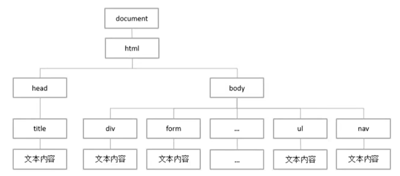

### 4.2 节点属性

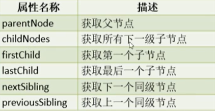

<font color = "blue">示例</font>

```html
<!DOCTYPE html>
<html lang="en">
<head>
    <meta charset="UTF-8">
    <title>node</title>
</head>
<body>
    <div id="box">
        <!--该位置处有一个enter键-->
        <div>
            <input type="text">
        </div>
        <a href="javascript: void(0)">超链接1</a>
        <a href="javascript: void(0)">超链接2</a>
        <a href="javascript: void(0)">超链接3</a>
        <a href="javascript: void(0)">超链接4</a>
        <a href="javascript: void(0)">超链接5</a>
    </div>
    <a href="javascript: void(0)">超链接5</a>
</body>
<script type="text/javascript">
    let box = document.getElementById("box");
    // 父节点
    console.log(box.parentNode);
    // 文本内容包括enter键所在的内的换行,注释都属于节点
    let childNodes = box.childNodes;
    console.log(childNodes);
    // 第一个子节点
    console.log(box.firstChild);
    // 最后一个字节点
    console.log(box.lastChild);

    // 第一个字节点
    let first = childNodes[0];
    console.log(first.nextSibling);
    // 最后一个字节点
    let last = box.lastChild;
    console.log(last.previousSibling);
</script>
</html>
```

### 4.3 元素属性

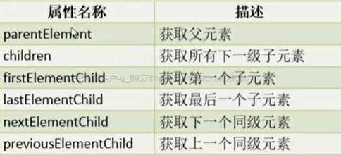

*注：nextElementSilbing 为获取下一个同级元素*

<font color = "blue">示例</font>

```html
<!DOCTYPE html>
<html lang="en">
<head>
    <meta charset="UTF-8">
    <title>element</title>
</head>
<body>
    <div id="box">
        <!--该位置处有一个enter键-->
        <div>
            <input type="text">
        </div>
        <a href="javascript: void(0)">超链接1</a>
        <a href="javascript: void(0)">超链接2</a>
        <a href="javascript: void(0)">超链接3</a>
        <a href="javascript: void(0)">超链接4</a>
        <a href="javascript: void(0)">超链接5</a>
    </div>
<a href="javascript: void(0)">超链接5</a>
</body>
<script type="text/javascript">
    let box = document.getElementById("box");
    // 父元素,元素也就是标签
    console.log(box.parentElement);
    // 下一级子元素
    let children = box.children;
    console.log(children);
    // 第一个子元素
    console.log(box.firstElementChild);
    // 最后一个子元素
    console.log(box.lastElementChild);
    // 第一个子元素的下一个同级元素
    console.log(box.firstElementChild.nextElementSibling);
    // 第一个子元素的上一个同级元素
    console.log(box.firstElementChild.previousElementSibling);
</script>
</html>
```

### 4.4 节点操作

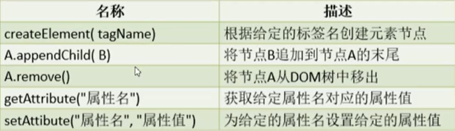

<font color = "blue">示例</font>

```html
<!DOCTYPE html>
<html lang="en">
<head>
    <meta charset="UTF-8">
    <title>表格刷新</title>
</head>
<body>
    <input type="button" value="查询" id="searchBtn">
    <table>
        <thead>
        <tr>
            <td>姓名</td>
            <td>性别</td>
            <td>年龄</td>
        </tr>
        </thead>
        <tbody id="dataBox">

        </tbody>
    </table>
</body>
<script type="text/javascript">
    let stus = [{
        name: "张三1",
        sex: "男",
        age: 20
    },{
        name: "张三2",
        sex: "男",
        age: 20
    },{
        name: "张三3",
        sex: "男",
        age: 20
    },{
        name: "张三4",
        sex: "男",
        age: 20
    },]

    let btn = document.getElementById("searchBtn");
    btn.onclick = function () {
        let dataBox = document.getElementById("dataBox");
        // 获取table标签
        let table = dataBox.parentElement;
        // 将tbody从DOM树中移除
        dataBox.remove();
        // 创建tbody标签
        dataBox = document.createElement("tbody");
        dataBox.setAttribute("id", "dataBox");
        table.appendChild(dataBox);

        for (let i = 0; i < stus.length; i++) {
            // 创建tr标签
            let tr = document.createElement("tr");
            // 创建td标签
            let td = document.createElement("td");
            td.textContent = stus[i].name;
            // 将td追加到tr的末尾
            tr.appendChild(td);
            td = document.createElement("td");
            td.textContent = stus[i].sex;
            // 将td追加到tr的末尾
            tr.appendChild(td);
            td = document.createElement("td");
            td.textContent = stus[i].age;
            // 将td追加到tr的末尾
            tr.appendChild(td);

            dataBox.appendChild(tr);
        }
    }
</script>
</html>
```

### 4.5 节点样式

#### 4.5.1 style 样式

``` javascript
// 节点.style.样式属性 = "值";
```

<font color = "blue">示例</font>

```html
<!DOCTYPE html>
<html lang="en">
<head>
    <meta charset="UTF-8">
    <title>节点样式</title>
    <style>
        .box {
            width: 200px;
            height: 200px;
            background-color: #ddd;
        }

        .active {
            background-color: red;
        }
    </style>
</head>
<body>
    <div id="a"></div>
    <div id="box active"></div>
</body>
<script type="text/javascript">
    let div = document.getElementById("a");
    div.style.height = "50px";
    div.style.background = "red";
    // div.className = "box";
</script>
</html>
```

#### 4.5.2 class 样式

```javascript
// 节点.className = "样式属性";
```

<font color = "blue">示例</font>

```html
<!DOCTYPE html>
<html lang="en">
<head>
    <meta charset="UTF-8">
    <title>节点样式</title>
    <style>
        .box {
            width: 200px;
            height: 200px;
            background-color: #ddd;
        }

        .active {
            background-color: red;
        }
    </style>
</head>
<body>
    <div id="a"></div>
    <div id="box active"></div>
</body>
<script type="text/javascript">
    let div = document.getElementById("a");
    // div.style.height = "50px";
    // div.style.background = "red";
    div.className = "box";
</script>
</html>
```

### 4.6 节点属性

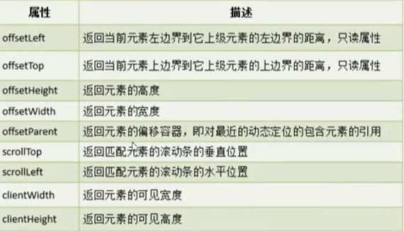

<font color = "blue">示例</font>

```html
<!DOCTYPE html>
<html lang="en">
<head>
    <meta charset="UTF-8">
    <title>节点属性</title>
    <style>
        html,
        body {
            margin: 0;
            padding: 0;
            height: 100%;
            width: 100%;
            /*滚动条取值，需要设置此属性*/
            overflow: scroll;
        }
    </style>
</head>
<body>
    <div id="a">
        <ul id="u" style="list-style: none; margin: 0">
            <li>测试</li>
        </ul>
        <input type="button" value="按钮" id="btn" style="height: 1000px">
    </div>
</body>
<script type="text/javascript">
    let u = document.getElementById("u");
    console.log(u.offsetLeft);
    console.log(u.offsetTop);
    console.log(u.offsetWidth + " X " + u.offsetHeight);
    console.log(u.clientWidth + " X " + u.clientHeight);

    document.getElementById("btn").onclick = function () {
        let body = document.getElementsByTagName("body")[0];
        console.log(body.scrollTop);
    }
</script>
</html>
```


## 5. Promise 对象

### 5.1 Promise 简介

Promise 对象代表了未来将要发生的事件，用来传递异步操作的消息，其状态不受外界影响。Promise 对象代表一个异步操作，有三种状态：

* pending：初始状态，不是成功或失败状态
* fulfilled：意味着操作成功完成
* rejected：意味着操作失败

只有异步操作的结果，可以决定当前是哪一种状态，任何其他操作都无法改变这个状态。这也是 Promise 这个名字的由来(承诺)，表示其他手段无法改变。

一旦 Promise 对象从初始状态改变，就不会再变，任何时候都可以得到这个结果。Promise 对象的状态改变，只有两种可能：从 pending 变为 resolved 和从 pending 变为 rejected。只要这两种情况发生，状态就凝固了，不会再改变，会一直保持这个结果

### 5.2 Promise 应用

```javascript
let promise = new Promise(function(resolve, reject) {
    // 异步处理
    // 处理结束后，调用 resolve 或 reject
})

promise.then(function(result) {
    // result 的值是上面调用resolve(···)方法传入的值，可以对该结果进行相应的处理
})

promise.catch(function(error) {
    // error 的值是上面调用reject(···)方法传入的值，可以对该结果进行相应的处理
})

// 链式调用
let promise = new Promise(function(resolve, reject) {
    // 异步处理
    // 处理结束后，调用resolve或reject
}).then(function(result) {
    // result 的值是上面调用resolve(···)方法传入的值，可以对该结果进行相应的处理
}).catch(function(error) {
    // error 的值是上面调用reject(···)方法传入的值，可以对该结果进行相应的处理
});
```

Promise 构造函数包含一个参数和一个带有 resolve（解析）和 reject（拒绝）两个参数的回调。在回调种执行一些操作（例如异步），如果一切都正常，则调用 resolve，否则调用 reject。

<font color = "blue">示例</font>

```html
<!DOCTYPE html>
<html lang="en">
<head>
    <meta charset="UTF-8">
    <title>promise</title>
</head>
<body>

</body>
<script type="text/javascript">

    function calculate(a, b) {
        let promise = new Promise(function (resolve, reject) {
            // 异常情况处理，使用reject函数进行拒绝
            if (b === 0) {
                reject(new Error("除数不能为0"));
            // 成功处理的情况使用resolve函数进行处理
            } else {
                resolve(a / b);
            }
        })

        // 这里的response接收的值就是promise对象中resolve函数的参数值
        promise.then(function (response) {
            console.log("处理成功 " + response);
        })
        // 这里的error接收的值就是promise对象中reject函数的参数值
        promise.catch(function(error) {
            console.log("处理失败 " + "除数不能为0");
        })
    }
    calculate(2, 1);
    calculate(2, 0);
</script>
</html>
```


## 6. 箭头函数

箭头函数想象于Java中的lambda表达式，传递的依然是实现过程

<font color = "blue">示例</font>

```html
<!DOCTYPE html>
<html lang="en">
<head>
    <meta charset="UTF-8">
    <title>箭头表达式</title>
</head>
<body>

</body>
<script type="text/javascript">

    function calculate(a, b) {
        let promise = new Promise((resolve, reject) => {
            // 异常情况处理，使用reject函数进行拒绝
            if (b === 0) {
                reject(new Error("除数不能为0"));
            // 成功处理的情况使用resolve函数进行处理
            } else {
                resolve(a / b);
            }
        })

        // 这里的response接收的值就是promise对象中resolve函数的参数值
        promise.then(response => {
            console.log("处理成功 " + response);
        })
        // 这里的error接收的值就是promise对象中reject函数的参数值
        promise.catch(error => {
            console.log("处理失败 " + error);
        })
    }
    calculate(2, 1);
    calculate(2, 0);
</script>
</html>
```
