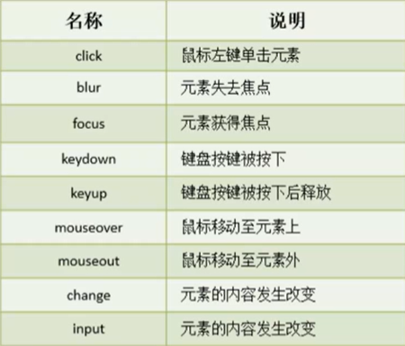
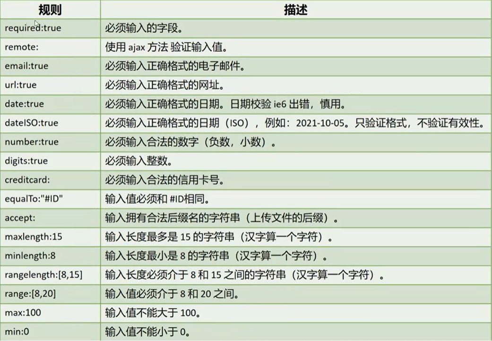
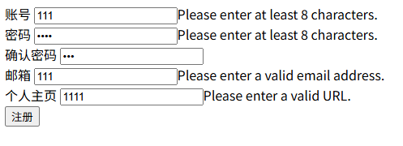
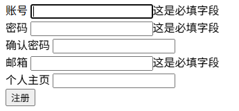
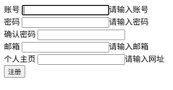

# jQuery

## 1. jQuery 简介

jQuery 是对 JavaScript 对象和函数的封装

### 1.1 jQuery 用途

* 访问和操作 DOM 元素
* 控制页面样式
* 对页面事件进行处理
* 扩展新的 jQuery 插件
* 与 Ajax 技术完美结合

### 1.2 jQuery 优势

* 体积小、压缩只有100KB 左右
* 强大的选择器
* 出色的 DOM 封装
* 可靠的事件处理机制
* 出色的浏览器兼容性
* 使用隐式迭代简化编程
* 丰富的插件支持

### 1.3 jQuery 引入

```html
<script type="text/javascript" src="jQuery库文件路径"></script>
```


## 2. jQuery 语法

### 2.1 jQuery 选择器

```javascript
$(CSS选择器|DOM元素);
```

<font color = "red">**注意：jQuery选择器得到的结果是一个集合**</font>

<font color = "blue">示例</font>

```javascript
// jQuery选择器
$("form");  // 选中页面中所有的form表单
$("#username")  // ID选择器，选择所有ID为username的元素
$(".form-group");   // 选中所有使用了类样式的form-group的元素
$("input[type=text]");  //选中所有的文本输入框
$("input[name=username]");  // 选中名称为username的输入框
$("div, span"); // 并集选择器，选中所有的div和span元素
$("form input");    // 后代选择器，选中form标签下的所有input元素
$("div > span");    // 子代选择器，选中div标签下一级的所有span标签

$("div:first"); // 过滤选择器，选中所有div标签中的第一个标签
$("div:last"); // 过滤选择器，选中所有div标签中的最后一个标签

$("div:even");  // 过滤选择器，选中所有div标签中下标为偶数的标签
$("div:odd");   // 过滤选择器，选中所有div标签中下标为奇数的标签

$("div:eq(0)"); // 过滤选择器，选中所有div标签中下标为0的标签
// gt = greater than 大于
$("div:gt(0)"); // 过滤选择器，选中所有div标签中下标大于0的标签
// lt = less than 小于
$("div:lt(0)"); // 过滤选择器，选中所有div标签中下标小于0的标签

$("input:focus");   // 过滤选择器，选中所有input标签中获得焦点的标签

$(document);    // 选中整个文档
```

### 2.2 ready 方法

```javascript
$(选择器|DOM元素).ready(回调函数);
```

ready 方法表示 jQuery 选择器选择的标签准备好了之后需要执行的后续动作。通常用于表示文档准备好之后需要做的后续动作

<font color = "blue">示例</font>

```javascript
// 文档准备好了之后，需要执行的脚本代码
$(document).ready(function () {
    // 脚本代码
});

// 省略的等价写法
$(function() {
    // 脚本代码
   
});
```


## 3. DOM 元素操作

### 3.1 操作元素内容

```javascript
$(选择器 | DOM元素).text();	// 获取标签内的文本内容
$(选择器 | DOM元素).text(元素文本内容);	// 设置标签内的文本内容

$(选择器 | DOM元素).html();	// 获取标签内的html内容
$(选择器 | DOM元素).html(元素内html内容);	// 设置标签内的html内容
```

<font color = "blue">示例</font>

```html
<!DOCTYPE html>
<html lang="en">
<head>
    <meta charset="UTF-8">
    <title>content</title>
    <style>
        .error {
            color: red;
            height: 30px;
            line-height: 30px;
        }
        .info {
            color: blue;
        }
    </style>
</head>
<body>
    <div class="error"></div>
    <div class="info"></div>
</body>
<script type="text/javascript" src="js/jquery-4.0.0.js"></script>
<script type="text/javascript">
    $(function () {
        // $(".error").text("账号或密码错误");
        let elements = $(".error"); // jQuery对象是一个集合
        // 集合可以通过下标直接访问某个位置的元素
        // 在前端就是数组
        elements[0].textContent = "账号或密码错误";
        // 集合可以通过get方法传递一个下标进去获取对应位置的元素
        elements.get(0).textContent = "账号密码错误"
        // 不论是通过下标直接获取还是通过get方法获取，得到的都是一个DOM对象，DOM对象可以直接操控属性
        elements.get(0).innerText = "账号密码错误";

        $(".info").html("<h1>显示一级标题</h1>")
        // $(".info").text("<h1>显示一级标题</h1>")

        console.log($(".error").text());
        console.log($(".info").html());
    })
</script>
</html>
```

### 3.2 操作元素属性

```javascript
$(选择器 | DOM元素).val();	// 获取标签的value属性
$(选择器 | DOM元素).val(value值);	// 设置标签的value值

$(选择器 | DOM元素).attr(属性名);	// 获取标签上给定属性名对应的属性值
$(选择器 | DOM元素).attr(属性名, 属性值);	// 设置标签上给定属性名对应的属性值

$(选择器 | DOM元素).removeAttr(属性名);	// 移除标签上给定的属性名
```

<font color = "blue">示例</font>

```html
<!DOCTYPE html>
<html lang="en">
<head>
    <meta charset="UTF-8">
    <title>jQuery操作元素属性</title>
</head>
<body>
    <input type="text" value="123">
    <div id="content" data-info="这是测试内容"></div>
</body>
<script type="text/javascript" src="js/jquery-4.0.0.js"></script>
<script type="text/javascript">
    $(function () {
        // 获取input标签上的type属性值
        let type = $("input").attr("type");
        console.log(type);
        let value = $("input").attr("value");
        console.log(value);
        // 只能获取value属性的值
        value = $("input").val();
        console.log(value);

        $("input").attr("value", "234");
        // 只能设置value属性的值
        $("input").val("345");

        // attr还可以获取自定义属性的值
        console.log($("#content").attr("data-info"));
        $("#content").attr("data-info", "这是修改内容");

        // removeAttr可以移除元素属性，包括自定义属性
        $("#content").removeAttr("data-info");
    })
</script>
</html>
```

### 3.3 操作元素样式

#### 3.3.1 操作元素的宽度和高度

```javascript
$(选择器 | DOM元素).width();	// 获取标签的宽度
$(选择器 | DOM元素).width(宽度值);	// 设置标签的宽度

$(选择器 | DOM元素).height();	// 获取标签的高度
$(选择器 | DOM元素).height(高度值);	// 设置标签的高度
```

<font color = "blue">示例</font>

```html
<!DOCTYPE html>
<html lang="en">
<head>
    <meta charset="UTF-8">
    <title>style</title>
</head>
<body>
    <div class="info"></div>
</body>
<script type="text/javascript" src="js/jquery-4.0.0.js"></script>
<script type="text/javascript">
    $(function () {
        let info = $(".info");
        info.width("200px");
        info.height("200px");

        console.log(info.width());
        console.log(info.height());
        console.log(info.width() + " x " + info.height());
    })
</script>
</html>
```

#### 3.3.2 操作元素行内样式

```javascript
$(选择器 | DOM元素).css(样式属性名);	// 获取标签上给定样式属性名对应的样式属性值
$(选择器 | DOM元素).css(属性名， 属性样式值);	// 设置标签上给定样式属性名对应的样式属性值

$(选择器 | DOM元素).css({
   // css样式，样式属性名中存在中横线时，使用驼峰命名法对样式属性名进行组装 
});
```

<font color = "blue">示例</font>

```html
<!DOCTYPE html>
<html lang="en">
<head>
    <meta charset="UTF-8">
    <title>style</title>
</head>
<body>
    <div class="info">这是测试文字</div>
</body>
<script type="text/javascript" src="js/jquery-4.0.0.js"></script>
<script type="text/javascript">
    $(function () {
        let info = $(".info");
        info.width("200px");
        info.height("200px");

        console.log(info.width());
        console.log(info.height());
        console.log(info.width() + " x " + info.height());

        // 如果css样式属性名中包含 - 符号，那么可以使用驼峰命名法，将每个单词进行组装，作为css样式属性名
        info.css("backgroundColor", "red");
        info.css("background-color", "blue");
        console.log(info.css("backgroundColor"));

        info.css({
            "font-size": "30px",
            "border" : "1px solid black"
        });
    })
</script>
</html>
```

#### 3.3.3 操作类样式

```javascript
$(选择器 | DOM元素).addClass(类名);	// 为标签添加类样式
$(选择器 | DOM元素).removeClass(类名);	// 将给定的类样式从标签上移除
$(选择器 | DOM元素).toggleClass(类名);	// 如果元素上存在给定的类样式，则移除该类样式，否则，则为该标签上添加该类样式
$(选择器 | DOM元素).hasClass(类名);	// 判断标签上是否存在给定的类样式
```

<font color = "blue">示例</font>

```html
<!DOCTYPE html>
<html lang="en">
<head>
    <meta charset="UTF-8">
    <title>style</title>
    <style>
        .text {
            color: green;
        }
        .active {
            color: red;
        }
    </style>
</head>
<body>
    <div class="info">这是测试文字</div>
    <div class="text">这是一个会激活的文字</div>
</body>
<script type="text/javascript" src="js/jquery-4.0.0.js"></script>
<script type="text/javascript">
    $(function () {
        let info = $(".info");
        info.width("200px");
        info.height("200px");

        console.log(info.width());
        console.log(info.height());
        console.log(info.width() + " x " + info.height());

        // 如果css样式属性名中包含 - 符号，那么可以使用驼峰命名法，将每个单词进行组装，作为css样式属性名
        // info.css("backgroundColor", "red");
        // info.css("background-color", "blue");
        console.log(info.css("backgroundColor"));

        info.css({
            "font-size": "30px",
            "border" : "1px solid black"
        });

        let text = $(".text");
        // 为使用了类样式text的元素添加一个active类样式
        text.addClass("active");
        // 将使用了类样式text的元素移除一个类样式active
        text.removeClass("active");

        console.log(text.hasClass("active"));

        // 检测使用了类样式text的元素是否拥有active类样式
        // 如果有，则移除该类样式；如果没有则添加该类样式
        text.toggleClass("active");
        console.log(text.hasClass("active"));
    });
</script>
</html>
```

#### 3.3.4 元素事件



```javascript
// 为元素添加事件
$(选择器 | DOM元素).on(事件名， 函数);
// 为元素添加事件
$(选择器 | DOM元素).事件名(函数);

// 为元素中的子元素添加事件，通常用刷新部分的内容
$(选择器 | DOM元素).on(事件名，选择器，函数);
```

<font color = "blue">示例</font>

```html
<!DOCTYPE html>
<html lang="en">
<head>
    <meta charset="UTF-8">
    <title>元素事件</title>
</head>
<body>
    <input type="button" value="点击" id="btn">
    <table>
        <thead>
        <tr>
            <td>姓名</td>
            <td>性别</td>
            <td>年龄</td>
            <td>操作</td>
        </tr>
        </thead>
        <tbody>
        <!--    <tr>-->
        <!--        <td>张三</td>-->
        <!--        <td>男</td>-->
        <!--        <td>20</td>-->
        <!--        <td>-->
        <!--            <a href="javascript:void(0)">修改</a>-->
        <!--            <a href="javascript:void(0)">删除</a>-->
        <!--        </td>-->
        <!--    </tr>-->
        </tbody>
    </table>
</body>
<script type="text/javascript" src="js/jquery-4.0.0.js"></script>
<script type="text/javascript">
    $(function () {
        // 为id为btn的函数添加点击事件
        // $("#btn").on("click", function () {
        //     alert("你点击了按钮");
        // });
        $("#btn").click(function () {
            // alert("你点击了按钮");
            let students = [{
                name: "张三",
                sex: "男",
                age: "28"
            }];

            let html = "";
            for (let i = 0; i < students.length; i++) {
                html += "<tr>";
                html += "<td>" + students[i].name + "</td>";
                html += "<td>" + students[i].sex + "</td>";
                html += "<td>" + students[i].age + "</td>";
                html += "<td><a href=\"javascript:void(0)\" class='update'>修改</a><a href=\"javascript:void(0)\" class='delete'>删除</a></td>\n";
                html += "</tr>";
            }
            $("tbody").html(html);
        });

        // 为tbody中使用了类样式update的元素添加点击事件
        $("tbody").on("click", ".update", function () {
            alert("你点击了修改按钮");
        });
        // 为tbody中使用了类样式delete的元素添加点击事件
        $("tbody").on("click", ".delete", function () {
            let result = confirm("确定要删除这条信息吗");
            if (result) {
                console.log("删除了这条信息");
            }
        });
    });
</script>
</html>
```


## 4. 节点操作

### 4.1 创建、获取节点

```javascript
$(选择器);	// 获取节点
$(DOM元素);	// 将DOM元素转化为jQuery对象，该对象就是一个元素节点
$(HTML内容);	// 将HTML内容转换为一个jQuery对象，该对象就是一个元素节点
```

<font color = "blue">示例</font>

```html
<!DOCTYPE html>
<html lang="en">
<head>
    <meta charset="UTF-8">
    <title>node</title>
</head>
<body>
    <div id="text"></div>
</body>
<script type="text/javascript" src="js/jquery-4.0.0.js"></script>
<script type="text/javascript">
    $(function () {
        // 通过元素ID获取一个DOM对象
        let dom = document.getElementById("text");
        // 这就是一个jQuery获取节点的对象
        $(dom);
        $("#text");
        // 这就是创建了元素节点
        $("<tr></tr>");
    })
</script>
</html>
```

### 4.2 插入节点

```javascript
// 将给定的元素节点添加到jQuery选择器选择的标签内容的末尾
$(选择器 | DOM元素).append(元素节点);
// 将jQuery选择器选择的标签添加到给定的元素节点内容的末尾
$(选择器 | DOM元素).appendTo(元素节点);

// 将给定的元素节点添加到jQuery选择器选择的标签内容的最前面
$(选择器 | DOM元素).prepend(元素节点);
// 将jQuery选择器选择的标签添加到给定的元素节点内容的最前面
$(选择器 | DOM元素).prependTo(元素节点)；

// 将给定的元素节点插入到jQuery选择器选择的标签后面
$(选择器 | DOM元素).after(元素节点);
// 将jQuery选择器选择的标签添加到元素节点后面
$(选择器 | DOM元素).insertAfter(元素节点);

// 将给定的元素节点添加到jQuery选择器选择的标签前面
$(选择器 | DOM元素).before(元素节点);
// 将jQuery选择器选择的标签添加到给定的元素节点前面
$(选择器 | DOM元素).insertBefore(元素节点);
```

> * 内部插入（子代层级）：
>
>   * 最前面
>     * `目标.prepend(新节点)`
>     * `新节点.prependTo(目标)`
>
>   * 最后面
>     * `目标.append(新节点)`
>     * `新节点.appendTo(目标)`
>
> * 外部插入（兄弟层级）
>
>   - 紧挨着前面
>     - `目标.before(新节点)`
>     - `新节点.insertBefore(目标)`
>   - 紧挨着后面
>     - `目标.after(新节点)`
>     - `新节点.insertAfter(目标)`

<font color = "blue">示例</font>

```html
<!DOCTYPE html>
<html lang="en">
<head>
    <meta charset="UTF-8">
    <title>node</title>
</head>
<body>
    <div id="text"></div>
</body>
<script type="text/javascript" src="js/jquery-4.0.0.js"></script>
<script type="text/javascript">
    $(function () {
        // 通过元素ID获取一个DOM对象
        let dom = document.getElementById("text");
        // 这就是一个jQuery获取节点的对象
        // $(dom);
        // $("#text");
        // 这就是创建了元素节点
        // $("<tr></tr>");

        let text = $("#text");
        // 将给定的内容追加到jQuery选择器选择的元素内容的末尾
        text.append($("<div><input type='text'></div>"));
        text.append($("<div id='append'><input type='text' value='append'></div>"));
        // 将选择器的内容追加到给定的选择器定位元素内容的末尾
        $("<div id='appendTo'><input type='text' value='appendTo'></div>").appendTo(text);

        // 将给定的内容追加到jQuery选择器选择的元素内容的最前面
        text.prepend($("<div><input type='text'></div>"))
        text.prepend($("<div id='prepend'><input type='text' value='prepend2'></div>"))
        // 将选择器的内容追加到给定的选择器定位元素内容的最前面
        $("<div><input type='text'></div>").prependTo(text);
        $("<div id='prependTo'><input type='text' value='prependTo'></div>").prependTo(text);

        // 将给定的内容添加到给定选择器定位元素的后面，与该定位的元素同级
        text.after($("<div><input type='text' value='after'></div>"))
        text.after($("<div><input type='text' value='after2'></div>"))
        // 将选择器中的内容添加到给定选择器定位的元素的后面，与该元素同级
        $("<div><input type='text' value='insertAfter'></div>").insertAfter(text);

        // 将给定的内容添加到给定选择器定位元素的前面，与该定位的元素同级
        text.before($("<div><input type='text' value='before'></div>"))
        text.before($("<div><input type='text' value='before2'></div>"))
        // 将选择器中的内容添加到给定选择器定位的元素的前面，与该元素同级
        $("<div><input type='text' value='insertBefore'></div>").insertBefore(text);
    })

</script>
</html>
```

### 4.3 替换节点

```javascript
// 将jQuery选择器选择的标签使用给定的元素节点替换
$(选择器 | DOM元素).replaceWith(元素节点);
```

<font color = "blue">示例</font>

```html
<!DOCTYPE html>
<html lang="en">
<head>
    <meta charset="UTF-8">
    <title>节点替换</title>
</head>
<body>
    <div id="content"></div>
</body>
<script type="text/javascript" src="js/jquery-4.0.0.js"></script>
<script type="text/javascript">
    $(function () {
        // 使用给定选择器中的内容替换选择器选择的元素
        $("#content").replaceWith($("<ul><li>第一项</li></ul>"));
    })
</script>
</html>
```

### 4.4 移除节点

```javascript
// 将jQuery选择器选择选择的标签中的所有内容清空
$(选择器 | DOM元素).empty();

// 将jQuery选择器选择的标签(包括该标签中的所有内容)从DOM树中移除
$(选择器 | DOM元素).remove();
```

<font color = "blue">示例</font>

```html
<!DOCTYPE html>
<html lang="en">
<head>
    <meta charset="UTF-8">
    <title>移除节点</title>
</head>
<body>
    <div id="content">
        <input type="text">
    </div>
</body>
<script type="text/javascript" src="js/jquery-4.0.0.js"></script>
<script type="text/javascript">
    $(function () {
        // 清空选择器定位的元素的内容，但节点还在
        $("#content").empty();
        // 移除选择器定位的元素，节点不存在
        $("#content").remove();
    })
</script>
</html>
```

### 4.5 查找节点

```javascript
// 获取jQuery选择器选择的标签中的下一级标签
$(选择器 | DOM元素).children();

// 获取jQuery选择器选择的标签的父级标签
$(选择器 | DOM元素).parent();

// 根据jQuery选择器1选择的标签，开始沿DOM树向上按选择器2查找，查找距离该元素最近的父级元素
$(选择器1 | DOM元素).closest(选择器2);

// 获取jQuery选择器选择的标签紧邻匹配元素之后的元素
$(选择器1 | DOM元素).next([选择器2])；

// 获取jQuery选择器选择的标签紧邻匹配元素之前的元素
$(选择器1 | DOM元素).prev([选择器2]);

// 获取jQuery选择器选择的标签位于匹配元素前面的和后面的所有同辈元素
$(选择器1 | DOM元素).siblings([选择器2]);

// 在jQuery选择器选择的标签中查找拥有选择器2的元素
$(选择器1 | DOM元素).find(选择器2);

// 获取jQuery选择器选择的标签中的第一个标签
$(选择器1 | DOM元素).first();

// 获取jQuery选择器选择的标签中的最后一个标签
$(选择器1 | DOM元素).last();
```

<font color = "blue">示例</font>

```html
<!DOCTYPE html>
<html lang="en">
<head>
    <meta charset="UTF-8">
    <title>查找元素</title>
</head>
<body>
    <div></div>
    <div class="content">
        <ul class="content">
            <li id="first">第一项</li>
            <li>第二项</li>
            <li>第三项</li>
            <li>第四项</li>
        </ul>
    </div>
</body>
<script type="text/javascript" src="js/jquery-4.0.0.js"></script>
<script type="text/javascript">
    $(function () {
        // 定位ul，然后获取ul下一级的所有子元素
        let children = $(".content > ul").children();
        console.log(children)

        // 定位ul，然后获取ul父级标签
        let parent = $(".content > ul").parent();
        console.log(parent);
        // 查找距离该元素最近的父级元素
        let ancestor = $("#first").closest(".content");
        console.log(ancestor);

        // 查找与jQuery选择器定位的元素同级的下一个元素
        console.log($("#first").next());
        console.log($("div.content").next());
        // 查找与jQuery选择器定位的元素同级的上一个元素
        console.log($("div.content").prev());

        // 获取与jQuery定位的元素同级的所有元素
        console.log($("#first").siblings());
        console.log($("div.content").siblings());

        console.log($("li").first());
        console.log($("li").last());

        // 在jQuery选择器定位的元素中根据给定的选择器查找元素
        console.log($("div.content").find("#first"));
    })
</script>
</html>
```

### 4.6 遍历节点

```javascript
// index表示元素下标，e表示元素
$(选择器1 | DOM元素).each(function(index, e) {
    // 遍历操作
}) 
```

<font color = "blue">示例</font>

```html
<!DOCTYPE html>
<html lang="en">
<head>
    <meta charset="UTF-8">
    <title>遍历元素</title>
</head>
<body>
    <div></div>
    <div class="content">
        <ul class="content">
            <li id="first">第一项</li>
            <li>第二项</li>
            <li>第三项</li>
            <li>第四项</li>
        </ul>
    </div>
</body>
<script type="text/javascript" src="js/jquery-4.0.0.js"></script>
<script type="text/javascript">
    $(function () {
        // 定位ul，然后获取ul下一级的所有子元素
        let children = $(".content > ul").children();
        // 遍历
        children.each(function (index, e) {
            console.log(index);
            console.log(e);
        })
    })
</script>
</html>
```

## 5. jQuery validate

### 5.1 jQuery validate 简介

jQuery validate 插件为表单提供了强大的验证功能，让客户端表单验证变得简单，同时提供了大量的定制选项，满足应用程序的各种需求



### 5.2 jQuery validate 使用

```html
<!DOCTYPE html>
<html lang="en">
<head>
    <meta charset="UTF-8">
    <title>jQuery validate</title>
</head>
<body>
<form class="registerForm" id="registerForm" method="post" action="">
    <div>
        <label for="username">账号</label>
        <input id="username" name="username" minlength="8" maxlength="15"
               type="text" required>
    </div>
    <div>
        <label for="password">密码</label>
        <input id="password" name="password" minlength="8" maxlength="20"
               type="password" required>
    </div>
    <div>
        <label for="password">确认密码</label>
        <input id="confirm" name="confirm" type="password">
    </div>
    <div>
        <label for="email">邮箱</label>
        <input id="email" type="email" name="email" required>
    </div>
    <div>
        <label for="url">个人主页</label>
        <input id="url" type="url" name="url">
    </div>
    <div>
        <input class="submit" type="submit" value="注册">
    </div>
</form>
</body>
</html>
```

验证结果：



 jQuery validate 提供了国际化的支持，可以将 messages_zh.js 引入，以支持中文。

```javascript
<script type="text/javascript" src="js/messages_zh.js"></script>
```



### 5.3 自定义校验规则

```html
<!DOCTYPE html>
<html lang="en">
<head>
    <meta charset="UTF-8">
    <title>jQuery validate</title>
</head>
<body>
<form class="registerForm" id="registerForm" method="post" action="">
    <div>
        <label for="username">账号</label>
        <input id="username" name="username"
               type="text">
    </div>
    <div>
        <label for="password">密码</label>
        <input id="password" name="password"
               type="password">
    </div>
    <div>
        <label for="password">确认密码</label>
        <input id="confirm" name="confirm" type="password">
    </div>
    <div>
        <label for="email">邮箱</label>
        <input id="email" type="email" name="email">
    </div>
    <div>
        <label for="url">个人主页</label>
        <input id="url" type="url" name="url">
    </div>
    <div>
        <input class="submit" type="submit" value="注册">
    </div>
</form>
<script type="text/javascript" src="js/jquery-4.0.0.js"></script>
<script type="text/javascript" src="js/jquery.validate.js"></script>
<script type="text/javascript" src="js/messages_zh.js"></script>
<!--<script type="text/javascript">-->
<!--    //使用默认的验证提示-->
<!--    $.validator.setDefaults({-->
<!--        //提交表单的事件处理-->
<!--        submitHandler: function() {-->
<!--            //表单验证成功后执行的后续操作-->
<!--            alert("表单验证通过,可以将数据发送至服务器了");-->
<!--        }-->
<!--    });-->
<!--    $(function () {-->
<!--        //表单验证-->
<!--        $("#registerForm").validate();-->
<!--    })-->
<!--</script>-->
<script type="text/javascript">
    $(function () {
        $("#registerForm").validate({
            rules: {    // 这里面为每一个需要验证的属性定义规则
                username: { // 定义验证规则，可以参照规则表进行编写
                    required: true,
                    maxlength: 15,
                    minlength: 8
                },
                password: {
                    required: true,
                    maxlength: 15,
                    minlength: 8
                },
                confirm: {
                    equalTo: "#password"
                },
                email: {
                    required: true,
                    email: true
                },
                url: {
                    required: true,
                    url: true
                }
            },
            messages: { // 这里面为每一个需要验证的属性定义对应的提示信息
                username: {
                    required: "请输入账号",
                    maxlength: "账号长度只能在8~15位之间",
                    minlength: "账号长度只能在8~15位之间"
                },
                password: {
                    required: "请输入密码",
                    maxlength: "密码长度只能在8~15位之间",
                    minlength: "密码长度只能在8~15位之间"
                },
                confirm: {
                    equalTo: "两次密码输入不一致"
                },
                email: {
                    required: "请输入邮箱",
                    email: "邮箱格式不正确"
                },
                url: {
                    required: "请输入网址",
                    url: "个人网址输入不正确"
                }
            },
            submitHandler: function (form) {    // 验证通过，提交表单
                form.submit();
            }
        })
    })
</script>
</body>
</html>
```


