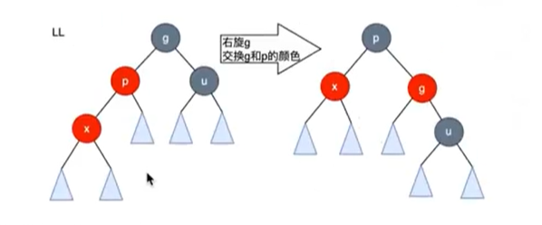
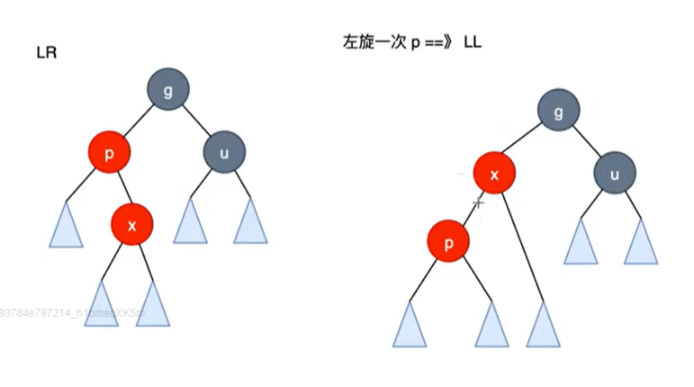
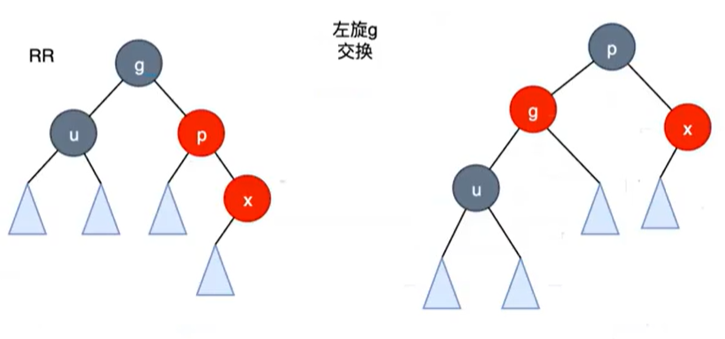
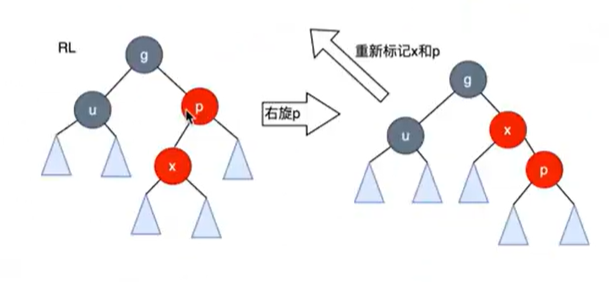
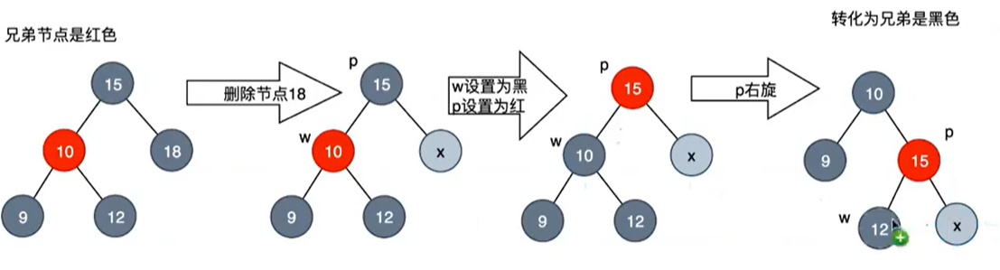
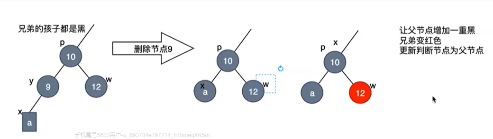
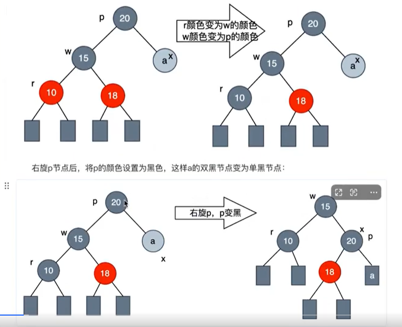
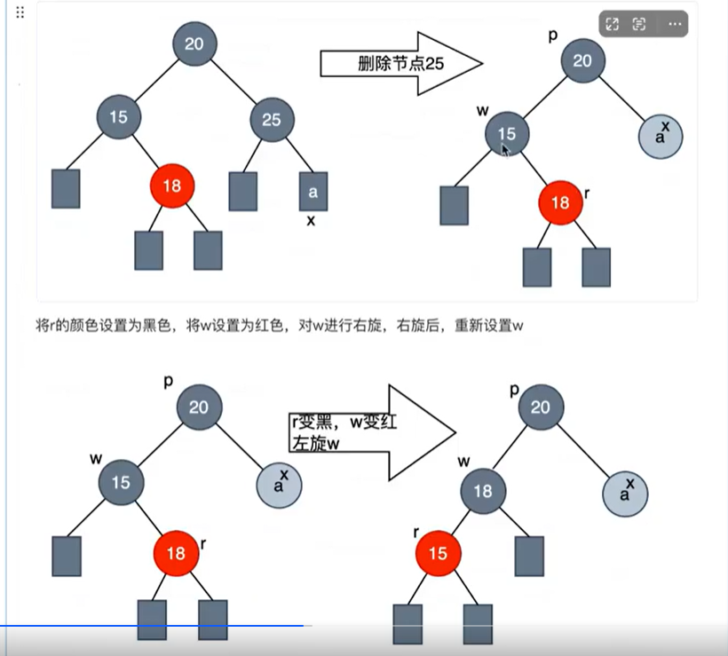
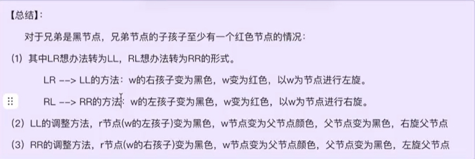

# 红黑树

## 1. 概述

红黑树是一种自平衡的二叉查找树。它在节点上增加了一个存储位来表示节点的颜色（红色或黑色），通过对任何一条从根到叶子的路径上各个节点的颜色进行约束，确保没有一条路径会比其他路径长出两倍，因此是近似平衡的。

红黑树的目的是在最坏情况下，依然能够保证搜索、插入、删除操作的时间复杂度为 O(log N)。它牺牲了严格的平衡要求，换取了更少旋转次数的插入和删除操作。


**性质**

* 节点颜色：每个节点要么时红色，要么是黑色
* 根节点颜色：根节点必需是黑色
* 叶子节点颜色：所有叶子节点（即空节点 / NULL 节点）都是黑色
* 红色节点限制（不红红）：如果一个节点是红色的，那么它的两个子节点必须都是黑色的。（即：不能出现两个相连的红色节点）。
* 黑高一致：从任一节点到其每个叶子节点的所有简单路径上，包含相同数量的黑色节点。


## 2. 实现逻辑

### 2.1 插入

1. 创建一个红色节点
2. 根据左小右大规则，定位到插入点，插入
3. 判断父节点，如果是黑色，直接返回
4. 如果父节点是红色，进行调整

#### 2.1.1 叔叔节点是红色

1. 把父节点、叔叔节点都变成黑色
2. 把祖父节点设置为红色
3. 把祖父节点当作新节点继续往上

#### 2.1.2 叔叔节点是黑色

##### 2.1.2.1 LL

右旋 g

交换 g 和 p 的颜色



##### 2.1.2.2 LR

左旋转化为 LL



##### 2.1.2.3 RR

左旋 g

交换 g 和 p



##### 2.1.2.4 RL

右旋化为RR



### 2.2 删除

1. 按照二叉搜索树的规则进行节点删除（删除度为1或度为0的节点）

2. 删除节点，如果是黑 + 红，直接替换

3. 删除节点，如果是红 直接删除

4. 删除节点，如果是黑，满足双黑节点

   多了一个黑色节点，需要调整

#### 2.2.1 兄弟节点是红色

​	转化成兄弟节点为黑色



#### 2.2.2 兄弟节点是黑色

##### 2.2.2.1 兄弟节点两个孩子都是黑色

递归，把双黑的兄弟变为红色，修正父节点为当前节点



##### 2.2.2.2 兄弟节点中至少有一个同向红



##### 2.2.2.3 兄弟节点中至少有一个异向红



#### 2.2.3 总结




## 3. 申明

<font color = "blue">C 实现</font>

```c
#pragma once

// 枚举颜色类型
enum RedBlackColor {RED, BLACK};
typedef int keyType;

// 节点结构
typedef struct RBNode {
	keyType key;
	char color;
	struct RBNode* left;
	struct RBNode* right;
	struct RBNode* parent;
} RBNode;

typedef struct {
	RBNode* root;
	int count;
} RBTree;

```


<font color = "blue">Java 实现</font>

```java
package com.sonnet.red_black_tree;

/**
 * 红黑树结构
 */
public class RBTree<K extends Comparable<K>> {

    /**
     * 枚举红黑树的颜色
     */
    private enum Color {
        RED, BLACK
    }

    /**
     * 红黑树节点结构
     */
    static class RBNode<K extends Comparable<K>> {
        // 颜色
        private Color color;
        // 数值
        private K key;
        // 左孩子
        private RBNode<K> left;
        // 右孩子
        private RBNode<K> right;
        // 父亲节点
        private RBNode<K> parent;

        RBNode(K key) {
            this.key = key;
            this.color = Color.RED;
        }
    }

    // 根节点
    private RBNode<K> root;
    // 节点个数
    private int count;
}

```


## 4. 初始化

<font color = "blue">C 实现</font>

```c
RBTree* initRBTree() {
	RBTree* tree = malloc(sizeof(RBTree));
	if (tree == NULL) return NULL;
	memset(tree, 0, sizeof(RBTree));
	return tree;
}
```


<font color = "blue">Java 实现</font>

```java
public RBTree() {
    this.root = null;
    this.count = 0;
}
```


## 5. 插入

<font color = "blue">C 实现</font>

```c
// 创建红黑树节点
static RBNode* createRBNode(keyType key) {
	RBNode* node = malloc(sizeof(RBNode));
	if (node == NULL) return NULL;
	memset(node, 0, sizeof(RBNode));
	node->color = RED;
	node->key = key;
	return node;
}

/*
*		  px
*         |
*         x
*       /  \
*      lx   y
*          / \
*		  ly  ry
*
*/
static void leftRotate(RBTree* tree, RBNode* x) {
	RBNode* y = x->right;
	x->right = y->left;
	if (y->left) {
		y->left->parent = x;
	}
	y->parent = x->parent;
	if (x->parent) {
		if (x->parent->left == x) {
			x->parent->left = y;
		}
		else {
			x->parent->right = y;
		}
	}
	else {
		tree->root = y;
	}
	y->left = x;
	x->parent = y;
}

/*
*		  px
*         |
*         x
*        / \
*      y    rx
*     / \
*	 ly	 ry
*
*/
static void rightRotate(RBTree* tree, RBNode* x) {
	RBNode* y = x->left;
	x->left = y->right;
	if (y->right) {
		y->right->parent = x;
	}
	y->parent = x->parent;
	if (x->parent) {
		if (x->parent->left == x) {
			x->parent->left = y;
		}
		else {
			x->parent->right = y;
		}
	}
	else {
		tree->root = y;
	}
	y->right = x;
	x->parent = y;
}

/*
* 如果node的父节点是黑色，那么不需要修复，直接返回
* 如果node的父节点是红色，那么出现红红，进行调整
*	叔叔节点是红色
*		父节点和叔叔节点变为黑色，祖父节点变为红色，将祖父节点看作新节点重新判断
*	叔叔节点是黑色
*		旋转，交换父节点和祖父节点的颜色
*/
static void insertFixUp(RBTree* tree, RBNode* node) {
	RBNode* parent = node->parent;
	RBNode* grandparent = NULL;
	RBNode* uncle = NULL;
	RBNode* tmp = NULL;
	// 父节点存在且为红红，在红黑树中，根节点一定为黑色，所以根节点不为空
	while (parent && parent->color == RED) {
		// 找到祖父节点，根据祖父节点和父节点的关系找到叔叔节点
		grandparent = parent->parent;
		uncle = grandparent->left == parent ? grandparent->right : grandparent->left;
		// 叔叔节点存在且是红色的
		if (uncle && uncle->color == RED) {
			// 1. 把父节点和叔叔节点都变为黑色
			parent->color = BLACK;
			uncle->color = BLACK;
			// 2. 把祖父节点变为红色
			grandparent->color = RED;
			// 3. 将祖父节点看成新节点继续往上循环
			node = grandparent;
			parent = grandparent->parent;
			continue;
		}
		// 叔叔节点是黑色
		if (grandparent->left == parent) {	// L
			// LR
			if (parent->right == node) {
				leftRotate(tree, parent);
				tmp = node;
				node = parent;
				parent = tmp;
			}
			// LL
			rightRotate(tree, grandparent);
			grandparent->color = RED;
			parent->color = BLACK;
		}
		else {	// R
			// RL
			if (parent->left == node) {
				rightRotate(tree, parent);
				tmp = node;
				node = parent;
				parent = tmp;
			}
			// RR
			leftRotate(tree, grandparent);
			grandparent->color = RED;
			parent->color = BLACK;
		}
	}
	tree->root->color = BLACK;
}

// 插入
void insertRBTree(RBTree* tree, keyType key) {
	// 1. 创建一个红黑树节点
	RBNode* node = createRBNode(key);
	// 2. 根据二叉搜索树的规则找到待插入点
	RBNode* cur = tree->root;
	RBNode* pre = NULL;
	while (cur) {
		pre = cur;
		if (key < cur->key) {
			cur = cur->left;
		}
		else if (key > cur->key) {
			cur = cur->right;
		}
		else {
			printf("key: %d is exist\n", key);
			return;
		}
	}
	// 3. 在对应位置上插入，若是根节点，更新tree
	node->parent = pre;
	if (pre) {
		if (key < pre->key) {
			pre->left = node;
		}
		else {
			pre->right = node;
		}
	}
	else {
		tree->root = node;
	}
	tree->count++;
	// 4. 修复红黑树
	insertFixUp(tree, node);
}

```


<font color = "blue">Java 实现</font>

```java
/**
 * 左旋
 *         px
 *          |
 *          x
 *        /  \
 *       lx   y
 *           / \
 *       ly   ry
 * @param x 旋转的节点
 */
private void leftRotate(RBNode<K> x) {
    RBNode<K> y = x.right;
    x.right = y.left;
    if (y.left != null) {
        y.left.parent = x;
    }
    y.parent = x.parent;
    if (x.parent != null) {
        if (x.parent.left == x) {
            x.parent.left = y;
        } else {
            x.parent.right = y;
        }
    } else {
        this.root = y;
    }
    x.parent = y;
    y.left = x;
}

/**
 * 右旋
 *         px
 *          |
 *          x
 *         / \
 *       y    rx
 *      / \
 *   ly     ry
 * @param x 旋转的节点
 */
private void rightRotate(RBNode<K> x) {
    RBNode<K> y = x.left;
    x.left = y.right;
    if (y.right != null) {
        y.right.parent = x;
    }
    y.parent = x.parent;
    if (x.parent != null) {
        if (x.parent.left == x) {
            x.parent.left = y;
        } else {
            x.parent.right = y;
        }
    } else {
        this.root = y;
    }
    x.parent = y;
    y.right = x;
}

/**
 * 插入修复红黑树
 *  如果node的父节点是黑色，那么不需要修复，直接返回
 *  如果node的父节点是红色，那么出现红红，进行调整
 *  叔叔节点是红色
 *     父节点和叔叔节点变为黑色，祖父节点变为红色，将祖父节点看作新节点重新判断
 *  叔叔节点是黑色
 *     旋转，交换父节点和祖父节点的颜色
 * @param node 修复的节点
 */
private void insertFixUp(RBNode<K> node) {
    RBNode<K> parent = node.parent;
    RBNode<K> grandparent = null;
    RBNode<K> uncle = null;
    RBNode<K> tmp;
    // 父节点存在且为红红,在红黑树中，根节点一定为黑色，所以根节点不为空
    while (parent != null && parent.color == Color.RED) {
        // 找到祖父节点，根据父节点和祖父节点的关系，确定叔叔节点
        grandparent = parent.parent;
        uncle = grandparent.left == parent ? grandparent.right : grandparent.left;
        // 叔叔节点存在，且是红色的
        if (uncle != null && uncle.color == Color.RED) {
            // 1. 把父节点和叔叔节点都变为黑色
            uncle.color = Color.BLACK;
            parent.color = Color.BLACK;
            // 2. 把祖父节点变为红色
            grandparent.color = Color.RED;
            // 3. 把祖父节点当作新节点继续循环
            node = grandparent;
            parent = node.parent;
            continue;
        }
        // 叔叔节点是黑色
        if (grandparent.left == parent) {   // L
            // LR
            if (parent.right == node) {
                leftRotate(parent);
                tmp = node;
                node = parent;
                parent = tmp;
            }
            // LL
            rightRotate(grandparent);
            grandparent.color = Color.RED;
            parent.color = Color.BLACK;
        } else {    // R
            // RL
            if (parent.left == node) {
                rightRotate(parent);
                tmp = node;
                node = parent;
                parent = tmp;
            }
            // RR
            leftRotate(grandparent);
            grandparent.color = Color.RED;
            parent.color = Color.BLACK;
        }
    }
    this.root.color = Color.BLACK;
}

/**
 * 插入红黑树节点
 * @param key 插入的值
 */
public void insertRBTree(K key) {
    // 1. 创建红色节点
    RBNode<K> node = new RBNode<>(key);
    // 2. 根据二叉搜索树规则找到待插入位置
    RBNode<K> cur = this.root;
    RBNode<K> pre = null;
    while (cur != null) {
        pre = cur;
        int cmp = cur.key.compareTo(key);
        if (cmp < 0) {
            cur = cur.right;
        } else if (cmp > 0) {
            cur = cur.left;
        } else {
            System.out.println("key :" + key + "have exist");
            return;
        }
    }
    // 3. 在对应位置上插入，若是根节点，更新tree
    node.parent = pre;
    if (pre != null) {
        if (key.compareTo(pre.key) < 0) {
            pre.left = node;
        } else {
            pre.right = node;
        }
    } else {
        this.root = node;
    }
    this.count++;
    // 4. 修复红黑树
    insertFixUp(node);
}
```


## 6. 显示

<font color = "blue">C 实现</font>

```c
// 显示红黑树节点
void printRBTreeNode(RBNode* node, int parentKey, int dir) {
	if (node) {
		if (dir == 0) {
			printf("%2d[B] is root\n", node->key);
		}
		else {
			printf("%2d[%c] is %2d's %s\n", node->key,
				node->color == RED ? 'R' : 'B',
				parentKey, dir == 1 ? "right child" : "left child");
		}
		printRBTreeNode(node->left, node->key, -1);
		printRBTreeNode(node->right, node->key, 1);
	}
}

```


<font color = "blue">Java 实现</font>

```java
/**
 * 显示节点信息
 * @param parentKey 父亲节点的值
 * @param dir 方向，0：根节点，1：左，-1：右
 */
private void printRBNode(K parentKey, int dir) {
    if (dir == 0) {
        System.out.println(this.key + "[B] is root");
    } else {
        System.out.println(this.key + "[" + (this.color == Color.RED ? 'R' : 'B') + "] is " +
                parentKey + " " + (dir == 1 ? "left" : "right") + " child");
    }
    if (this.left != null)
        this.left.printRBNode(this.key, 1);
    if (this.right != null)
        this.right.printRBNode(this.key, -1);
}
```

```java
/**
 * 显示红黑树
 */
public void printRBTree() {
    if (this.root == null) {
        System.out.println("tree: have 0 node");
    }
    this.root.printRBNode(null, 0);
    System.out.println("tree: have " + this.count + " node");
}
```


## 7. 删除

<font color = "blue">C 实现</font>

```c
// 寻找节点
static RBNode* searchRBNode(RBTree* tree, keyType key) {
	RBNode* node = tree->root;
	while (node) {
		if (key < node->key) {
			node = node->left;
		} 
		else if (key > node->key) {
			node = node->right;
		}
		else {
			return node;
		}
	}
	printf("not found %d key\n", key);
	return NULL;
}

// 调整删除节点
static void deleteFixup(RBTree* tree, RBNode* x, RBNode* parent) {
	RBNode* w = NULL;
	// x不是根节点，并且x是黑色
	while (x != tree->root && (!x || x->color == BLACK)) {
		// x是父亲的左孩子
		if (parent->left == x) {
			w = parent->right;
			// case1: x的兄弟是红色
			if (w->color == RED) {
				// 1. 将兄弟节点设置为黑色
				w->color = BLACK;
				// 2. 将父亲节点设置为红色
				parent->color = RED;
				// 3. 左旋父亲节点
				leftRotate(tree, parent);
				// 4. 重新设置x的兄弟节点
				w = parent->right;
			}
			// case2: x的兄弟w是黑色，且w的孩子都是黑色
			if ((!w->left || w->left->color == BLACK) && (!w->right || w->right->color == BLACK)) {
				// 1. 兄弟节点变为红色
				w->color = RED;
				// 2. 修正父节点为当前节点
				x = parent;
				parent = parent->parent;
			}
			else {
				// case3：异向红，兄弟节点是黑色，左孩子是红色，右孩子是黑色
				if (!w->right || w->right->color == BLACK) {
					// 1. 左孩子变为黑色
					w->left->color = BLACK;
					// 2. 兄弟节点变为红色
					w->color = RED;
					// 3. 右旋父亲节点
					rightRotate(tree, w);
					// 4. 重新设置兄弟节点
					w = parent->right;
				}
				// case4: 同向红，x的兄弟节点是黑色，右孩子是红色，左孩子随意
				// 1. 兄弟的右孩子变为兄弟颜色
				w->right->color = w->color;
				// 2. 兄弟的颜色变为父亲的颜色
				w->color = parent->color;
				// 3。 将父亲节点变为黑色
				parent->color = BLACK;
				// 4. 左旋父亲节点
				leftRotate(tree, parent);
				x = tree->root;
				break;
			}
		}
		// x是父亲的右孩子
		else {
			w = parent->left;
			// case1: x的兄弟是红色
			if (w->color == RED) {
				// 1. 将兄弟节点设置为黑色
				w->color = BLACK;
				// 2. 将父亲节点设置为红色
				parent->color = RED;
				// 3. 右旋父亲节点
				rightRotate(tree, parent);
				// 4. 将重新设置兄弟节点
				w = parent->left;
			}
			// case2：x的兄弟是黑色，且兄弟节点的孩子都是黑色
			if ((!w->left || w->left->color == BLACK) && (!w->right || w->right->color == BLACK)) {
				// 1. 兄弟节点变为红色
				w->color = RED;
				// 2. 修正父节点为当前节点
				x = parent;
				parent = parent->parent;
			}
			else {
				// case3: 异向红，x的兄弟是黑色，且兄弟的右孩子是红色，左孩子是黑色
				if (!w->left || w->left->color == BLACK) {
					// 1. 右孩子变黑
					w->right->color = BLACK;
					// 2. 兄弟节点变红
					w->color = RED;
					// 3. 左旋兄弟节点
					leftRotate(tree, w);
					// 4. 重新设置兄弟节点
					w = parent->left;
				}
				// case4: 同向红，x的兄弟是黑色，且左孩子是红色，右孩子随意
				// 1. 兄弟的左孩子变为兄弟的颜色
				w->left->color = w->color;
				// 2. 兄弟节点的颜色变为父亲的颜色
				w->color = parent->color;
				// 3. 将父亲节点变为黑色
				parent->color = BLACK;
				// 4. 右旋父亲节点
				rightRotate(tree, parent);
				x = tree->root;
				break;
			}
		}
	}
	if (x) {
		x->color = BLACK;
	}
}

// 删除红黑树中的节点
static void deleteRBNode(RBTree* tree, RBNode* node) {
	RBNode* y;			// 真正删除的节点地址
	RBNode* x;			// 替换节点
	RBNode* parent;		// 替换节点为null后，无法找到父亲
	if (node->left == NULL || node->right == NULL) {
		y = node;
	}
	else {
		y = node->right;
		while (y->left) {
			y = y->left;
		}
	}
	// 真正删除的节点找到了，开始寻找替换节点
	if (y->left) {
		x = y->left;
	}
	else {
		x = y->right;
	}
	parent = y->parent;
	// 开始更新替换节点和原父节点的关系
	if (x) {
		x->parent = y->parent;
	}
	if (y->parent == NULL) {
		tree->root = x;
	}
	else {
		if (y->parent->left == y) {
			y->parent->left = x;
		}
		else {
			y->parent->right = x;
		}
	}
	// 更新左右孩子的根节点为后继节点的值，其他不变
	if (y != node) {
		node->key = y->key;
	}
	// 如果删除节点是黑色需要进行调整
	if (y->color == BLACK) {
		deleteFixup(tree, x, parent);
	}
	// 删除节点是红色，或者调整完，直接删除
	free(y);
	tree->count--;
}

// 删除红黑树节点
void deleteRBTree(RBTree* tree, keyType key) {
	RBNode* node = searchRBNode(tree, key);
	if (node == NULL) return;
	deleteRBNode(tree, node);
}

```


<font color = "blue">Java 实现</font>

```java
/**
 * 搜索红黑树中的节点
 * @param key 需要搜索的值
 * @return 搜索到的节点
 */
public RBNode<K> searchRBNode(K key) {
    RBNode<K> node = this.root;
    while(node != null) {
        int diff = key.compareTo(node.key);
        if (diff < 0) {
            node = node.left;
        } else if (diff > 0) {
            node = node.right;
        } else {
            return node;
        }
    }
    System.out.println("not found " + key + " node");
    return null;
}

/**
 * 删除修复红色树
 * @param x 代替的节点
 * @param parent 父节点
 */
private void deleteFixup(RBNode<K> x, RBNode<K> parent) {
    RBNode<K> w = null;
    // x不是根节点，并且x是黑色的
    while (this.root != x && (x == null || x.color == Color.BLACK)) {
        // x是父亲的左孩子
        if (parent.left == x) {
            w = parent.right;
            // case1: 兄弟节点是红色
            if (w.color == Color.RED) {
                // 1. 将兄弟节点设置为黑色
                w.color = Color.BLACK;
                // 2. 将父亲节点设置为红色
                parent.color = Color.RED;
                // 3. 左旋父亲节点
                leftRotate(parent);
                // 4. 重新设置兄弟节点
                w = parent.right;
            }
            // case2: 兄弟节点是黑色，并且兄弟节点的孩子都是黑色
            if ((w.left == null || w.left.color == Color.BLACK) &&
                    (w.right == null || w.right.color == Color.BLACK)) {
                // 1. 将兄弟节点设置为红色
                w.color = Color.RED;
                // 2. 将父节点设置为当前节点
                x = parent;
                parent = x.parent;
            } else {
                // case3: 异向红，兄弟节点是黑色，兄弟节点左孩子是红色，右孩子黑色
                if (w.right == null || w.right.color == Color.BLACK) {
                    // 1. 左孩子变为黑色
                    w.left.color = Color.BLACK;
                    // 2. 兄弟节点变为红色
                    w.color = Color.RED;
                    // 3. 右旋兄弟节点
                    rightRotate(w);
                    // 4. 重新设置兄弟节点
                    w = parent.right;
                }
                // case4: 同向红，兄弟节点是黑色，兄弟节点右孩子是红色，左孩子随意
                // 1. 右孩子变为兄弟节点的颜色
                w.right.color = w.color;
                // 2. 兄弟节点变为父亲节点的颜色
                w.color = parent.color;
                // 3. 父亲节点变为黑色
                parent.color = Color.BLACK;
                // 4. 左旋父亲节点
                leftRotate(parent);
                x = this.root;
                break;
            }
        // x是父亲的右孩子
        } else {
            w = parent.left;
            // case1: 兄弟节点是红色
            if (w.color == Color.RED) {
                // 1. 将兄弟节点设置为黑色
                w.color = Color.BLACK;
                // 2. 将父亲节点设置为红色
                parent.color = Color.RED;
                // 3. 右旋父亲节点
                rightRotate(parent);
                // 4. 重新设置兄弟节点
                w = parent.left;
            }
            // case2: 兄弟节点是黑色，并且兄弟节点两个孩子都是黑色
            if ((w.left == null || w.left.color == Color.BLACK) &&
                    (w.right == null || w.right.color == Color.BLACK)) {
                // 1. 将兄弟节点设置为红色
                w.color = Color.RED;
                // 2. 将父亲节点设置为当前节点
                x = parent;
                parent = w.parent;
            } else {
                // case3: 异向红，兄弟节点是黑色，兄弟节点右孩子是红色，左孩子黑色
                if (w.left == null || w.left.color == Color.BLACK) {
                    // 1. 右孩子变为黑色
                    w.right.color = Color.BLACK;
                    // 2. 兄弟变为红色
                    w.color = Color.RED;
                    // 3. 左旋兄弟节点
                    leftRotate(w);
                    // 4. 重新设置兄弟节点
                    w = parent.left;
                }
                // case4: 同向红，兄弟节点是黑色，兄弟节点左孩子红色，右孩子随意
                // 1. 左孩子变为兄弟节点的颜色
                w.left.color = w.color;
                // 2. 兄弟节点变为父亲节点的颜色
                w.color = parent.color;
                // 3. 父亲节点变为黑色]
                parent.color = Color.BLACK;
                // 4. 右旋父亲节点
                rightRotate(parent);
                x = this.root;
                break;
            }
        }
    }
    if (x != null) {
        this.root.color = Color.BLACK;
    }

}

/**
 * 删除红黑树中的一个节点
 * @param node 需要删除的节点
 */
private void deleteRBNode(RBNode<K> node) {
    // 真正需要删除的节点
    RBNode<K> y = null;
    // 替换的节点
    RBNode<K> x = null;
    // 替换节点为null后无法找到父亲
    RBNode<K> parent = null;
    if (node.left == null || node.right == null) {
        y = node;
    } else {
        y = node.right;
        while(y.left != null) {
            y = y.left;
        }
    }
    // 真正删除的节点找到了，开始寻找替换节点
    if (y.left != null) {
        x = y.left;
    } else {
        x = y.right;
    }
    parent = y.parent;
    // 开始更新替换节点和原父节点的关系
    if (x != null) {
        x.parent = y.parent;
    }
    if (y.parent == null) {
        this.root = x;
    } else if (y.parent.left == y) {
        y.parent.left = x;
    } else {
        y.parent.right = x;
    }
    // 更新左右孩子的根节点为后继节点的值，其他不变
    if (y != node) {
        node.key = y.key;
    }
    // 如果删除的节点是黑色，需要调整
    if (y.color == Color.BLACK) {
        deleteFixup(x, parent);
    }
    // 如果删除的节点是红色，或者调整完，直接删除即可
    y = null;
    this.count--;
}

/**
 * 删除红黑树节点
 * @param key 需要删除的值
 */
public void deleteRBTree(K key) {
    RBNode<K> node = searchRBNode(key);
    if (node == null) return;
    deleteRBNode(node);
}
```

## 8. 释放

<font color = "blue">C 实现</font>

```c
// 释放红黑树的节点
static void releaseRBNode(RBTree* tree, RBNode* node) {
	if (node) {
		releaseRBNode(tree, node->left);
		releaseRBNode(tree, node->right);
		free(node);
		tree->count--;
	}
}

// 释放红黑树
void releaseRBTree(RBTree* tree) {
	if (tree->root) {
		releaseRBNode(tree, tree->root);
	}
	printf("release: tree have %d node\n", tree->count);
}
```


<font color = "blue">Java 实现</font>

```java
/**
 * 释放红黑树中的节点
 * @param node 释放的节点
 */
private void releaseRBNode(RBNode<K> node) {
    if (node != null) {
        releaseRBNode(node.left);
        releaseRBNode(node.right);
        node.left = null;
        node.right = null;
        node.parent = null;
        this.count--;
    }
}

/**
 * 释放红黑树
 */
public void releaseRBTree() {
    releaseRBNode(this.root);
    System.out.println("release: tree have " + this.count + " node");
}
```

## 9. 完整实现

<font color = "blue">C 实现</font>

`RedBlackTree.h`

```c
#pragma once

enum RedBlckColor { RED, BLACK };
typedef int keyType;

// 红黑树节点结构
typedef struct RBNode {
	char color;
	keyType key;
	struct RBNode* parent;
	struct RBNode* left;
	struct RBNode* right;
} RBNode;

typedef struct {
	RBNode* root;
	int count;
} RBTree;

// 初始化红黑树
RBTree* initRBTree();

//向红黑树插入值
void insertRBTree(RBTree* tree, keyType key);

// 释放红黑树
void releaseRBTree(RBTree* tree);

// 显示红黑树
void printRBTreeNode(RBNode* root, int parentKey, int dir);

// 从红黑树中删除一个节点
void deleteRBTree(RBTree* tree, keyType key);
```

`RedBlackTree.c`

```c
#include <stdio.h>
#include <stdlib.h>
#include "RedBlackTree.h"

RBTree* initRBTree() {
	RBTree* tree = malloc(sizeof(RBTree));
	if (tree == NULL) return NULL;
	memset(tree, 0, sizeof(RBTree));
	return tree;
}

/*
*		  px
*         |
*         x
*       /  \
*      lx   y
*          / \
*		  ly  ry
* 
*/
static void leftRotate(RBTree* tree, RBNode* x) {
	RBNode* y = x->right;
	x->right = y->left;
	if (y->left) {
		y->left->parent = x;
	}
	y->parent = x->parent;
	if (x->parent) {
		if (x->parent->left == x) {
			x->parent->left = y;
		}
		else {
			x->parent->right = y;
		}
	}
	else {
		tree->root = y;
	}
	y->left = x;
	x->parent = y;
}

/*
*		  px
*         |
*         x
*        / \
*      y    rx
*     / \     
*	 ly	 ry   
*
*/
static void rightRotate(RBTree* tree, RBNode* x) {
	RBNode* y = x->left;
	x->left = y->right;
	if (y->right) {
		y->right->parent = x;
	}
	y->parent = x->parent;
	if (x->parent) {
		if (x->parent->left == x) {
			x->parent->left = y;
		}
		else {
			x->parent->right = y;
		}
	}
	else {
		tree->root = y;
	}
	y->right = x;
	x->parent = y;
}

// 创建一个红黑树节点，默认创建的是红色，父子节点为null
static RBNode* createRBNode(keyType key) {
	RBNode* node = malloc(sizeof(RBNode));
	if (node == NULL) return NULL;
	memset(node, 0, sizeof(RBNode));
	node->key = key;
	node->color = RED;
	return node;
}

/*
* 如果node的父节点是黑色，那么不需要修复，直接返回
* 如果node的父节点是红色，那么出现红红，进行调整
*	叔叔节点是红色
*		父节点和叔叔节点变为黑色，祖父节点变为红色，将祖父节点看作新节点重新判断
*	叔叔节点是黑色
*		旋转，交换父节点和祖父节点的颜色
*/
static void insertFixUp(RBTree* tree, RBNode* node) {
	RBNode* parent = node->parent;
	RBNode* grandParent = NULL;
	RBNode* uncle = NULL;
	RBNode* tmp;
	// 父节点存在且为红红,在红黑树中，根节点一定为黑色，所以根节点不为空
	while (parent && parent->color == RED) {
		// 找到祖父节点，根据祖父节点和父节点的关系，确定uncle节点
		grandParent = parent->parent;
		uncle = grandParent->left == parent ? grandParent->right : grandParent->left;
		// 叔叔节点存在且是红色
		if (uncle && uncle->color == RED) {
			// 1. 把父节点、叔叔节点都变成黑色
			uncle->color = BLACK;
			parent->color = BLACK;
			// 2. 把祖父节点设置为红色
			grandParent->color = RED;
			// 3. 把祖父节点当作新节点继续往上
			node = grandParent;
			parent = grandParent->parent;
			continue;
		}
		// 叔叔节点是黑色
		if (grandParent->left == parent) {	// L
			// LR
			if (parent->right == node) {	
				leftRotate(tree, parent);
				tmp = parent;
				parent = node;
				node = tmp;
			}
			// LL
			rightRotate(tree, grandParent);
			grandParent->color = RED;
			parent->color = BLACK;
		}
		else {	// R
			// RL
			if (parent->left == node) {
				rightRotate(tree, parent);
				tmp = parent;
				parent = node;
				node = tmp;
			}
			// RR
			leftRotate(tree, grandParent);
			grandParent->color = RED;
			parent->color = BLACK;
		}
	}
	tree->root->color = BLACK;
}

void insertRBTree(RBTree* tree, keyType key) {
	// 1. 创建一个红色节点
	RBNode* node = createRBNode(key);
	// 2. 根据二叉搜索树的规则找到待插入位置
	RBNode* cur = tree->root;
	RBNode* pre = NULL;
	while (cur) {
		pre = cur;
		if (key < cur->key) {
			cur = cur->left;
		}
		else if (key > cur->key) {
			cur = cur->right;
		}
		else {
			printf("key: %d have exist\n", key);
			return;
		}
	}
	// 3. 在对应位置上插入，若是根节点，更新tree
	node->parent = pre;
	if (pre) {
		if (key < pre->key) {
			pre->left = node;
		}
		else {
			pre->right = node;
		}
	}
	else {
		tree->root = node;
	}
	tree->count++;
	// 4. 修复红黑树
	insertFixUp(tree, node);
}

// 释放红黑树节点
static void releaseRBTreeNode(RBTree* tree, RBNode* node) {
	if (node == NULL) return;
	releaseRBTreeNode(tree, node->left);
	releaseRBTreeNode(tree, node->right);
	free(node);
	tree->count--;
}

// 释放红黑树
void releaseRBTree(RBTree* tree) {
	if (tree == NULL) return;
	releaseRBTreeNode(tree, tree->root);
	printf("release: RBTree have %d node\n", tree->count);
}

// 显示红黑树节点
void printRBTreeNode(RBNode* node, int parentKey, int dir) {
	if (node) {
		if (dir == 0) {
			printf("%2d[B] is root\n", node->key);
		}
		else {
			printf("%2d[%c] is %2d's %s\n", node->key,
				node->color == RED ? 'R' : 'B',
				parentKey, dir == 1 ? "right child" : "left child");
		}
		printRBTreeNode(node->left, node->key, -1);
		printRBTreeNode(node->right, node->key, 1);
	}
}

// 查找红黑树中的节点
static RBNode* searchRBNode(RBTree* tree, keyType key) {
	RBNode* node = tree->root;
	while (node) {
		if (key < node->key) {
			node = node->left;
		}
		else if (key > node->key) {
			node = node->right;
		}
		else {
			return node;
		}
	}
	printf("not found %d\n", key);
	return NULL;
}

static void deleteFixup(RBTree* tree, RBNode* x, RBNode* parent) {
	RBNode* w = NULL;
	// x不是根节点，并且x是黑色
	while (x != tree->root && (!x || x->color == BLACK)) {
		// x是父亲的左节点
		if (parent->left == x) {
			w = parent->right;
			// case1: x的兄弟是红色
			if (w->color == RED) {
				// 1. 将兄弟节点设置为黑色
				w->color = BLACK;
				// 2. 将父亲节点设置为红色
				parent->color = RED;
				// 3. 左旋父亲节点
				leftRotate(tree, parent);
				// 4. 重新设置x的兄弟节点
				w = parent->right;
			}
			// case2：x的兄弟w是黑色，且兄弟节点的孩子都是黑色
			if ((!w->left || w->left->color == BLACK) &&
				(!w->right || w->right->color == BLACK)) {
				// 1. 兄弟节点变为红色
				w->color == RED;
				// 2. 修正父节点为当前节点
				x = parent;
				parent = x->parent;
			}
			else {
				// case3: 异向红，兄弟节点是黑色，左孩子是红色，右孩子是黑色
				if (!w->right || w->right->color == BLACK) {
					// 1. 将左孩子变为黑色
					w->left->color = BLACK;
					// 2. 将兄弟节点变为红色
					w->color = RED;
					// 3. 右旋兄弟节点
					rightRotate(tree, w);
					// 4. 重新设置兄弟节点
					w = parent->right;
				}
				// case4: 同向红，兄弟节点是黑色，右孩子是红色，左孩子随意
				// 1. 兄弟的右孩子变为兄弟颜色
				w->right->color = w->color;
				// 2. 兄弟的颜色变为父亲的颜色
				w->color = parent->color;
				// 3。 将父亲节点变为黑色
				parent->color = BLACK;
				// 4. 左旋父亲节点
				leftRotate(tree, parent);
				x = tree->root;
				break;
			}
		}
		// x是父亲的右节点
		else {
			// case1: x的兄弟节点是红色
			if (w->color == RED) {
				// 1. 将x的兄弟节点设置为黑色
				w->color = BLACK;
				// 2. 将父亲节点设置为红色
				parent->color = RED;
				// 3, 右旋父亲节点
				rightRotate(tree, parent);
				// 4. 重新设置兄弟节点
				w = parent->left;
			}
			// case2: 兄弟节点的孩子都为黑色
			if ((!w->left || w->left->color == BLACK) &&
				(!w->right || w->right->color == BLACK)) {
				// 1. 兄弟节点变为红色
				w->color = RED;
				// 2. 修正父节点为当前节点
				x = parent;
				parent = x->parent;
			}
			else {
				// case3: 异向红，x的兄弟是黑色，兄弟的左孩子是黑色，右孩子是红色
				if (!w->left || w->left->color == BLACK) {
					// 1. 将右孩子变为黑色
					w->right->color = BLACK;
					// 2, 将兄弟节点变为红色
					w->color = RED;
					// 3. 左旋兄弟节点
					leftRotate(tree, w);
					// 4. 重新设置兄弟节点
					w = parent->left;
				}
				// case4: 同向红，x的兄弟w是黑色，并且左孩子是红色，右孩子随意
				// 1. 兄弟的左孩子变为兄弟w的颜色（BLACK）
				w->left->color = w->color;
				// 2. 兄弟节点w变为父亲节点的颜色（BLACK）
				w->color = parent->color;
				// 3. 将父亲节点变为黑色
				parent->color = BLACK;
				// 4. 右旋父亲节点
				rightRotate(tree, parent);
				x = tree->root;
				break;
			}
		}
	}
	if (x) { 
		x->color = BLACK;
	}
}

// 从红黑树中删除一个节点 
static void deleteRBNode(RBTree* tree, RBNode* node) {
	RBNode* y;			// 真正删除的节点地址
	RBNode* x;			// 替换节点
	RBNode* parent;	// 替换节点为null后，无法找到父亲
	if (node->left == NULL || node->right == NULL) {
		y = node;
	}
	else {
		y = node->right;
		while (y->left) {
			y = y->left;
		}
	}
	// 真正删除的节点找到了，开始寻找替换节点
	if (y->left) {
		x = y->left;
	}
	else {
		x = y->right;
	}
	parent = y->parent;
	// 开始更新替换节点和原父节点的关系
	if (x) {
		x->parent = y->parent;
	}
	if (y->parent == NULL) {
		tree->root = x;
	}
	else if (y->parent->left == y) {
		y->parent->left = x;
	}
	else {
		y->parent->right = x;
	}
	// 更新左右孩子的根节点为后继节点的值，其他不变
	if (y != node) {
		node->key = y->key;
	}
	// 如果删除的节点是黑色，需要调整
	if (y->color == BLACK) {
		deleteFixup(tree, x, parent);
	}
	// 调整完，或者删除节点是红色，直接删除
	free(y);
	tree->count--;
}

void deleteRBTree(RBTree* tree, keyType key) {
	RBNode* node = searchRBNode(tree, key);
	if (node == NULL) return;
	deleteRBNode(tree, node);
}
```

`main.c`

```c
#include <stdio.h>
#include <stdlib.h>
#include "RedBlackTree.h"

int main() {
	int data[] = { 55, 40, 65, 60, 75, 57, 63, 56 };

	RBTree* tree = initRBTree();
	for (int i = 0; i < sizeof(data) / sizeof(data[0]); i++) {
		insertRBTree(tree, data[i]);
	}
	printRBTreeNode(tree->root, tree->root->key, 0);
	printf("===================\n");
	deleteRBTree(tree, 40);
	printRBTreeNode(tree->root, tree->root->key, 0);
	releaseRBTree(tree);

	return 0;
}
```


<font color = "blue">Java 实现</font>

`RBTree`

```java
package com.sonnet.red_black_tree;

/**
/**
 * 红黑树结构
 */
public class RBTree<K extends Comparable<K>> {

    /**
     * 枚举红黑树的颜色
     */
    private enum Color {
        RED, BLACK
    }

    /**
     * 红黑树节点结构
     */
    static class RBNode<K extends Comparable<K>> {
        // 颜色
        private Color color;
        // 数值
        private K key;
        // 左孩子
        private RBNode<K> left;
        // 右孩子
        private RBNode<K> right;
        // 父亲节点
        private RBNode<K> parent;

        RBNode(K key) {
            this.key = key;
            this.color = Color.RED;
        }

        /**
         * 显示节点信息
         * @param parentKey 父亲节点的值
         * @param dir 方向，0：根节点，1：左，-1：右
         */
        private void printRBNode(K parentKey, int dir) {
            if (dir == 0) {
                System.out.println(this.key + "[B] is root");
            } else {
                System.out.println(this.key + "[" + (this.color == Color.RED ? 'R' : 'B') + "] is " +
                        parentKey + " " + (dir == 1 ? "left" : "right") + " child");
            }
            if (this.left != null)
                this.left.printRBNode(this.key, 1);
            if (this.right != null)
                this.right.printRBNode(this.key, -1);
        }
    }

    // 根节点
    private RBNode<K> root;
    // 节点个数
    private int count;

    public RBTree() {
        this.root = null;
        this.count = 0;
    }

    /**
     * 左旋
     *         px
     *          |
     *          x
     *        /  \
     *       lx   y
     *           / \
     *       ly   ry
     * @param x 旋转的节点
     */
    private void leftRotate(RBNode<K> x) {
        RBNode<K> y = x.right;
        x.right = y.left;
        if (y.left != null) {
            y.left.parent = x;
        }
        y.parent = x.parent;
        if (x.parent != null) {
            if (x.parent.left == x) {
                x.parent.left = y;
            } else {
                x.parent.right = y;
            }
        } else {
            this.root = y;
        }
        x.parent = y;
        y.left = x;
    }

    /**
     * 右旋
     *         px
     *          |
     *          x
     *         / \
     *       y    rx
     *      / \
     *   ly     ry
     * @param x 旋转的节点
     */
    private void rightRotate(RBNode<K> x) {
        RBNode<K> y = x.left;
        x.left = y.right;
        if (y.right != null) {
            y.right.parent = x;
        }
        y.parent = x.parent;
        if (x.parent != null) {
            if (x.parent.left == x) {
                x.parent.left = y;
            } else {
                x.parent.right = y;
            }
        } else {
            this.root = y;
        }
        x.parent = y;
        y.right = x;
    }

    /**
     * 插入修复红黑树
     *  如果node的父节点是黑色，那么不需要修复，直接返回
     *  如果node的父节点是红色，那么出现红红，进行调整
     *  叔叔节点是红色
     *     父节点和叔叔节点变为黑色，祖父节点变为红色，将祖父节点看作新节点重新判断
     *  叔叔节点是黑色
     *     旋转，交换父节点和祖父节点的颜色
     * @param node 修复的节点
     */
    private void insertFixUp(RBNode<K> node) {
        RBNode<K> parent = node.parent;
        RBNode<K> grandparent = null;
        RBNode<K> uncle = null;
        RBNode<K> tmp;
        // 父节点存在且为红红,在红黑树中，根节点一定为黑色，所以根节点不为空
        while (parent != null && parent.color == Color.RED) {
            // 找到祖父节点，根据父节点和祖父节点的关系，确定叔叔节点
            grandparent = parent.parent;
            uncle = grandparent.left == parent ? grandparent.right : grandparent.left;
            // 叔叔节点存在，且是红色的
            if (uncle != null && uncle.color == Color.RED) {
                // 1. 把父节点和叔叔节点都变为黑色
                uncle.color = Color.BLACK;
                parent.color = Color.BLACK;
                // 2. 把祖父节点变为红色
                grandparent.color = Color.RED;
                // 3. 把祖父节点当作新节点继续循环
                node = grandparent;
                parent = node.parent;
                continue;
            }
            // 叔叔节点是黑色
            if (grandparent.left == parent) {   // L
                // LR
                if (parent.right == node) {
                    leftRotate(parent);
                    tmp = node;
                    node = parent;
                    parent = tmp;
                }
                // LL
                rightRotate(grandparent);
                grandparent.color = Color.RED;
                parent.color = Color.BLACK;
            } else {    // R
                // RL
                if (parent.left == node) {
                    rightRotate(parent);
                    tmp = node;
                    node = parent;
                    parent = tmp;
                }
                // RR
                leftRotate(grandparent);
                grandparent.color = Color.RED;
                parent.color = Color.BLACK;
            }
        }
        this.root.color = Color.BLACK;
    }

    /**
     * 插入红黑树节点
     * @param key 插入的值
     */
    public void insertRBTree(K key) {
        // 1. 创建红色节点
        RBNode<K> node = new RBNode<>(key);
        // 2. 根据二叉搜索树规则找到待插入位置
        RBNode<K> cur = this.root;
        RBNode<K> pre = null;
        while (cur != null) {
            pre = cur;
            int cmp = cur.key.compareTo(key);
            if (cmp < 0) {
                cur = cur.right;
            } else if (cmp > 0) {
                cur = cur.left;
            } else {
                System.out.println("key :" + key + "have exist");
                return;
            }
        }
        // 3. 在对应位置上插入，若是根节点，更新tree
        node.parent = pre;
        if (pre != null) {
            if (key.compareTo(pre.key) < 0) {
                pre.left = node;
            } else {
                pre.right = node;
            }
        } else {
            this.root = node;
        }
        this.count++;
        // 4. 修复红黑树
        insertFixUp(node);
    }

    /**
     * 显示红黑树
     */
    public void printRBTree() {
        if (this.root == null) {
            System.out.println("tree: have 0 node");
            return;
        }
        this.root.printRBNode(null, 0);
        System.out.println("tree: have " + this.count + " node");
    }

    /**
     * 搜索红黑树中的节点
     * @param key 需要搜索的值
     * @return 搜索到的节点
     */
    public RBNode<K> searchRBNode(K key) {
        RBNode<K> node = this.root;
        while(node != null) {
            int diff = key.compareTo(node.key);
            if (diff < 0) {
                node = node.left;
            } else if (diff > 0) {
                node = node.right;
            } else {
                return node;
            }
        }
        System.out.println("not found " + key + " node");
        return null;
    }

    /**
     * 删除修复红色树
     * @param x 代替的节点
     * @param parent 父节点
     */
    private void deleteFixup(RBNode<K> x, RBNode<K> parent) {
        RBNode<K> w = null;
        // x不是根节点，并且x是黑色的
        while (this.root != x && (x == null || x.color == Color.BLACK)) {
            // x是父亲的左孩子
            if (parent.left == x) {
                w = parent.right;
                // case1: 兄弟节点是红色
                if (w.color == Color.RED) {
                    // 1. 将兄弟节点设置为黑色
                    w.color = Color.BLACK;
                    // 2. 将父亲节点设置为红色
                    parent.color = Color.RED;
                    // 3. 左旋父亲节点
                    leftRotate(parent);
                    // 4. 重新设置兄弟节点
                    w = parent.right;
                }
                // case2: 兄弟节点是黑色，并且兄弟节点的孩子都是黑色
                if ((w.left == null || w.left.color == Color.BLACK) &&
                        (w.right == null || w.right.color == Color.BLACK)) {
                    // 1. 将兄弟节点设置为红色
                    w.color = Color.RED;
                    // 2. 将父节点设置为当前节点
                    x = parent;
                    parent = x.parent;
                } else {
                    // case3: 异向红，兄弟节点是黑色，兄弟节点左孩子是红色，右孩子黑色
                    if (w.right == null || w.right.color == Color.BLACK) {
                        // 1. 左孩子变为黑色
                        w.left.color = Color.BLACK;
                        // 2. 兄弟节点变为红色
                        w.color = Color.RED;
                        // 3. 右旋兄弟节点
                        rightRotate(w);
                        // 4. 重新设置兄弟节点
                        w = parent.right;
                    }
                    // case4: 同向红，兄弟节点是黑色，兄弟节点右孩子是红色，左孩子随意
                    // 1. 右孩子变为兄弟节点的颜色
                    w.right.color = w.color;
                    // 2. 兄弟节点变为父亲节点的颜色
                    w.color = parent.color;
                    // 3. 父亲节点变为黑色
                    parent.color = Color.BLACK;
                    // 4. 左旋父亲节点
                    leftRotate(parent);
                    x = this.root;
                    break;
                }
            // x是父亲的右孩子
            } else {
                w = parent.left;
                // case1: 兄弟节点是红色
                if (w.color == Color.RED) {
                    // 1. 将兄弟节点设置为黑色
                    w.color = Color.BLACK;
                    // 2. 将父亲节点设置为红色
                    parent.color = Color.RED;
                    // 3. 右旋父亲节点
                    rightRotate(parent);
                    // 4. 重新设置兄弟节点
                    w = parent.left;
                }
                // case2: 兄弟节点是黑色，并且兄弟节点两个孩子都是黑色
                if ((w.left == null || w.left.color == Color.BLACK) &&
                        (w.right == null || w.right.color == Color.BLACK)) {
                    // 1. 将兄弟节点设置为红色
                    w.color = Color.RED;
                    // 2. 将父亲节点设置为当前节点
                    x = parent;
                    parent = w.parent;
                } else {
                    // case3: 异向红，兄弟节点是黑色，兄弟节点右孩子是红色，左孩子黑色
                    if (w.left == null || w.left.color == Color.BLACK) {
                        // 1. 右孩子变为黑色
                        w.right.color = Color.BLACK;
                        // 2. 兄弟变为红色
                        w.color = Color.RED;
                        // 3. 左旋兄弟节点
                        leftRotate(w);
                        // 4. 重新设置兄弟节点
                        w = parent.left;
                    }
                    // case4: 同向红，兄弟节点是黑色，兄弟节点左孩子红色，右孩子随意
                    // 1. 左孩子变为兄弟节点的颜色
                    w.left.color = w.color;
                    // 2. 兄弟节点变为父亲节点的颜色
                    w.color = parent.color;
                    // 3. 父亲节点变为黑色]
                    parent.color = Color.BLACK;
                    // 4. 右旋父亲节点
                    rightRotate(parent);
                    x = this.root;
                    break;
                }
            }
        }
        if (x != null) {
            this.root.color = Color.BLACK;
        }

    }

    /**
     * 删除红黑树中的一个节点
     * @param node 需要删除的节点
     */
    private void deleteRBNode(RBNode<K> node) {
        // 真正需要删除的节点
        RBNode<K> y = null;
        // 替换的节点
        RBNode<K> x = null;
        // 替换节点为null后无法找到父亲
        RBNode<K> parent = null;
        if (node.left == null || node.right == null) {
            y = node;
        } else {
            y = node.right;
            while(y.left != null) {
                y = y.left;
            }
        }
        // 真正删除的节点找到了，开始寻找替换节点
        if (y.left != null) {
            x = y.left;
        } else {
            x = y.right;
        }
        parent = y.parent;
        // 开始更新替换节点和原父节点的关系
        if (x != null) {
            x.parent = y.parent;
        }
        if (y.parent == null) {
            this.root = x;
        } else if (y.parent.left == y) {
            y.parent.left = x;
        } else {
            y.parent.right = x;
        }
        // 更新左右孩子的根节点为后继节点的值，其他不变
        if (y != node) {
            node.key = y.key;
        }
        // 如果删除的节点是黑色，需要调整
        if (y.color == Color.BLACK) {
            deleteFixup(x, parent);
        }
        // 如果删除的节点是红色，或者调整完，直接删除即可
        y = null;
        this.count--;
    }

    /**
     * 删除红黑树节点
     * @param key 需要删除的值
     */
    public void deleteRBTree(K key) {
        RBNode<K> node = searchRBNode(key);
        if (node == null) return;
        deleteRBNode(node);
    }

    /**
     * 释放红黑树中的节点
     * @param node 释放的节点
     */
    private void releaseRBNode(RBNode<K> node) {
        if (node != null) {
            releaseRBNode(node.left);
            releaseRBNode(node.right);
            node.left = null;
            node.right = null;
            node.parent = null;
            this.count--;
        }
    }

    /**
     * 释放红黑树
     */
    public void releaseRBTree() {
        releaseRBNode(this.root);
        System.out.println("release: tree have " + this.count + " node");
    }
}
```

`Test`

```java
import com.sonnet.red_black_tree.RBTree;

public class Test {

    public static void main(String[] args) {
        RBTree<Integer> tree = new RBTree<>();
        Integer[] arr = { 55, 40, 65, 60, 75, 57, 63, 56 };
        for (int i : arr) {
            tree.insertRBTree(i);
        }
        tree.printRBTree();
        System.out.println("======================");
        tree.deleteRBTree(40);
        tree.printRBTree();
        tree.releaseRBTree();
    }
}
```
